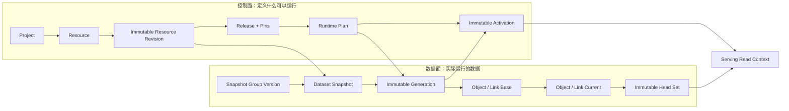
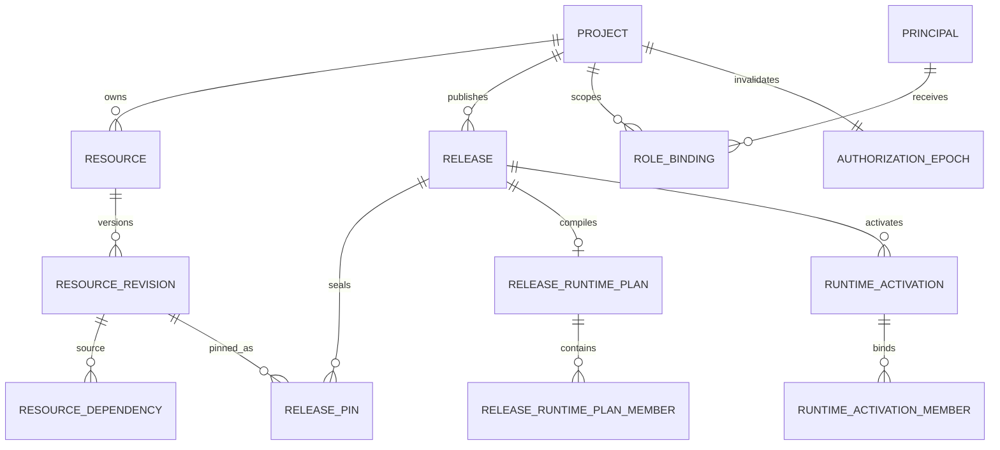
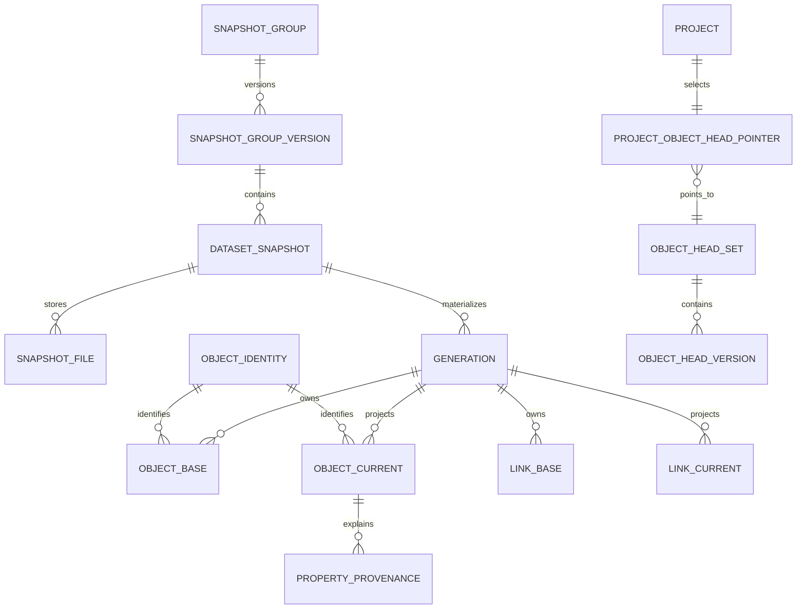
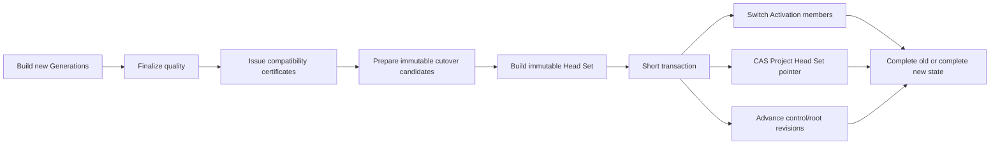

# Ontos 核心数据库设计

- 文档状态：Current-state architecture reference
- 已实现基线：连续前向 Migration `0001`～`0021`
- 已覆盖 Gate：G2-00 Foundation、G2-01 Metadata、G2-02 Materialization
- 尚未实现：G2-03 Query/Policy、G2-04 Action/Overlay、G2-05 完整交付面、G2-07 完整 Audit/Operations

## 1. 先说结论

核心数据库已经做过，而且不是停留在概念 ER 图：当前 PostgreSQL 16 Schema 已由 21 个连续 Migration、真实 Repository、权限负测、100k Object / 1m Link 数据验收和 clean-room 重建共同验证。

现在已经落库的核心是：

1. **Metadata 控制面**：Project、Ontology Resource、Revision、Dependency、Release、Package、Activation 与管理权限；
2. **Materialization 数据面**：受管 Snapshot、Mapping 绑定、稳定 Object Identity、不可变 Generation、Object/Link Base 与 Current Projection；
3. **原子服务指针**：Release/Activation、Snapshot Group 与不可变 Object Head Set，保证刷新时不读到半套数据；
4. **生产运行控制**：Job/Lease、Checkpoint、质量报告、Provenance、Index Plan、容量准入、Cutover 和保守 GC；
5. **最小数据库安全边界**：迁移、API、Worker、只读运维分权，默认拒绝，业务事实通过约束、Trigger 和受控函数保护。

但“最终产品全部数据库”还没有完成：

- G2-03 才会增加完整 Runtime Identity、Claim Mapping、Policy Compilation 和 Query Lease/GC Root；
- G2-04 才会增加 Action、Overlay、Conflict、ChangeSet、Outbox/Audit；
- `action`、`audit` Schema 目前已经预留，但尚无业务基础表；
- 当前 `authz` 是 Metadata 管理 RBAC，不等于 Object/Property/Link 业务 Policy 已实现。

因此，当前数据库足以支撑“定义 Ontology → 导入数据 → 物化 Object/Link → 原子激活”的生产闭环；还不能声称“安全查询 → Action 写回 → 完整审计”的最终闭环已经落库。

## 2. 权威来源与阅读规则

本文件是人类可读总图，不替代可执行事实。出现冲突时按以下顺序判断：

1. [`migrations/db-00/`](../../migrations/db-00/)：物理 Schema、约束、权限和受控函数的唯一落库事实；
2. [`tools/database/`](../../tools/database/) 与 PostgreSQL Integration：迁移、权限、不可变、并发和故障行为的可执行证据；
3. Accepted ADR：为什么选择这些键、事务和边界；
4. G2-03/G2-04 任务包：未来意图，不可当成当前实现。

本文中的“91 张基础表、20 个受控视图”是指 `0001`～`0021` 由 Ontos Migration 显式创建、并扣除已被迁移为 View 的旧 `runtime.object_heads` 表后的当前仓库模型；不把 PostgreSQL Catalog 或 `pg_trgm` 扩展内部对象算入业务表。

## 3. 完成度边界

| 数据库能力               | 当前状态           | 当前可以依赖什么                                        | 还不能依赖什么                                       |
| ------------------------ | ------------------ | ------------------------------------------------------- | ---------------------------------------------------- |
| Migration 与角色         | **已实现**         | 单一账本、Hash 防漂移、事务回滚、最小权限               | 自动 Down Migration                                  |
| Metadata/Release/Package | **已实现**         | 不可变 Revision、依赖闭包、原子发布和回滚发布           | 未激活 Resource Family 的完整运行语义                |
| 管理 AuthZ               | **已实现**         | OIDC Principal、Project/Resource Role Binding、Epoch    | Object 行级和 Property/Link Policy                   |
| Snapshot/Materialization | **已实现**         | 受管 CSV、不可变 Snapshot/Generation、质量与 Provenance | 任意数据连接器和通用 ETL                             |
| Object/Link Projection   | **已实现**         | 共享 Base/Current、稳定 RID、类型化 Link、Head Set      | Action Overlay 与冲突合并                            |
| Index/Capacity           | **已实现**         | 受限 Index Recipe、隔离 DDL、准入和实测库存             | 无上限索引、任意 SQL、无限 Project                   |
| Job/Recovery/GC          | **已实现**         | Lease Fencing、Checkpoint、Kill/Resume、保守回收        | Query Lease、Preflight/Hold/Action Root 的已激活扫描 |
| Runtime Query/Policy     | **已设计，未实现** | G2-03 任务边界和候选事实责任                            | 正式 Query 表、Policy Artifact、业务读权限           |
| Action/Overlay/Audit     | **已规划，未实现** | G2-04/G2-07 Owner 边界                                  | Action、ChangeSet、Outbox、完整 Audit 表             |

## 4. 总体模型：控制面与数据面分离

Ontos 不把 Metadata 定义和实际业务对象混在一张表里。



控制面回答：

- Project 中有哪些 Object Type、Link Type、Mapping、Policy 等 Resource；
- 哪个不可变 Revision 被哪个 Release Pin 住；
- 哪个 Runtime Plan 和 Activation 正在服务。

数据面回答：

- 哪个受管文件形成哪个 Snapshot；
- Snapshot 用哪个 Mapping 生成哪个 Generation；
- Generation 中有哪些 Object/Link；
- 哪个不可变 Head Set 是当前业务对象视图。

二者只通过稳定 UUID、不可变 Revision/Digest 和复合外键连接，不依赖显示名称或数据库自然顺序。

## 5. 逻辑 Schema 与数据库角色

### 5.1 Schema

| Schema            |    当前对象规模 | 责任                                                      | 当前状态                           |
| ----------------- | --------------: | --------------------------------------------------------- | ---------------------------------- |
| `ontos_migration` |            1 表 | Migration 账本和内部约束函数                              | 已实现；Runtime 不可见             |
| `meta`            |           18 表 | Project、Resource、Revision、Release、Package、Activation | 已实现                             |
| `authz`           |            3 表 | Principal、管理 Role Binding、Authorization Epoch         | 管理权限已实现；业务 Policy 未实现 |
| `runtime`         |  44 表 + 3 View | Snapshot、Generation、Projection、Cutover、Index/Capacity | 已实现到 G2-02                     |
| `ops`             | 25 表 + 17 View | Job、Staging、质量、DDL、GC 和脱敏运维读面                | 已实现到 G2-02                     |
| `action`          |            0 表 | Action/Overlay/Conflict 的预留边界                        | G2-04                              |
| `audit`           |            0 表 | 完整 Audit/Outbox 的预留边界                              | G2-04/G2-07                        |

### 5.2 正式角色

| 角色              | 用途                                                                    | 明确禁止                                       |
| ----------------- | ----------------------------------------------------------------------- | ---------------------------------------------- |
| `migration_owner` | 拥有 Schema、表、函数和 Migration 账本                                  | 作为 API/Worker 日常运行身份                   |
| `api_runtime`     | 调用管理 API 所需的受控表列和函数                                       | 任意 DDL、裸写 Materialization 表、切换 Owner  |
| `worker_runtime`  | Claim/Heartbeat Job，写入自己 Lease/Fencing Token 对应的 Staging 和进度 | Serving Head 任意写、API 管理写、DDL、任意删除 |
| `read_only_ops`   | 读取脱敏 `ops` View                                                     | 裸读业务数据、裸读 Job 输入、任何写入          |

所有角色均为无登录、非 Superuser、不可创建 Database/Role、不可绕过 RLS 的能力角色。API、Worker 和 Ops 的登录身份只被授予各自需要的 Runtime 角色，不能成为 `migration_owner` 成员；只有受控部署身份可以为执行 Migration 获得 `SET ROLE migration_owner` 的能力。

当前实现没有把业务授权依赖在一组尚未冻结的通用 RLS Policy 上。Project 复合键和最小数据库权限提供存储边界；G2-03 的 Object/Property/Link 授权仍必须由唯一 Policy Gateway 编译进参数化 SQL。数据库 Runtime 凭据不会直接发给浏览器或外部用户。

动态 Index 由隔离的 Projection DDL Executor 执行。它只消费服务器已编译、持久化且可核验的 Index Plan/DDL Request，不接受客户端 Raw SQL 或任意 Identifier，也不共享 API/Worker 凭据。

## 6. Metadata 控制面

### 6.1 核心关系



### 6.2 核心表

| 表                                    | 业务含义                                                | 关键设计                                                             |
| ------------------------------------- | ------------------------------------------------------- | -------------------------------------------------------------------- |
| `meta.projects`                       | Ontology/租户边界                                       | 稳定 `project_id`；API Name 墓碑不复用；归档不物理删除               |
| `meta.resources`                      | Object Type、Link Type、Mapping、Policy 等稳定身份      | `(project_id, namespace, api_name)` 唯一；Family 不原地改变          |
| `meta.resource_revisions`             | Resource 的不可变版本内容                               | Draft 用 `etag` 并发修改；Validated/Published 内容受 DB Trigger 保护 |
| `meta.resource_dependencies`          | Revision 间的确定性依赖边                               | 必须与服务器从内容提取的依赖一致；禁止自环和未允许循环               |
| `meta.validation_reports`             | Revision/Release 验证事实                               | 绑定 Subject Digest、Validator Version 和结构化 Issue                |
| `meta.releases`                       | 一次不可变发布候选/发布事实                             | 状态只前移；Manifest Digest 唯一；Rollback 创建新 Release            |
| `meta.release_pins`                   | Release 封存的 Revision 集合                            | 按 Release + Resource 唯一，保存 Revision 与 Content Digest          |
| `meta.release_channels`               | Project Channel 当前指针                                | 通过 Control Sequence 做 CAS；只指向合法 Release/Activation          |
| `meta.release_serving_heads`          | 每个 Release 的当前服务 Activation                      | Refresh 可在同一 Release 下切换新 Activation                         |
| `meta.runtime_activations`            | 一组不可变可服务 Generation 绑定                        | Activation Digest 与成员数量受约束，激活后不改成员                   |
| `meta.runtime_activation_members`     | Activation 到 Generation 的成员集合                     | 同时外键绑定 Release Plan、Generation 和 Compatibility Certificate   |
| `meta.release_runtime_plans`          | Release 的物理运行计划                                  | 从不可变 Release Pins 服务器派生并以 Digest 封存                     |
| `meta.release_runtime_plan_members`   | Object/Link 成员的 Revision、Mapping、Group、Index 绑定 | 不能由客户端提供任意成员或计划摘要                                   |
| `meta.packages` / `package_revisions` | 可安装 Ontology Package 及不可变版本                    | Semantic Version、Manifest Digest 和作者身份稳定                     |
| `meta.package_installations`          | Project 当前安装指针                                    | Active Package Revision 与 Active Release 成对切换                   |
| `meta.package_installation_changes`   | Install/Upgrade/Rollback 请求事实                       | Pending Change 先记录，Release Publish 时原子激活                    |
| `meta.artifact_references`            | 不可变 Artifact 引用                                    | 只保存 Digest、Media Type、Source；不保存任意路径或 Secret           |

### 6.3 发布事务

一次 Definition Publish 的短事务至少完成：

1. 锁定 Project 发布序列、目标 Release 和 Channel；
2. 重验 Release 状态、Manifest、Pin；有数据成员时同时重验 Runtime Plan 和 Generation Certificate；
3. 创建不可变 Activation 和完整 Activation Members；
4. 切换 Release Serving Head 和目标 Channel；
5. 标记 Release/Revision Published，Supersede 旧 Release；
6. 如来自 Package Change，同时切换 Installation 三个关联指针；
7. 推进 Authorization Epoch；
8. 任一 SQL 边界失败则全部回滚。

发布事务不等待 S3、Worker、网络或 `CREATE INDEX`。大工作必须在事务外完成并产生不可变证据，最终事务只做有界重验和指针切换。

## 7. 身份与管理权限

| 表                           | 作用                                                       | 关键约束                                                      |
| ---------------------------- | ---------------------------------------------------------- | ------------------------------------------------------------- |
| `authz.principals`           | 把 `(oidc_issuer, oidc_subject)` 映射为稳定 Principal UUID | 外部身份唯一；Disabled 状态与时间一致                         |
| `authz.role_bindings`        | Project 或 Resource 范围的管理角色                         | Owner/Editor/Viewer/Executor/Auditor；Active Binding 局部唯一 |
| `authz.authorization_epochs` | Project 权限事实版本                                       | 单调递增；权限/可见性变化与 Epoch 同事务                      |

重要边界：

- 这三张表目前解决的是 Metadata/Release/Materialization Admin 权限；
- G2-03 的 Object、Property、Link Policy 仍未实现；
- 不能把 `role_bindings` 当成业务对象行过滤；
- G2-03 会沿用 Principal 和 Epoch 历史，只向前增加 Human/Service 类型、Claim Mapping 与 Policy Artifact，不重建第二套身份表。

## 8. Snapshot、Generation 与共享投影

### 8.1 核心关系



### 8.2 Snapshot 与 Generation

| 表                                   | 作用                                             | 核心字段/约束                                                                 |
| ------------------------------------ | ------------------------------------------------ | ----------------------------------------------------------------------------- |
| `runtime.snapshot_groups`            | 需要一起原子换代的一组 Object/Link 成员          | Project 内 `group_key` 唯一；定义成员数有上限                                 |
| `runtime.snapshot_group_versions`    | 一次完整 Group 数据版本                          | 成员数 1～256；状态只前移；Group Digest 唯一                                  |
| `runtime.dataset_snapshots`          | 单个成员的一次不可变输入快照                     | 精确绑定 Target Revision、Schema Revision、Mapping Revision、Runtime Plan     |
| `runtime.snapshot_files`             | S3 受管对象的数据库事实                          | 保存受管 Artifact/版本、Digest、字节数、行数；不保存本地任意路径              |
| `runtime.snapshot_group_members`     | Group Version 的完整成员集合                     | Snapshot、Target Resource/Revision 和 Member Key 复合绑定                     |
| `runtime.generations`                | Snapshot 经 Mapping 生成的一代不可变投影         | 绑定 Project、目标 Revision、Snapshot、Mapping、Index Plan、质量报告与 Digest |
| `runtime.compatibility_certificates` | Generation 可供目标 Release 使用的服务器签发证据 | 精确绑定两边 Revision/Plan/Digest；不能由客户端伪造                           |

Snapshot 注册与文件上传分开：上传完成前不能注册成可物化 Snapshot。Finalize 必须以服务端读取的对象版本、流式 SHA-256、实际字节数、CSV 物理结构和行数为准，不信任客户端声明。

### 8.3 永久 Object Identity

`runtime.object_identities` 保存：

```text
(project_id, object_type_resource_id, canonical_primary_key)
  -> permanent object_rid
```

它解决两个问题：

- 同一业务主键跨 Snapshot/Generation 保持同一个 `object_rid`；
- Link 只保存稳定 RID，并用复合外键证明 Source/Target 属于正确 Project 和 Object Type。

Canonical Primary Key 由公共 `pk1` Codec 生成。数据库不使用本地 Collation 或隐式 Cast 猜测同一性，唯一约束使用确定的 `C` Collation。

### 8.4 Base 与 Current

| 表                            | 语义                                                                        | 是否原地修改                   |
| ----------------------------- | --------------------------------------------------------------------------- | ------------------------------ |
| `runtime.object_base`         | 某 Generation 从 Snapshot/Mapping 产生的不可变 Object 基础事实              | 否；仅 GC 在严格计划下物理回收 |
| `runtime.object_current`      | 供 Runtime 使用的当前投影候选，包含 `properties jsonb` 和 `lifecycle_state` | 否；新 Generation 写新行       |
| `runtime.link_base`           | 某 Generation 的不可变、类型化 Link 基础事实                                | 否                             |
| `runtime.link_current`        | 供 Runtime 遍历的 Link 投影候选                                             | 否                             |
| `runtime.property_provenance` | 每个 Current Property 对应的 Snapshot/File/Row/Column/Mapping 证据          | 否                             |

当前 G2-02 是 **Base-only Current**：`Current` 由通过质量检查的 Base 生成，还没有 Action Overlay。保留 Base/Current 两层不是重复浪费，而是给 G2-04 的 Overlay/Catch-up 留出稳定接缝；G2-04 必须接入现有 Current/Cutover 算法，不能另建第二套服务表。

Object 的动态 Property 存在 `properties jsonb` 中，而稳定身份、Revision、Generation、Source 和 Digest 是强类型列。这个混合模型避免为每个 Object Type 动态建表，同时让租户隔离、版本绑定、唯一性、关联和常用查询仍可由数据库约束与索引保证。

P0 Link 不承载任意动态业务属性，同一 Generation/Link Type/Source/Target 只允许一条边。需要多条可区分关系或复杂关系属性时，应建模为 Object，而不是绕过 Link 唯一约束。

## 9. 为什么没有“每种 Object Type 一张表”

Ontos 采用共享物理投影：

```text
runtime.object_current
  PK (project_id, generation_id, object_type_resource_id, object_rid)
  UNIQUE (project_id, generation_id, object_type_resource_id, canonical_primary_key)

runtime.link_current
  PK (project_id, generation_id, link_type_resource_id, link_rid)
  UNIQUE (project_id, generation_id, link_type_resource_id, source_object_rid, target_object_rid)
```

这样做的主要原因：

- Object Type 是用户定义的 Metadata，不应让普通发布请求拥有 DDL；
- Release、Rollback 和 Refresh 只需切换不可变 Generation/Activation，不需迁移每种业务表；
- 两个不同领域 Package 使用同一 Kernel 数据模型，不在代码或 Schema 中写领域分支；
- 容量、GC、权限和 Query Compiler 可以围绕有限表面统一验证。

代价是 `properties jsonb` 不能依靠“给所有字段建 GIN”解决查询。Ontos 使用 Published Property 能力生成有限、类型化的 Index Plan，严格控制能查什么和为此付出多少写放大。

## 10. Index Plan 与容量

### 10.1 固定索引

固定索引来自结构不变量：

- Object/Link 主键；
- Object Canonical Primary Key 唯一键；
- Link Source/Target 唯一键；
- Link 双向遍历索引；
- Generation、Snapshot、Release、Job 和 GC 的外键/领取路径索引。

### 10.2 动态 Property 索引

动态索引只允许受限 Recipe：

| Recipe        | 用途                      | 限制                              |
| ------------- | ------------------------- | --------------------------------- |
| B-tree        | 标量 Filter/Sort          | 1～3 个已声明 Key，确定方向       |
| Unique B-tree | 单 Property 业务唯一      | Scope 固定在 Project + Generation |
| Trigram GIN   | `searchable` String       | 使用锁定的 `pg_trgm` 与受控表达式 |
| Array GIN     | `filterable` String Array | 只允许已声明数组 Property         |

禁止：

- 全局 `properties` JSONB GIN；
- 为所有 Property 自动建索引；
- 客户端提交 Raw SQL、表达式或任意索引名；
- 在 Publish/Cutover 长事务中执行 `CREATE/DROP INDEX`。

`runtime.index_plans`、`runtime.index_plan_entries`、`runtime.index_inventory`、`ops.projection_ddl_requests` 分别保存计划、条目、实际库存和受控 DDL 请求。编译计划与实际 Catalog 必须双向核验。

### 10.3 当前容量包络

当前证据支持的默认限制包括：

- 一份 100k Object / 1m Link P0 基准投影约 497 MiB，准入按 150% 预留约 745.5 MiB；
- 单 Release 正常 2 GiB、硬上限 3 GiB；
- Project Steady 正常 8 GiB；
- Project Peak 正常 10 GiB、硬上限 12 GiB；
- 非活动 Generation GC Grace 不少于 7 天；
- 参考部署在 G2-07 总部署容量 Gate 完成前最多 1 个 data-bearing Project。

这不是长期产品限制，而是当前测试能证明的有限安全包络。提高限制必须补真实多 Project、磁盘水位、WAL/VACUUM、备份和故障恢复证据，不能只改常量。

## 11. 原子 Cutover 与 Object Head

### 11.1 为什么 `object_heads` 是 View

早期实现是一行一个可变 Object Head。`0016_snapshot_group_cutover.sql` 已把它前向迁移为：

- `runtime.object_head_sets`：一套不可变 Head 集合及 Digest；
- `runtime.object_head_versions`：集合中的每个 Object Head；
- `runtime.project_object_head_pointers`：每个 Project 当前 Head Set 的单行 CAS 指针；
- `runtime.object_heads`：带 `security_barrier` 的当前 Head View。

所以当前 `runtime.object_heads` **不是基础表**。读取它等价于读取 Project Pointer 选中的完整 Head Set。

### 11.2 Cutover 流程



短事务前，昂贵的候选计算和 Head Set 构建已经完成。事务内只重验：

- 期望的旧 Activation/Head Set/Control Revision 是否仍然相同；
- Generation、Certificate、Index/Capacity、Quality 和 Overlay Inventory 是否仍有效；
- Snapshot Group 的 Object 与 Base Link 成员是否完整。

任何一项变旧都返回稳定冲突，旧指针保持不变。读者只能看到完整旧代或完整新代，不会看到部分 Object 已刷新、部分 Link 仍是旧数据。

`head_digest` 表示业务语义，`base_value_digest` 表示具体 Current/Base 物理绑定。一次 Refresh 即使换了 Generation，只要业务内容没变，就可 Repoint 而不伪造业务版本变化。

## 12. Materialization Job、质量和恢复

### 12.1 Job 状态

```text
QUEUED → LEASED → SCAN → MAP → VALIDATE → BUILD_STAGE
       → BUILD_INDEX → READY_FOR_ACTIVATION → CATCH_UP → ACTIVATE → SUCCEEDED
                   ↘ RETRY_WAIT / FAILED / CANCELLED
```

核心表：

| 责任                 | 表                                                                                                                                          |
| -------------------- | ------------------------------------------------------------------------------------------------------------------------------------------- |
| Job 与 Attempt       | `ops.materialization_jobs`, `ops.materialization_attempts`                                                                                  |
| Lease 进度           | `ops.materialization_checkpoints`, `ops.materialization_staged_batches`                                                                     |
| Attempt 隔离 Staging | `ops.materialization_generation_stages`, `ops.materialization_generation_stage_batches`, `ops.object_base_staging`, `ops.link_base_staging` |
| 有界错误样本         | `ops.materialization_error_samples`, `ops.materialization_job_error_samples`                                                                |
| 质量计算             | `ops.materialization_quality_observations`, `ops.materialization_quality_preparations`, `runtime.materialization_reports`                   |
| 人工确认             | `runtime.materialization_confirmations`, `runtime.materialization_quality_bindings`                                                         |

### 12.2 恢复不变量

- Worker 使用 PostgreSQL `FOR UPDATE SKIP LOCKED` 领取 Job；
- Lease 到期后新 Attempt 获得更大的 Fencing Token；
- 旧 Worker 即使恢复网络也不能再写进度、Base、Current 或完成 Job；
- Checkpoint 只有在阶段输出完整且 Digest/Count 验证后写入；
- Staging 属于具体 Attempt，失败 Attempt 的半成品不能被新 Attempt 误认成成功；
- Cancel 只在安全点生效，进入最终 Cutover 后只能整笔提交或整笔回滚；
- 进程重启后的状态全部来自 PostgreSQL/S3，不依赖内存 Queue 或本地临时状态。

### 12.3 质量与 Provenance

质量规则默认 fail closed：

- Primary Key null/duplicate：阈值 0；
- Required Property 转换失败：阈值 0；
- Required Link 悬空：阈值 0；
- Optional Property/Link 默认最多 0.1%，但坏行整体进入 Rejected Row；
- 与前序 Snapshot 行数差异超出显式阈值时进入 `AWAITING_CONFIRMATION`。

数据库保存汇总、原因码、有限脱敏样本和 Artifact 引用；完整失败原始行留在受控对象存储，不进入普通 Log、Metric Label 或 API Error。

## 13. GC：保守的 Mark–Plan–Commit

GC 不是“不是当前代就删”，而是：

```text
Inventory → Root Scan → Mark → Immutable Plan → Batched Commit
```

当前权威 Root 包括：

- Channel 与所有支持期内 Release Serving Head；
- 当前/在建 Head Set；
- Active/Retry Job 和 Attempt；
- 历史 Activation Member；
- 每个 Member 最近两个成功非活动 Generation。

未来的 Query Lease、Preflight Token、Investigation Hold、Historical Action/ChangeSet/Artifact 已在 `ops.gc_root_provider_registry` 中保留 Provider 槽位。能力尚未上线时是 `INACTIVE`，不能假装“已扫描且为空”；一旦能力激活但 Provider 缺失、失败或版本不匹配，GC 必须返回 `GC_REFERENCE_SCAN_INCOMPLETE` 且不生成候选。

GC 计划绑定 Project 的 Root Revision、Inventory Revision、Provider Registry Digest、Candidate 和实际字节。任一事实变化都会使旧计划失效。关系数据按固定顺序小批提交，不使用 `CASCADE`；动态 Index Drop 仍由隔离 DDL Executor 重验并执行。

## 14. 核心数据库不变量

### 14.1 Project 隔离

- 所有业务数据主键、唯一键、关键外键和查询计划显式携带或验证 `project_id`；
- 不能只凭全局 UUID 猜测租户；跨 Project 复合外键会失败；
- 当前参考部署只有一个 data-bearing Project，但 Schema 仍保持 Project 隔离，不能为当前限制删除 `project_id`。

### 14.2 不可变事实与前向状态

- Published Revision、Release Pin、Activation Member、Snapshot File、Generation、Base/Current、Certificate、Report、Provenance 等事实不原地改正文；
- 可变控制记录只允许有限状态迁移、单调版本或 CAS 指针更新；
- 更新/删除由列级 Grant、CHECK/FK、Trigger 和负面 Integration 共同阻断；
- 业务回滚创建新 Release/Activation，不改写历史。

### 14.3 Digest 与确定性

- Resource Content、Release Manifest、Runtime Plan、Snapshot、Generation、Certificate、Head Set、GC Plan 均以规范 SHA-256 Digest 绑定；
- JSON Key 顺序、数据库读取顺序、时间、Worker ID 和随机值不得进入本应确定的语义 Digest；
- 客户端声明的 Hash、Count、Plan 或 SQL 不能替代服务器重新计算。

### 14.4 有界输入和有界运行

- Resource、Dependency、Release Pin、Runtime Member、Snapshot File、Index Entry、错误样本均有数量或长度上限；
- 没有任意 SQL、任意路径、任意脚本或无限图遍历进入数据库执行；
- 长操作在 Job/Worker 或隔离 DDL Executor 中执行，短事务只重验和切指针。

## 15. 关键事务与锁边界

| 场景                   | 原子边界                                   | 并发控制                                   | 失败结果                       |
| ---------------------- | ------------------------------------------ | ------------------------------------------ | ------------------------------ |
| Migration              | 每个版本独立事务                           | 全 Runner Session Advisory Lock + 账本复验 | 无半套 Schema/伪账本           |
| 创建 Project           | Project + Owner Binding + Epoch            | 唯一键和事务                               | 三者全部无或全部有             |
| 修改 Draft             | 单 Revision                                | `etag` Compare-and-Swap                    | 一个 Writer 成功，其他稳定冲突 |
| Publish Release        | Release/Activation/Channel/Package 指针    | Project 发布序列 + 行锁/CAS                | 旧发布状态完整保留             |
| Finalize Upload        | Upload Session + Snapshot File 事实        | Object Version/Digest/状态重验             | 未完成上传不成为 Snapshot      |
| Claim Job              | Job + Attempt + Lease                      | `SKIP LOCKED` + Fencing Token              | 只有一个有效 Worker            |
| Promote Base           | Attempt Staging → immutable Base           | Attempt/Generation/Fencing 重验            | 不留下部分 Base                |
| Finalize Quality       | Report + Current + Provenance + Generation | Digest/Count/状态绑定                      | 不合格代不进入 READY           |
| Snapshot Group Cutover | Activation + Head Set Pointer +控制版本    | 全局锁序 + Candidate 重验 + CAS            | 完整旧代或完整新代             |
| GC Batch               | Plan Entry + Collection Marker +物理删除   | Root/Inventory Revision 每批复验           | 已提交批次幂等，未提交批次回滚 |

## 16. 迁移与演进规则

### 16.1 当前规则

- 所有数据库变化继续进入 `migrations/db-00/` 的单一连续账本；
- 文件名必须是 `NNNN_lower_snake_case.sql`，当前最后版本为 `0021`；
- 已应用文件不能改名、移动或修改字节，否则 Hash 账本判定历史漂移；
- 不提供自动 Down Migration，错误通过更高版本 Roll Forward 修复；
- 每个 Migration 在同一事务创建对象、设置 Owner、撤销默认权限、显式 Grant 并登记账本；
- 当前只接受已验证的 PostgreSQL 16。

### 16.2 下一逻辑波次

G2-03 如通过 `03-01` 架构 Spike，才允许从 `0022+` 增加：

- Human/Service Identity 类型的前向扩展；
- 版本化 OIDC Claim Mapping；
- Policy Compilation/Test Artifact 引用；
- Query Lease/Generation Root；
- Policy Resource 的确定性 Dependency Type；
- 所有有效授权变化与 Authorization Epoch 的同事务推进/通知。

表名、列和索引必须在 G2-03-03 Migration 任务中冻结。本文不会提前虚构这些表，也不会把 G2-03 候选责任写成已落库事实。

G2-04 才拥有：

- Action Plan/Preflight/Apply；
- Overlay、Conflict、Object Version Recheck；
- ChangeSet、Outbox 和 Action Audit；
- 对 G2-02 zero-overlay Cutover Seam 的真实接入。

## 17. 当前明确缺口与风险

| 缺口                                                    | 是否当前缺陷                                         | 处理 Gate   |
| ------------------------------------------------------- | ---------------------------------------------------- | ----------- |
| Object/Property/Link Policy 未落库                      | 不是 G2-02 缺陷，但阻止公开 Runtime Read             | G2-03       |
| Query Lease/GC Root 未激活                              | 不是当前无 Query 时的缺陷；Query 上线前必须完成      | G2-03       |
| `action`/`audit` 无业务表                               | 诚实的延后范围                                       | G2-04/G2-07 |
| Current 尚无真实 Overlay                                | 由 zero-overlay Inventory fail closed 保护           | G2-04       |
| 只有 1 个 data-bearing Project 的证据包络               | 当前容量限制，不是 Schema 单租户                     | G2-07       |
| 无完整 PITR/HA/跨区恢复承诺                             | 不影响 clean-room 功能证明，但阻止生产运维成熟度声明 | G2-07       |
| 共享 JSONB Projection 的 Query 性能尚未通过 Policy 负载 | G2-02 只证明物化/索引；不能外推查询 SLO              | G2-03-09/14 |
| 完整 Query/Action Audit 保留策略未实现                  | 当前只有结构化证据和运维事实                         | G2-04/G2-07 |

## 18. 物理对象清单

以下是当前 91 张基础表的责任分组。这里用于查找，不替代 Migration 列定义。

### 18.1 Migration、Metadata 与 AuthZ（22 表）

- Migration：`ontos_migration.schema_migrations`
- Project/Resource：`meta.projects`, `meta.resources`, `meta.resource_revisions`, `meta.resource_dependencies`, `meta.validation_reports`
- Release：`meta.releases`, `meta.release_pins`, `meta.release_channels`, `meta.release_serving_heads`, `meta.runtime_activations`, `meta.runtime_activation_members`
- Runtime Plan：`meta.release_runtime_plans`, `meta.release_runtime_plan_members`
- Package：`meta.packages`, `meta.package_revisions`, `meta.package_installations`, `meta.package_installation_changes`, `meta.artifact_references`
- AuthZ：`authz.principals`, `authz.role_bindings`, `authz.authorization_epochs`

### 18.2 Runtime 数据与控制事实（44 表）

- Snapshot：`runtime.snapshot_groups`, `runtime.snapshot_group_versions`, `runtime.snapshot_group_definition_members`, `runtime.snapshot_group_members`, `runtime.dataset_snapshots`, `runtime.snapshot_files`, `runtime.snapshot_upload_sessions`
- Generation/报告：`runtime.generations`, `runtime.compatibility_certificates`, `runtime.materialization_reports`, `runtime.materialization_report_reasons`, `runtime.materialization_confirmations`, `runtime.materialization_quality_bindings`
- Projection：`runtime.object_identities`, `runtime.object_base`, `runtime.object_current`, `runtime.link_base`, `runtime.link_current`, `runtime.property_provenance`, `runtime.rejected_row_sets`
- Head/Cutover：`runtime.object_head_candidates`, `runtime.object_head_sets`, `runtime.object_head_versions`, `runtime.project_object_head_pointers`, `runtime.snapshot_group_cutover_preparations`, `runtime.snapshot_group_cutover_release_candidates`, `runtime.snapshot_group_cutover_member_candidates`, `runtime.snapshot_group_cutover_head_candidates`, `runtime.snapshot_group_cutover_object_type_locks`, `runtime.activation_content_bindings`
- Index/Capacity：`runtime.index_plans`, `runtime.index_plan_entries`, `runtime.index_inventory`, `runtime.index_plan_admissions`, `runtime.capacity_admissions`, `runtime.capacity_approvals`, `runtime.source_forecasts`, `runtime.project_physical_measurements`, `runtime.project_runtime_inventories`, `runtime.generation_measurements`
- Collection/部署边界：`runtime.generation_collections`, `runtime.head_set_collections`, `runtime.materialization_report_collections`, `runtime.data_bearing_project_guard`

### 18.3 Operations（25 表）

- Job：`ops.materialization_jobs`, `ops.materialization_attempts`, `ops.materialization_checkpoints`, `ops.materialization_staged_batches`, `ops.materialization_error_samples`, `ops.materialization_job_error_samples`
- Staging：`ops.materialization_generation_stages`, `ops.materialization_generation_stage_batches`, `ops.object_base_staging`, `ops.link_base_staging`
- Quality：`ops.materialization_quality_observations`, `ops.materialization_quality_preparations`, `ops.materialization_provenance_templates`
- DDL：`ops.projection_ddl_requests`
- GC：`ops.gc_runs`, `ops.gc_plans`, `ops.gc_plan_candidates`, `ops.gc_plan_entries`, `ops.gc_root_provider_registry`, `ops.gc_root_epochs`, `ops.gc_root_provider_scans`, `ops.gc_orphan_deletions`, `ops.gc_batch_events`, `ops.gc_execution_contexts`, `ops.materialization_attempt_collections`

### 18.4 当前 20 个受控 View

- Runtime：`runtime.object_heads`, `runtime.current_compatibility_certificates`, `runtime.materialization_admin_capacity_approvals`
- Job/Ingress/Inventory：`ops.materialization_job_status`, `ops.snapshot_ingress_status`, `ops.runtime_inventory_status`, `ops.materialization_admin_report_samples`, `ops.projection_ddl_request_status`
- GC：`ops.gc_status`, `ops.gc_provider_registry_status`, `ops.gc_provider_scan_status`, `ops.gc_live_provider_scans`, `ops.gc_generation_roots`, `ops.gc_generation_inventory`, `ops.gc_head_set_inventory`, `ops.gc_index_inventory`, `ops.gc_attempt_inventory`, `ops.gc_orphan_upload_inventory`, `ops.gc_plan_status`, `ops.gc_plan_entry_status`

这些 View 主要用于最小权限、脱敏和稳定读合同。`read_only_ops` 不因为能读 View 就能读其底层业务表。

## 19. 设计到实现的核对结果

本次以“设计意图”和“实际 Migration/Integration”逐项对照，结论如下：

| 声明                          | 实现证据                                                                                                                                       | 结果                       |
| ----------------------------- | ---------------------------------------------------------------------------------------------------------------------------------------------- | -------------------------- |
| 单一连续 Migration 账本       | [`0001_foundation.sql`](../../migrations/db-00/0001_foundation.sql) + `schema_migrations` Hash Integration                                     | 一致                       |
| Metadata 历史不可变、发布原子 | [`0002`～`0006`](../../migrations/db-00/) Trigger/FK + Metadata PostgreSQL 故障注入                                                            | 一致                       |
| 不为每种 Object Type 动态建表 | [`0008_materialization_shared_projection.sql`](../../migrations/db-00/0008_materialization_shared_projection.sql) + Catalog 负测               | 一致                       |
| 稳定 RID、类型化 Link         | `object_identities` + [`0011_object_identity_base_staging.sql`](../../migrations/db-00/0011_object_identity_base_staging.sql) 复合 FK          | 一致                       |
| Refresh 原子切换              | [`0016_snapshot_group_cutover.sql`](../../migrations/db-00/0016_snapshot_group_cutover.sql) 不可变 Head Set + Pointer CAS                      | 一致                       |
| Worker 过期后不能写           | [`0013_materialization_job_worker.sql`](../../migrations/db-00/0013_materialization_job_worker.sql) + 两 Worker Integration                    | 一致                       |
| Runtime 最小权限              | [`materialization-postgres.integration.test.ts`](../../tools/database/materialization-postgres.integration.test.ts) 裸表、DDL、`SET ROLE` 负测 | 一致                       |
| GC 缺 Root 时 fail closed     | [`0017_generation_index_gc.sql`](../../migrations/db-00/0017_generation_index_gc.sql) Provider Registry、Root Epoch、计划陈旧性检查            | 一致                       |
| Query/Policy 已完成           | 当前无相应生产 Package/Migration/Endpoint                                                                                                      | **未实现，本文明确不声明** |
| Action/Overlay/Audit 已完成   | `action`/`audit` 当前无业务表                                                                                                                  | **未实现，本文明确不声明** |

当前没有发现需要回滚 G2-01/G2-02 的阻断性设计—实现偏差。后续最大数据库风险不是现有表无法使用，而是 G2-03 Query/Policy 或 G2-04 Overlay 若绕过现有 Activation、Generation、Head Set、Epoch 和 GC Root 接缝，会制造第二套真相；对应任务包已把这种情况列为停止条件。

## 20. 相关文档

- [DB-00 Migration、角色与逻辑 Schema](db-00-migration-roles.md)
- [ADR-013 Metadata/Release/Package 控制面](adr/013-metadata-release-package-control-plane.md)
- [G2-01 Metadata 任务包](../delivery/g2-01-metadata-task-pack.md)
- [G2-01 DB Migration 运行手册](../operations/db-01-metadata-migration.md)
- [ADR-008 Shared Projection、Index Plan 与容量](adr/008-shared-projection-index-capacity.md)
- [ADR-014 Materialization 事务与 DDL/Overlay 边界](adr/014-materialization-transaction-ddl-overlay-boundary.md)
- [ADR-015 永久 Object Identity 与 Attempt-owned Base](adr/015-permanent-object-identity-attempt-owned-base.md)
- [ADR-016 Quality、Current 与 Provenance](adr/016-quality-current-provenance-confirmation.md)
- [ADR-017 Worker 恢复](adr/017-materialization-worker-recovery.md)
- [ADR-018 Snapshot Group Cutover](adr/018-immutable-head-set-snapshot-group-cutover.md)
- [ADR-019 Generation/Index GC](adr/019-generation-index-mark-plan-commit-gc.md)
- [G2-02 Materialization 任务包](../delivery/g2-02-materialization-task-pack.md)
- [G2-03 Query + Policy 任务包](../delivery/g2-03-query-policy-task-pack.md)
- [G2-03 UI/API 消费者合同](g2-03-ui-api-consumer-contract.md)
