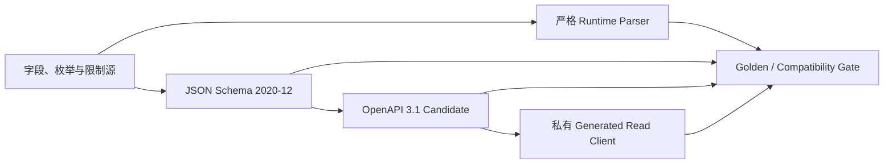

# G2-03 Runtime Read 合同与生成边界

- 状态：Frozen for G2-03-02
- 日期：2026-08-18
- Owner：Contracts / Runtime / Policy / Web（accountable: `wyd-git`）
- 上游：[G2-03 任务包](../delivery/g2-03-query-policy-task-pack.md)、[ADR-020](adr/020-query-policy-identity-consumer-boundary.md)
- 机器合同：`packages/contracts/schemas/runtime-read.schema.json`
- HTTP Candidate：`packages/contracts/openapi/runtime-read.candidate.json`
- 仓内消费者：`@ontos/runtime-read-client`

## 1. 结论

G2-03-02 冻结了后续 Query Compiler、Policy Gateway、HTTP 和 Web 必须共同遵守的**机器合同**。它不是 Runtime 服务实现：本项没有 Migration、数据库事实表、生产 Endpoint、Policy Compiler、Query Executor 或产品页。

合同从 TypeScript 字段源构造 JSON Schema 2020-12，再从公共根定义构造 OpenAPI 3.1 Candidate，最后生成私有 TypeScript Read Client。运行时 Parser、Schema、OpenAPI 和生成文件任一漂移都会使 CI 失败，前后端不能另写平行 DTO。

## 2. 激活的合同

| 分组     | 合同                        | 用途                                                                |
| -------- | --------------------------- | ------------------------------------------------------------------- |
| Query    | `RuntimeSearchRequest`      | Select、Search、Where、Sort、Keyset Page                            |
| Query    | `RuntimeCountRequest`       | 只允许 `operation=count`，不返回行                                  |
| Query    | `RuntimeLinkSearchRequest`  | 一跳或声明式第二跳 Link 查询                                        |
| Identity | `RuntimeIdentityContext`    | 受信 Actor、有限 Delegation、Claims Fingerprint                     |
| Policy   | `PolicyArtifact`            | 发布绑定、有限 IR、必须的测试向量                                   |
| Policy   | `PolicyDecision`            | Allow/Deny 与 Property disposition，不含规则 Trace                  |
| Cursor   | `CursorEnvelope`            | 绑定 Release、Activation、Generation、Query、Policy、Identity、Sort |
| Response | `RuntimeMetadataResponse`   | Actor 可发现的类型、字段、Link 与查询能力                           |
| Response | `RuntimeObjectGetResponse`  | 单对象、Object Version 和字段状态                                   |
| Response | `RuntimeSearchResponse`     | 有界对象页与下一页 Cursor                                           |
| Response | `RuntimeCountResponse`      | Policy-aware 十进制字符串 Count                                     |
| Response | `RuntimeLinkSearchResponse` | 已解析路径、有界目标对象页与 Cursor                                 |

所有顶层对象都拒绝未知字段。Request/Internal/Server-issued 合同按严格写边界处理；Response 的生产者严格，未来消费者只允许忽略新增响应字段，不能忽略已知字段的错误类型。

## 3. Query 合同

允许的比较运算为 `eq/ne/lt/lte/gt/gte/in/contains/prefix/containsAny`，空值判断单独使用 `isNull`；逻辑节点仅为 `and/or/not`。值始终是参数数据，合同没有 SQL、Identifier、Function、网络地址或任意表达式槽位。

| 限制                 |   冻结值 |
| -------------------- | -------: |
| 逻辑最大深度         |        5 |
| Predicate 总数       |       50 |
| `in` / 集合最大项    |      500 |
| Select 最大项        |      256 |
| Search Text 最大长度 |      256 |
| 普通页默认 / 最大    | 50 / 500 |
| Link 页最大          |      200 |
| Link 最大跳数        |        2 |
| 二跳最大候选         |    5,000 |

只有一个业务 Sort；正式 Query Compiler 必须再追加 Canonical Primary Key 作为稳定 Tie-breaker。`count` 是独立合同，不允许借 Aggregate 名义加入 sum/avg/groupBy。

## 4. Identity 与权限边界

`RuntimeIdentityContext` 只接受：

- 服务端解析的 `principalId` 与 `human/service` 类型；
- 最多受合同约束的 Delegation Chain；
- 不可逆 Claims Fingerprint；
- Canonical `authenticatedAt`；
- 固定 `authorizationMode=intersection`。

Bearer、Raw Claims、客户端自报角色、Delegation Credential、Token 或 Cookie 没有合同字段，因此在进入 Application/Policy 前会被未知字段检查拒绝。G2-03-04 才实现生产 OIDC、Claim Mapping 与 Delegation 验证；当前合同不能被误报为已经完成身份认证。

## 5. Policy 合同

Policy Target 覆盖 Resource、Object、Property、Link 与 Action Target。有限 IR 只包含常量、比较、空值、all/any/not 和最多一跳的 `link_exists`；允许多个并列一跳条件，禁止在 `link_exists` 内再遍历。规则、Predicate、集合、Fact、测试向量均有上限。`request_time` 是 Execution Context 传入的受信时间，每个发布测试向量都必须用 Canonical `requestTime` 固定它，不允许在求值中自行读取时钟。

明确禁止：

- Raw SQL、任意 Identifier 或数据库函数；
- 网络调用、文件访问、外部时间源或非确定函数；
- 任意递归和两跳以上 Policy Traversal；
- 用客户端传入“已 Allow”布尔值代替服务端求值。

Published Artifact 必须绑定 Project、Release、Policy Revision、Compiler Version 与 Digest，并包含 allow、deny、null、missing 以及实际使用的 Link/Property mask/deny 向量。Decision 只返回必要结果、Policy Context Hash、Authorization Epoch 与时间，不公开命中规则、Predicate 或拒绝链路。

## 6. Cursor 安全合同

Cursor 对客户端始终是 16～65,536 字符的 Base64URL opaque string。上限覆盖两个合法最大 Sort Value 与最大 Envelope，普通 Token 会远小于该上限。内部 Envelope 只允许服务端 Parser/Verifier 使用，绑定：

- Project、Release、Release Revision、Activation；
- Object Type Resource/Revision；
- 最多 5 个有序且唯一的 Generation；
- Query、Policy Context、Identity Context Hash；
- 最多 2 个 Sort/Last Value；
- Key Version、Issued At、Expires At，最大 TTL 15 分钟。

`tools/contracts/cursor-reference.ts` 用 AES-256-GCM 提供可执行的 AEAD conformance reference，验证篡改、过期、未知 Key 和上下文变化。它不负责生产 Key Store、Rotation、Telemetry 或 Lease；这些由 G2-03-03/09 实现。Cursor 不是跨页 Snapshot Lease，也不能延长旧 Allow。

## 7. Response 与防泄露语义

每个成功响应都包含实际 `releaseId`、`releaseRevisionId`、`readTimestamp`、`correlationId` 和有界 `warnings`。Object 还包含稳定 Reference 与十进制字符串 `objectVersion`。

Property 状态严格区分：

| 状态         | 允许的载荷            | 含义                     |
| ------------ | --------------------- | ------------------------ |
| `value`      | 非 null `value`       | 可见实际值               |
| `null`       | `value: null`         | 字段存在且值为空         |
| `missing`    | 无值                  | 当前对象没有该事实       |
| `masked`     | 仅安全 `displayValue` | 字段存在但值被脱敏       |
| `restricted` | 无值                  | 字段不可读，不披露真实值 |

Masked/Restricted Metadata 必须同时移除 Filter、Sort、Search 能力，避免通过查询条件推断受限值。Serializer Parser 再次拒绝 masked/restricted 中夹带真实 `value`。Policy Decision 和公共响应都没有 Rule Trace。

## 8. HTTP Candidate 与生成消费者

OpenAPI 只发布五个 PRD 路径；Gate 同时锁定 Method、Operation ID、Path Parameter、Request Schema、`200` Response Schema 和 `runtime.read` Scope，不只检查 URL 文本：

1. `GET /api/v1/ontologies/{ontology}/metadata`
2. `GET /api/v1/ontologies/{ontology}/objects/{objectType}/{primaryKey}`
3. `POST /api/v1/ontologies/{ontology}/objects/{objectType}/search`
4. `POST /api/v1/ontologies/{ontology}/objects/{objectType}/aggregate`
5. `POST /api/v1/ontologies/{ontology}/objects/{objectType}/{primaryKey}/links/{linkType}/search`

内部 Identity、Policy 和 Cursor Envelope 不进入 OpenAPI Components。Spec 使用 `runtime.read` OIDC Scope，并明确版本为 `0.2.0-candidate`；`@ontos/runtime-read-client` 为 `private: true`，不是对外发布 SDK。

`npm run generate:runtime-read` 是唯一写入命令；`npm run check:runtime-read-generation` 在临时目录重建 Schema、OpenAPI、17 个 Client Source 文件和 34 个 Distribution 文件，并逐字节比较。HeyAPI 0.99 的传输源码使用 `exactOptionalPropertyTypes=false` 编译一次，产出确定性的 JavaScript 与声明文件；包根只导出 `dist/package`，不向消费者暴露生成源码。Gate 还以 `exactOptionalPropertyTypes=true` 编译一个 Web 形状的消费者，通过正式包入口创建 Client、调用 Search，并穷举五态 Property Result，随后动态导入 Distribution 核对运行时导出。根工程严格度没有降低，也没有手改生成文件。

## 9. 错误与兼容性

本 Gate 激活 `QUERY_COMPLEXITY_EXCEEDED`、`CURSOR_INVALID`、`CURSOR_EXPIRED`、`RELEASE_RETIRED`、`POLICY_CONTRACT_INVALID` 和 `POLICY_EVALUATION_UNAVAILABLE`，并复用 `INVALID_QUERY_AST`、`PROPERTY_NOT_QUERYABLE`、`CURSOR_CONTEXT_CHANGED`。HTTP Status、Category 与 Retryable 由核心 Catalog 和运行时分类双向核对。

冻结基线拒绝：Definition/Property 删除或改名、类型变化、新增必填、已有 Optional 变 Required、Enum/Nullability/默认值变化和限制收紧。OpenAPI 额外拒绝 Path/Method 删除或改名。兼容新增仍需先部署 Reader，再由 Producer 发出。

## 10. 测试、运维与安全交接

Golden 固定 WorkItem/Order 两个领域和 5 个 Actor，覆盖 Empty、Null、Missing、Mask、Deny、Cursor Context/Tamper/Expiry、Unknown、Over-limit 与 Injection-as-data。测试矩阵位于 `tools/contracts/runtime-read.test.ts`，合同总检查入口为 `npm run check:contracts`。

当前没有运行服务、数据库状态或需要备份的数据，因此本项没有部署/回滚命令。回滚只可回滚未被下游消费的 Candidate commit；一旦 G2-03-03 及后续实现依赖该 v1 基线，Breaking Change 必须发布新 Schema Version 与迁移计划，不能改写 Baseline。

生产阶段必须另行提供：OIDC/JWKS 与 Cursor Key Secret 管理、最小 DB Role、日志脱敏、Timeout/Abort、Lease 清理、Key Rotation、可观测性和 Incident Runbook。本合同只固定它们的输入输出边界。

## 11. 下一步

唯一放行项是 **G2-03-03：从 0022 起实现 Query/Policy 前向 Migration 与最小权限**。它必须消费这里冻结的 Identity/Policy/Cursor 绑定，不得反向把数据库私有形状塞回公共合同；未通过 G2-03-03 前仍不创建 Runtime Endpoint 或产品页。
