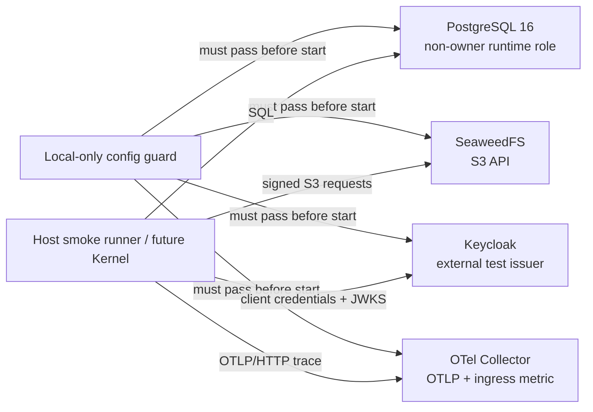

# 本地生产边界等价架构

- 状态：Accepted for G2-00-02
- 日期：2026-08-13
- Owner：Platform / Data

## 1. 决策范围

本环境验证 Ontology Kernel 后续实现必须面对的四类真实协议和权限边界：PostgreSQL、S3-compatible API、OIDC/OAuth 2.0 与 OTLP HTTP。它不提供业务 Endpoint、Repository、正式 Migration 或业务表，也不宣称复刻生产容量、高可用、安全加固和故障恢复拓扑。

所有宿主机端口只绑定 `127.0.0.1`。四个依赖与一次性配置守卫位于固定 Compose 项目 `ontos-g2-local`；没有个人浏览器登录、共享云账号、生产 Secret 或手工初始化步骤。

## 2. 版本与跨架构基线

镜像同时固定可读版本标签和 manifest-list digest。相同 Compose 文件在开发机与 CI 选择对应平台子 manifest，不使用浮动标签。

| 组件                    | 镜像                                           | Manifest-list digest                                                      | linux/arm64 | linux/amd64 |
| ----------------------- | ---------------------------------------------- | ------------------------------------------------------------------------- | ----------- | ----------- |
| PostgreSQL              | `postgres:16.14-bookworm`                      | `sha256:64154d0babcb1741988719e703419af0382b19953706149f9872fbd0f438efa8` | 有          | 有          |
| Test OIDC               | `quay.io/keycloak/keycloak:26.7.1`             | `sha256:f1f1f01e472c8a78df40d8f2a49a925274eda4d3d80d5f6edbb5c880ee3c01c6` | 有          | 有          |
| S3-compatible Storage   | `chrislusf/seaweedfs:4.41`                     | `sha256:43b768cd62b00d132439cda881b93fd1adebf1b315e996e794087743821d771d` | 有          | 有          |
| OpenTelemetry Collector | `otel/opentelemetry-collector-contrib:0.158.0` | `sha256:c5918f78992ee73b0d6f0e599423ac5ec52dd5d9726733114d6eca53d5a32ed5` | 有          | 有          |
| Config guard runtime    | `node:24.18.0-bookworm-slim`                   | `sha256:6f7b03f7c2c8e2e784dcf9295400527b9b1270fd37b7e9a7285cf83b6951452d` | 有          | 有          |

版本依据来自 [PostgreSQL 16.14 release](https://www.postgresql.org/docs/16/release-16-14.html)、[Keycloak releases](https://github.com/keycloak/keycloak/releases)、[SeaweedFS releases](https://github.com/seaweedfs/seaweedfs/releases) 和 [OpenTelemetry Collector Contrib 0.158.0](https://github.com/open-telemetry/opentelemetry-collector-releases/releases/tag/v0.158.0)。平台矩阵以 `docker buildx imagetools inspect` 对上述 digest 的结果为准。

## 3. 信任与权限边界

### PostgreSQL

- 容器管理员仅用于首次初始化，Smoke 和未来 Kernel 连接使用 `ontos_smoke_runtime`。
- `ontos_smoke_owner` 为 `NOLOGIN` owner；runtime 角色不是 superuser，不能创建 Database/Role，也不能 `SET ROLE` 到 owner。
- 唯一的 `ontos_smoke.object_probe` 是 G2-00-02 协议探针，不是正式业务表或 DB-00/DB-01 Migration。
- `migration_owner`、`api_runtime` 等正式角色留给 G2-00-10，不在本任务提前定义。

### OIDC

- Keycloak 是 Kernel 进程外部的测试 Issuer；Smoke 使用 client credentials 获取 Token，再经 discovery/JWKS 验证签名、`iss` 和 `aud`。
- Realm import 使用环境变量替换 client secret，并由 `--import-realm` 在空卷时自动完成。
- Issuer 固定为 `http://127.0.0.1:18080/realms/ontos-local`；不接受隐藏的浏览器 Session。

### S3

- SeaweedFS `mini` 提供真实签名 S3 API，并在空卷时创建隔离 Bucket `ontos-smoke`。
- Smoke 对随机 Key 执行 Put/Get/Delete、校验读取内容，并证明错误凭据被拒绝；不把本地 all-in-one 拓扑当作生产对象存储部署建议。

### Telemetry

- Collector 接收 OTLP/HTTP Trace，使用 debug exporter，不连接外部 SaaS。
- Smoke 在发送 Trace 前后读取 Collector 自身 Prometheus 指标 `otelcol_receiver_accepted_spans`，必须观察到增量；单纯端口连通不算通过。
- Collector health extension 与 internal metrics 使用当前配置结构；不使用已废弃的 `service.telemetry.metrics.address`。

## 4. 防误用与生命周期

提交的 `.env.example` 中所有凭据都是公开、可丢弃且带 `local-only-` 标记的 Fixture。`config-guard` 是其他四个服务的 `service_completed_successfully` 依赖，仓库入口和正常的 dependency-aware Compose 启动都会先执行它：

- 缺少必需配置时失败；
- `ONTOS_ENVIRONMENT=production` 遇到任一示例凭据时失败；
- 本地 Compose 遇到非 `local` 环境时失败；
- 本地 Issuer 或受限数据库角色偏离固定合同也失败。

本地 Compose 文件不能防御操作者刻意添加 `--no-deps`、覆盖 Entrypoint 或修改 Compose 文件；这些是明确绕开受支持入口的运维行为，不属于本地配置守卫的安全承诺。生产部署必须在独立的部署与准入层再次执行同类 fail-closed 校验。

`env:restart` 仅重启四个长期服务并保留卷；`env:reset` 的参数由代码生成和单测锁定，只能对固定项目、固定 Compose 文件执行 `down --volumes --remove-orphans`。两者语义不可合并。

## 5. 与生产仍然不同

| 本地选择                  | 生产必须另行解决                               |
| ------------------------- | ---------------------------------------------- |
| 单节点 PostgreSQL         | HA、备份/PITR、TLS、连接池与容量               |
| Keycloak `start-dev` + H2 | 受管或生产化 IdP、TLS、密钥轮换、HA 和审计     |
| SeaweedFS `mini`          | 对象存储耐久性、复制、生命周期、加密和容量     |
| Collector debug exporter  | 生产 Backend、采样、队列、重试、认证和数据保留 |
| 公开本地 Fixture Secret   | Secret manager、轮换、最小权限和事件响应       |

这些差异是有意边界，不是待偷偷补齐的功能。单区域生产拓扑与 Secret 管理要在对应 Foundation 任务中独立验收。

## 6. 官方配置依据

- [Keycloak realm import](https://www.keycloak.org/server/importExport) 与 [容器启动](https://www.keycloak.org/server/containers)
- [Keycloak health endpoints](https://www.keycloak.org/observability/health)
- [SeaweedFS S3 quick start](https://github.com/seaweedfs/seaweedfs)
- [OpenTelemetry Collector health extension](https://opentelemetry.io/docs/collector/components/extension/)
- [OpenTelemetry Collector internal telemetry](https://opentelemetry.io/docs/collector/internal-telemetry/)
