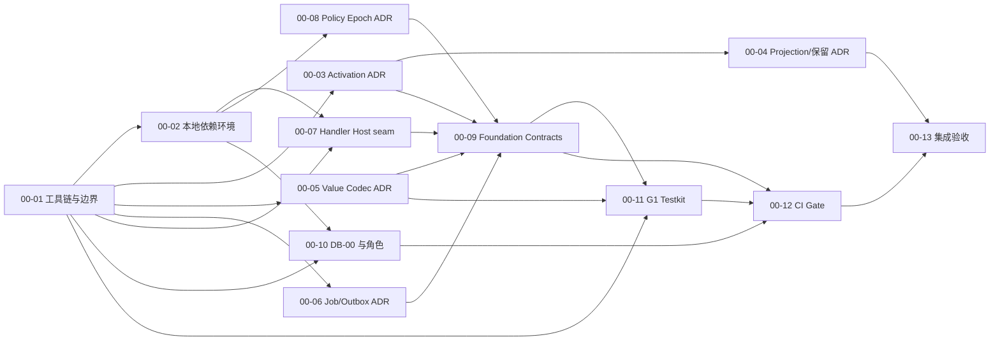

# G2-00 Foundation 可执行任务包

- 版本：1.0
- 日期：2026-08-13
- 上游：[G2 生产实现蓝图](../product/ontology-kernel-implementation-blueprint.md)
- 风险依据：[G2 蓝图红队审查](../reviews/g2-blueprint-red-team.md)
- Gate 目标：建立可重复、可约束、可审计的生产工程底座
- Gate 之后：只有 PASS 才进入 G2-01 Metadata

## 1. 这阶段到底做什么

G2-00 不实现产品闭环中的业务能力。它要证明后续实现不会建立在错误的合同、失控的 Release/Generation 模型、假权限或不可复现环境上。

完成后应得到：

```text
Pinned Toolchain + Module Boundaries
→ Accepted ADR-007..012 + Executable Invariants
→ Foundation Contracts + Compatibility Gate
→ DB-00 Migration + Negative Role Tests
→ Local/CI PostgreSQL + OIDC + S3 + OTEL
→ G1 Testkit without Spike Runtime Imports
→ Reproducible Gate Evidence
```

## 2. 明确不做

G2-00 不创建或实现：

- Resource/Revision/Release/Package Store 与 Admin API；
- DB-01 及后续业务表；
- Snapshot Upload、Mapping、Materialization 和 Current Projection；
- Object Query、Policy Compiler、Function 或 Action Runtime；
- Builder、Object Explorer、生成式页面或 SDK；
- 生产 Kubernetes、多区域、AI、Automation 或 Data Pipeline。

若某任务必须靠上述能力才能验收，应拆出 seam model/harness，而不是把业务实现提前塞进 Foundation。

## 3. 工作包依赖



任务应独立提交和审查；依赖表示“不能宣称完成”，不妨碍先建立骨架或测试 Fixture。

规模使用理想工程日而非日历承诺：S = 1–2 天，M = 3–5 天，L = 5–8 天。实际日期等 Owner/容量矩阵完成后计算。

## 4. Why–What–Acceptance 工作项

### G2-00-01：固定工具链、仓库骨架和依赖边界

- 规模：M
- 建议 Owner：Tech Lead / Platform
- 依赖：无

**Why**

后续五个进程和多个 Kernel 包必须共享合同但不能互相越层导入；如果工具链、模块边界和根命令不先稳定，CI 无法区分真正的架构违规与普通构建噪声。

**What**

建立正式 monorepo 的最小可运行骨架，锁定受支持的 Node LTS、包管理器和 TypeScript 配置；只创建本任务真实使用的目录。定义 `apps → application packages → contracts/domain rules ← adapters` 的机器可检查依赖规则和统一根命令。

**Acceptance Criteria**

- Node 与包管理器版本由仓库文件锁定，clean checkout 的安装产生相同 lockfile；
- 根命令至少覆盖 bootstrap、format check、lint、typecheck、unit test 和 verify；
- `contracts` 不可依赖数据库、HTTP、React、云 SDK 或应用包；
- 存在自动测试证明跨层导入和循环依赖会失败；
- 公共包不暴露框架类型，内部路径不能被消费者直接导入；
- 本任务不包含业务 Endpoint、Repository 或表。

### G2-00-02：建立本地生产边界等价环境

- 规模：L
- 建议 Owner：Platform / Data
- 依赖：G2-00-01

**Why**

G1 没有证明真实 OIDC、S3、连接池和 Telemetry。若 Foundation 仍用内存替身或开发者隐藏凭据，后续所有 Gate 都会给出虚假信心。

**What**

用本地编排建立 PostgreSQL 16、S3-compatible Storage、外部于 Kernel 的测试 OIDC Provider 和 OpenTelemetry Collector。环境用于验证协议和权限边界，不宣称等同生产容量或高可用部署。

**Acceptance Criteria**

- clean state 可用一个文档化入口启动、探活和关闭全部依赖；
- smoke suite 能获取测试 OIDC Token、验证 issuer/audience、读写临时 Object、以非 owner DB 角色连接并接收一条 Trace；
- 启动不依赖个人浏览器登录、共享云账号或人工输入生产 Secret；
- arm64 开发机和 amd64 CI 使用相同版本且兼容的镜像/配置；
- 持久化重启与完全清空是两个显式命令，清空目标被严格限定在项目卷；
- 示例配置不能被误用为生产配置，生产启动遇到示例 Secret 必须失败。

### G2-00-03：ADR-007 Runtime Activation 与 Serving Head

- 规模：L
- 建议 Owner：Tech Lead / Runtime
- 依赖：G2-00-01

**Why**

Release 和 Generation 的一致绑定影响 DB-01、DB-02、Query、Preflight、Rollback 和 GC；如果这个模型错误，后续模块会围绕不可修补的引用语义实现。

**What**

编写 ADR-007，并建立不依赖数据库的可执行状态模型。模型必须区分 Release Pin、Channel、Serving Head、Activation、Generation、Snapshot 和在途引用。

**Acceptance Criteria**

- ADR 明确 Publish、纯数据 Refresh、Rollback、Release Retire 和 GC 的状态转换及并发控制；
- 固定场景覆盖 R1/R2、S1/S2、兼容/不兼容 Mapping、并发 Publish/Refresh、在途 Query 和 Preflight Stale；
- property-based test 证明一次请求只解析一次 Activation，且 Release Pin 与 Generation Schema/Mapping 始终匹配；
- ADR 在保留 PRD 90 天支持要求的同时，明确它与“保留每个历史数据 Generation”不是同一承诺；若无法给出有界方案，触发正式 PRD 变更而不是静默降级；
- 明确同时服务 Release/Generation 的上限、超额容量审批和退休行为；
- 任一仍被 Serving Head、有效 Token、Job 或 Hold 引用的内容不可被 GC。

### G2-00-04：ADR-008 Shared Projection、Index Plan 与容量上界

- 规模：M
- 建议 Owner：Runtime / Database
- 依赖：G2-00-03

**Why**

G1 证明了共享 Current 表和有限索引可行，也证明索引会显著放大写入；没有容量上界时，Release 支持窗和 Generation 保留会让正确模型变成不可运营模型。

**What**

编写 ADR-008，把共享 Generation 表、类型化索引、保留/GC 和容量审批转成可以计算和测试的 Index Plan Contract。

**Acceptance Criteria**

- 明确共享表键、唯一性、命名、索引声明和禁止全 Property 自动索引；
- 使用 G1 的 100k/1m 表/索引大小和写放大作为基线输入，不篡改原证据；
- 容量模型覆盖活动代、最近成功代、并发服务 Release、调查 Hold 和 Staging 峰值；
- 每个 Release/Project 有明确索引预算和超预算错误，而不是发布后告警；
- GC 输入、不可回收引用、dry-run 报告和失败安全行为被定义；
- 若模型无法给出有限上界，ADR 不得 Accepted，DB-02 不得开始。

### G2-00-05：ADR-009 公共值编码与 Golden Vector

- 规模：M
- 建议 Owner：Contracts / Runtime
- 依赖：G2-00-01

**Why**

Primary Key、64 位整数、Decimal 和 Timestamp 若在 Snapshot、Action、Query 或 SDK 中编码不同，会造成身份漂移、精度损失和索引顺序错误。

**What**

编写 ADR-009，并实现纯函数 Codec 与 Golden Vector。只处理公共值语义，不实现 Object Store 或 Query Compiler。

**Acceptance Criteria**

- 覆盖 UUID、canonical Primary Key、integer、decimal、date、timestamp、enum、string/string[] 和受限 json；
- integer/decimal 的 JSON 表示不会经过 JavaScript `number` 丢失精度；
- timestamp 统一为 UTC、六位小数、固定宽度 RFC 3339，非法/歧义输入在边界拒绝；
- Primary Key 大小写、Unicode、长度和复合键规范化有正反例；
- TypeScript 与 PostgreSQL Fixture 对同一向量产生相同规范值和排序；
- 属性测试覆盖 round-trip、边界值和不同输入同规范值的碰撞检测。

### G2-00-06：ADR-010 PostgreSQL Job/Lease 与 Outbox

- 规模：M
- 建议 Owner：Backend / Platform
- 依赖：G2-00-01

**Why**

Materialization 和 Outbox 都依赖持久化租约与恢复，但具有不同顺序和事务要求。若只写一个“通用队列”而没有状态不变量，崩溃后容易重复激活或伪装 Exactly-once。

**What**

编写 ADR-010 和纯状态模型，冻结数据库时钟、领取、Heartbeat、租约到期、重试、Dead Letter、幂等与可观测字段；不实现具体 Materializer 或外部 Consumer。

**Acceptance Criteria**

- Job 与 Outbox 的共同原语和不同状态被明确区分；
- 领取语义使用数据库时钟和条件更新/`SKIP LOCKED`，不信任 Worker 本机时间；
- Worker crash、lease reclaim、重复 attempt、commit-before-response 和下游超时场景有测试；
- Outbox 明确 at-least-once，同一对象顺序和消费者 `eventId` 去重责任可观察；
- 重试上限、退避、Dead Letter、人工重放和审计行为有稳定状态；
- 状态模型不允许未持有有效 Lease 的 Worker 完成 Job/Event。

### G2-00-07：ADR-011 与 Handler Host seam proof

- 规模：L
- 建议 Owner：Backend / Security
- 依赖：G2-00-01、G2-00-02

**Why**

Trusted Handler 是 Action/Function 的关键扩展边界。若进程隔离、硬超时或 Context 限制不可行，等到 G2-04 才发现会迫使 Action 合同重写或产生数据库旁路。

**What**

编写 ADR-011，并制作最小独立进程原型：已登记 Digest 的 Fixture Artifact、版本化私有 RPC、受限 Query Mock 和 Worker Pool 生命周期。不实现用户上传代码、Artifact Catalog 或业务 Action。

**Acceptance Criteria**

- Host 进程环境不包含 DB、S3、OIDC 管理或 Registry Credential；
- RPC 只接受登记过的 Artifact Digest 和类型化请求，不接受任意代码、文件路径或模块名；
- 正常、异常、无限循环、Host kill 和重启后再调用均有自动测试；
- 无限循环在硬超时加 1 秒 grace 内终止，API/测试协调进程继续可用；
- Context 拒绝未声明 Query、超出 Read Set 的读取和任意网络访问；
- ADR 明确这是 trusted deployment boundary，不是恶意多租户沙箱声明。

### G2-00-08：ADR-012 Policy Epoch、缓存和 fail-closed

- 规模：M
- 建议 Owner：Identity/Policy / Security
- 依赖：G2-00-02

**Why**

蓝图不引入 Redis，却要求多 API 进程最长五秒撤权一致。若失效通知、Epoch 和硬 TTL 没有准确合同，正向缓存会成为可持续权限旁路。

**What**

编写 ADR-012 和双进程决策 Harness，定义 Epoch 的事实来源、缓存键、数据库时钟、通知加速、TTL 上界和依赖不可用行为。不提前实现完整 Object Policy Compiler。

**Acceptance Criteria**

- Authorization 变更与 Project Epoch 递增在同一事务；
- 缓存键包含 Project、Actor/Delegation、Release、Policy Revision、Compiler Version 和 Epoch；
- 通知只负责加速，丢通知时硬 TTL 仍保证最长五秒收敛；
- 两个模拟 API 进程在撤权测试中都于五秒内拒绝，且不存在 allow-on-error；
- Epoch/Compilation 无法确认时 fail closed，并产生不含敏感值的可观察错误；
- P0 Resource/Role 授权是否保留 PostgreSQL 关系表被明确冻结；若改接外部授权引擎，必须重新审查 P0 范围和运维依赖；
- OIDC Group Token 刷新延迟与 Kernel 内授权撤销延迟在文档中分开描述。

### G2-00-09：建立 Foundation Contract 与兼容性 Gate

- 规模：L
- 建议 Owner：Contracts / Tech Lead
- 依赖：G2-00-03、05、06、07、08

**Why**

所有模块需要同一身份、编码、错误、版本和 Correlation 语义，但过早冻结完整 Query/Action/Snapshot 字段会把推测变成兼容负担。

**What**

建立两层合同治理：G2-00 冻结跨模块 Foundation Contract；Query、Snapshot、Action、Event 等模块合同登记 Owner 和最晚冻结 Gate，并仅保留 seam fixture。

**Acceptance Criteria**

- Foundation 层冻结 ID、Value Codec、Schema Version、Error Envelope、Correlation、Identity/Delegation 摘要、Release Binding 和兼容规则；
- 所有写入 Schema 默认拒绝未知字段，读取兼容策略被明确记录；
- 每类合同有合法、边界和拒绝 Golden Fixture；
- 自动 Diff 能阻止删除/改名/收紧等破坏性变更，并允许已定义的兼容增加；
- Query、Snapshot、Action、Event 有 Owner、语义不变量和 G2-01～04 最晚冻结 Gate，但不宣称字段已全部稳定；
- 合同包不依赖 HTTP/DB/React/云 SDK，也不暴露数据库列名。

### G2-00-10：实现 DB-00 Migration 与数据库角色

- 规模：L
- 建议 Owner：Database / Platform
- 依赖：G2-00-01、02

**Why**

后续事实不可变和模块写入边界必须由数据库权限共同执行；只在代码评审中约定“不更新”不足以阻止事故或旁路。

**What**

实现 DB-00：迁移账本、逻辑 Schema、扩展/版本检查、默认权限和 `migration_owner`、`api_runtime`、`worker_runtime`、`read_only_ops` 角色。DB-01 业务表不在本任务范围。

**Acceptance Criteria**

- 空 PostgreSQL 16 可前向部署，重复运行得到 no-op，Migration Hash/顺序可审计；
- 不兼容数据库版本或缺失扩展在写入前失败并给出稳定错误；
- Runtime 角色不是 owner/superuser，不能创建 Schema、角色或扩展；
- test-only append-only/owner 表的负面权限测试证明普通 Runtime 不能 UPDATE/DELETE 或绕过默认权限；
- `read_only_ops` 不能写入，Handler Host 没有数据库身份；
- 故障 Migration 有向前修复演练，不提供未经验证的自动 Schema downgrade。

### G2-00-11：迁移 G1 Fixture、生成器和测试向量到 testkit

- 规模：M
- 建议 Owner：Quality / Runtime
- 依赖：G2-00-01、05、09

**Why**

G1 的价值是算法证据和行为向量，不是其本地进程脚本。若生产包直接导入 Spike，实现会继承一次性凭据、目录假设和原型边界。

**What**

把两个 Package Manifest、确定性数据生成器、Query Corpus、Overlay/Conflict、Policy 和 Package 兼容向量迁入正式 `testkit`，保留来源和冻结 Hash。

**Acceptance Criteria**

- `testkit` 可从固定 Seed 生成小型测试集和 100k/1m 基准，不提交生成大文件；
- 两包仍各含至少 5 Object Types、5 Links、3 Actions、2 Policies 和 2 Views；
- 每组迁移向量记录 G1 来源文件、原冻结指纹和任何有意转换；
- `testkit` 自身也不在运行时导入 `spikes/g1`；需要的 Fixture/Vector 作为带来源记录的正式测试资产迁移；
- 生产 `apps/packages` 不能导入 `spikes/g1`，由依赖检查强制；
- 测试不依赖 G1 原始 Evidence、个人路径、固定本机端口或示例数据库密码；
- G1 原始冻结指纹仍可在 `spikes/g1` 独立复验。

### G2-00-12：建立强制 CI 与架构 Gate

- 规模：L
- 建议 Owner：Platform / Quality
- 依赖：G2-00-09、10、11

**Why**

Foundation 的约束若只写在 ADR 中，会在第一个赶工 PR 中失效。CI 必须让合同破坏、越层依赖、假数据库测试和秘密泄露成为不可合并错误。

**What**

建立 PR CI，并让本地 `verify` 调用相同的核心命令。Gate 输出可下载的机器报告和最小人类摘要。

**Acceptance Criteria**

- 必跑项覆盖 lockfile/install、format、lint、typecheck、unit、Contract Golden/Diff、架构依赖、真实 PostgreSQL Integration 和环境 smoke；
- CI 包含秘密/私钥扫描、依赖许可证清单和 SBOM 生成；漏洞策略区分“阻断等级”和暂缓记录，不静默忽略；
- 至少各有一个故意失败 Fixture 证明合同破坏、越层导入、角色越权和 Secret 会阻止流水线；
- 本地 `verify` 与 CI 使用同一脚本，不维护第二套命令；
- 报告记录 Commit、工具版本、数据库版本、Fixture Hash 和执行时间；
- 分支保护要求上述检查后才能合并，紧急绕过必须可审计。

### G2-00-13：执行集成 Gate 并冻结证据

- 规模：M
- 建议 Owner：Tech Lead + 独立 Reviewer
- 依赖：G2-00-01～12

**Why**

多个子任务分别通过不等于底座可以从零重建。最后必须用无隐藏状态的 clean-room 路径证明 ADR、合同、权限、环境和 testkit 能共同工作。

**What**

从 clean checkout 执行完整 bootstrap、依赖启动、DB-00、所有验证和 teardown；保存可复现证据并给出明确 PASS/FAIL，不用截图代替结果。

**Acceptance Criteria**

- clean checkout 在文档化支持环境上无需个人隐藏配置即可完成；
- ADR-007～012 均为 Accepted，且每份都有对应可执行证据；
- Contract、DB 角色、OIDC/S3/OTEL smoke、testkit、架构边界和秘密扫描全部通过；
- 仓库中不存在 DB-01 业务表、业务 Endpoint 或页面实现；
- Evidence Manifest 记录 Commit、Artifact/Fixture Digest、环境版本、命令、结果和未关闭风险 Owner；
- Owner/容量矩阵完成；若实际并行度不足，G2-01～05 日历已重算；
- 独立 Reviewer 确认 PASS 后才创建 G2-01 分支。

## 5. G2-00 Gate 总验收

| 维度 | PASS 条件 | FAIL 时处理 |
|---|---|---|
| 范围 | 无 DB-01、业务 API、Runtime 或页面 | 移回后续 Gate，不以“已写完”为理由保留 |
| 决策 | ADR-007～012 Accepted 且有 executable evidence | 修正模型；不设计下游表 |
| 合同 | Foundation Golden/Diff 全绿，模块合同有 Owner/Gate | 收窄或补齐，不假冻结 |
| 数据库 | 空库部署、no-op 重跑、角色负面测试通过 | 修复 DB-00，不使用 owner 继续开发 |
| 环境 | PG/OIDC/S3/OTEL 本地和 CI smoke 通过 | Foundation FAIL，不退化为 mock Gate |
| 扩展边界 | Handler Host timeout/credential/read-set 测试通过 | 停止 Trusted Handler 路线并重做 ADR |
| 可复现 | clean-room verify 与 Evidence Manifest 完成 | 找出隐藏状态后重跑 |
| 交付能力 | Owner/容量/第二审查人明确 | 撤销日期承诺，保留技术 Gate |

## 6. G2-00 之后的唯一下一步

Gate PASS 后才创建 G2-01 Metadata 任务包，范围为 DB-01 与 Project/Resource/Revision/Dependency/Release/Package Store/API。不得从 G2-00 直接跳到 Materialization、页面或 Action。
