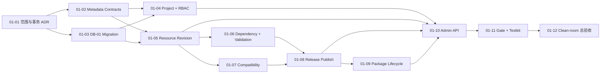

# G2-01 Metadata 可执行任务包

- 版本：1.0
- 日期：2026-08-14
- 状态：Implementation Ready，仍受本任务包 Gate 与停止条件约束
- 上游：[Ontology Kernel PRD](../product/ontology-kernel-prd.md)
- 实现蓝图：[G2 生产实现蓝图](../product/ontology-kernel-implementation-blueprint.md)
- Foundation 入口证据：[G2-00-13 Foundation 总验收](../evidence/g2-00-13-foundation-integration-gate.md)
- 交付容量：[G2 Owner 与容量矩阵](g2-owner-capacity-matrix.md)
- 风险审查：[G2-01 任务包红队](../reviews/g2-01-task-pack-red-team.md)
- Gate 目标：通过真实 PostgreSQL 与受认证 Admin API，原子发布一个依赖闭合、历史不可变、无业务数据的 Metadata Release
- Gate 之后：只有 PASS 才创建 G2-02 Materialization 任务包

## 1. 这阶段到底做什么

G2-01 是第一个正式业务 Gate。它建立 Ontology 的控制面：Project、Resource、Revision、Dependency、Release 和 Package 的合同、状态机、存储与管理 API。

完成后应能从真实 HTTP 入口执行：

```text
OIDC Admin Identity
→ Create Project + Owner Binding
→ Create Resource + Draft Revision
→ Validate Object/Property/Link Definition
→ Extract and Validate Dependency Graph
→ Compare Compatibility with Published Revision
→ Seal Release Pins + Manifest Digest
→ Stage a Zero-member Runtime Activation
→ Atomically Publish Channel + Serving Head
→ Install / Upgrade / Roll Back a Metadata Package through new Releases
```

这里的“无业务数据 Release”不是 Demo：它使用正式 ID、合同、权限、PostgreSQL 表、事务、Release Pointer 和失败语义。它只把 Generation Member 数量限制为零；G2-02 加入 Snapshot/Generation 后沿用相同 Release 与 Activation 模型，不重写 G2-01。

## 2. 范围冻结

### 2.1 本 Gate 必须实现

- `Project`、`Resource`、`Resource Revision`、`Dependency`、`Validation Report`、`Compatibility Report`、`Release`、`Release Pin`、`Release Channel`、`Release Serving Head` 和零成员 `Runtime Activation`；
- `Package`、`Package Revision`、`Package Installation` 与不可变 `Artifact Reference`；
- `Object Type`、嵌套 `Property` 和 `Link Type` 的 G2-01 内容合同、严格 Parser、Golden Fixture、依赖提取和兼容性比较；
- Draft `etag`、Validated/Published 不可变、归档不复用、显式父 Revision 和确定性内容 Hash；
- Project/Resource 管理 RBAC、OIDC 管理 Token 验证、Principal 映射和 Authorization Epoch；
- Admin HTTP API、真实 PostgreSQL Repository、DB-01 Migration、故障注入、并发测试和 clean-room Evidence；
- G2-00 Foundation 回归与 G2-01 独立 Gate 同时强制执行。

### 2.2 资源族渐进冻结

| Resource family                  | G2-01 行为                                        | 字段合同最晚 Gate |
| -------------------------------- | ------------------------------------------------- | ----------------- |
| Object Type / Property           | 严格校验并允许进入 READY/PUBLISHED Release        | G2-01             |
| Link Type                        | 严格校验、提取两端 Revision Dependency 并允许发布 | G2-01             |
| Interface                        | 只登记 Resource Envelope；不得进入 READY Release  | G2-05             |
| Mapping / Snapshot schema        | 不接受为 G2-01 可发布内容                         | G2-02             |
| Policy                           | 只允许 Package 预检报告为未激活能力；不得发布     | G2-03             |
| Function / Action Type           | 只允许 Package 预检报告为未激活能力；不得发布     | G2-04             |
| Object View / Application Config | 只允许 Package 预检报告为未激活能力；不得发布     | G2-05             |

`Resource` 的 Envelope、Revision 身份和内容 Digest 在 G2-01 冻结，不意味着上表后续资源族的业务字段提前冻结。未知或未激活资源族必须以稳定 Validation Issue 拒绝进入 READY，不能作为不透明 JSON 混入 Published Release。

### 2.3 明确不做

G2-01 不实现：

- Snapshot Upload、Mapping 执行、Materialization、Generation Member、Current Projection 或索引创建；
- Runtime Object/Link Query、Cursor、Aggregate、Policy Compiler/Gateway；
- Function 调用、Action Preflight/Apply、Overlay、ChangeSet、Outbox 或业务 Audit；
- Builder、Object Explorer、Package Catalog、SDK 或公开 OpenAPI 发布合同；
- Release 审批、多人工作流、自动依赖解析、Package Kernel Migration 或 Raw SQL；
- 生产备份、PITR、告警、安全最终审计或 Internal Alpha 声明。

若 G2-01 验收必须调用以上能力，先判断能否通过显式 `NOT_READY_FOR_GATE` 结果或测试 Port 表达；不能表达则停止并修正 Gate 边界，不能把下游模块临时塞进 Metadata。

## 3. 可实施设计边界

### 3.1 包与依赖方向

计划新增的正式 Workspace 边界为：

```text
apps/api                          app / composition root
  ├── @ontos/metadata-application
  ├── @ontos/metadata-postgres
  └── OIDC + HTTP adapters

@ontos/metadata-application      application / use cases + ports
  ├── @ontos/metadata-domain
  └── @ontos/contracts

@ontos/metadata-domain           domain / state + validation + compatibility
  └── @ontos/contracts

@ontos/metadata-postgres         adapter / PostgreSQL repositories
  ├── @ontos/metadata-application
  ├── @ontos/metadata-domain
  └── @ontos/contracts
```

Domain 与 Application 不导入 PostgreSQL、HTTP、OIDC SDK、文件系统或环境变量。HTTP DTO 在 App 边界映射为 G2-01 模块合同；PostgreSQL 行不成为公共类型。

### 3.2 DB-01 表所有权

DB-01 候选表必须在 G2-01-01 冻结列级设计，但表责任已经固定：

| Schema  | 本 Gate 表                                              | 关键约束                                                                                               |
| ------- | ------------------------------------------------------- | ------------------------------------------------------------------------------------------------------ |
| `meta`  | `projects`                                              | 稳定 UUID；API Name 永不复用；归档不物理删除                                                           |
| `meta`  | `resources`                                             | Project 内 Namespace/API Name 唯一；类型不可原地改变                                                   |
| `meta`  | `resource_revisions`                                    | Draft 可用 `etag` 修改；Validated/Published 内容受 DB 约束不可变                                       |
| `meta`  | `resource_dependencies`                                 | 来源 Revision 到目标 Revision；与已提取内容一致                                                        |
| `meta`  | `validation_reports`                                    | 绑定 Revision/Release + 内容 Digest；Issue 结构化                                                      |
| `meta`  | `releases`, `release_pins`                              | 一个 Release Pin 集合封存为确定性 Manifest Digest                                                      |
| `meta`  | `release_channels`, `release_serving_heads`             | Pointer 只指向不可变 Activation                                                                        |
| `meta`  | `runtime_activations`                                   | G2-01 只允许零成员 Activation；成员表由 DB-02 创建                                                     |
| `meta`  | `packages`, `package_revisions`                         | Namespace/Version/Manifest Digest 唯一；Revision 不可变                                                |
| `meta`  | `package_installations`, `package_installation_changes` | 稳定 Installation 只指向 Active Revision/Release；Install/Upgrade/Rollback 先产生不可变 Pending Change |
| `meta`  | `artifact_references`                                   | 只保存不可变 Digest、媒体类型和来源引用，不保存任意路径                                                |
| `authz` | `principals`                                            | OIDC issuer + subject 唯一映射到稳定 Principal UUID                                                    |
| `authz` | `role_bindings`                                         | Project/Resource Scope；Owner/Editor/Viewer/Executor/Auditor                                           |
| `authz` | `authorization_epochs`                                  | 每 Project 单调递增；与权限/可见性变更同事务                                                           |

DB-01 不创建 `runtime_activation_members`，因为 DB-02 的 Generation 尚不存在。首个 Release 发布时创建成员数为零的 Activation；DB-02 只能新增 Member 与 Generation 结构，不能改写历史 Release Pin 或 Activation 身份。

权限遵循 DB-00：对象全部由 `migration_owner` 创建；`api_runtime` 只获得完成 Admin Use Case 所需的表/列操作；`worker_runtime` 和 `read_only_ops` 不因方便获得 Metadata 写权。Published 事实的 UPDATE/DELETE/TRUNCATE 由权限、约束和负面测试共同阻断。

### 3.3 Resource Revision 状态

```text
DRAFT --validate(contentDigest)--> VALIDATED --publish by Release--> PUBLISHED
  |                                    |
  +--PATCH with If-Match               +--edit creates child DRAFT
  +--archive Resource                   +--content cannot change

PUBLISHED --> DEPRECATED --> ARCHIVED   # 只改变可用状态，不改历史内容
```

- Draft Patch 必须携带 `If-Match`，成功后递增 `etag`、重算规范内容 Hash 并使旧 Validation Report 失效；
- Validated Revision 的任何编辑创建带 `parentRevisionId` 的新 Draft；不能退回原行修改；
- Release Stage 绑定 Pin 的 Revision ID 与内容 Hash；之后同 Resource 的新 Draft 不影响该 Release；
- Published Revision 的内容、Hash、父 Revision、依赖边和作者字段不可更新；
- Resource 归档后 ID/API Name/历史 Revision 保留，名称不能被另一个 Resource 复用。

### 3.4 Dependency 与兼容性

- Dependency 只能由严格内容 Parser/Extractor 生成；客户端可提交引用，但持久化边必须等于服务器重新提取结果；
- G2-01 默认禁止所有循环。未来 Resource Family 如需允许循环，必须在其拥有 Gate 以 ADR 和固定 Dependency Type allowlist 放行；
- Release 按确定性拓扑顺序验证，排序 Tie-break 使用稳定 UUID，而不是插入时间或数据库默认排序；
- 与当前 Published Revision 比较时，结果分为 `compatible`、`conditional`、`breaking`、`forbidden`；
- `conditional` 且需要 Materialization/Index/Migration 的变化在 G2-01 必须停止于 Validation Report，不能假装 READY；
- 删除 Property、修改 Primary Key、收紧 Enum、修改 Link Endpoint/Cardinality 默认阻断；Display 文案变化、nullable Property 增加、Enum 放宽允许；
- Package 的未激活 Resource Family 只报告 Capability 不可用，不推测 G2-03～05 的字段兼容性。

### 3.5 Release 与原子发布

```text
DRAFT --validate--> DRAFT(with successful report)
DRAFT --stage sealed digest--> STAGING --> READY
DRAFT/STAGING --invalid or unrecoverable--> FAILED
READY --publish transaction--> PUBLISHED --> SUPERSEDED
```

- Draft Validation 失败仍留在 Draft 并保存绑定当前 Digest 的报告，允许修正；
- Stage 开始后 Pin 集合封存。若 Pin/Revision Digest 与验证结果不同，返回并发冲突；
- G2-01 Stage 只验证依赖、兼容性、权限、Package 和“无数据就绪条件”，不调用 S3、Worker 或 Materializer；
- Publish 短事务必须锁定 Release、目标 Channel 和 Project 发布序列，重新验证 READY、Manifest Digest 与零成员条件；
- 同一事务创建不可变 Activation、写入 Release Serving Head、切换 Channel、标记 Pinned Revision/Release Published、Supersede 旧 Release，并递增 Authorization Epoch；
- 若 Release 来自 Package Install/Upgrade/Rollback，同一事务还必须把对应 Pending Installation Change 标记为 Active，并同时切换 Installation 的 Active Package Revision/Release；
- 任一 SQL 边界故障必须使上述变更全部回滚；不得留下部分 Pin、孤儿 Pointer 或 Published Revision；
- 相同 Release/Digest 的重复 Publish 返回同一结果；不同 Digest 或状态返回稳定冲突；
- Rollback 复制历史 Pins 创建新的 Release Draft，经完整 Validate/Stage/Publish；绝不把 Channel 直接指回旧 Activation。

### 3.6 Package 边界

- Package Manifest 冻结 Package API Name、Version、Namespace、Kernel Contract Version、Resource Entries、Artifact Digests、Install Inputs 和 Manifest Digest；
- G2-01 安装只允许当前已激活的 Object/Property/Link 内容进入可发布 Release；Actions、Policies、Views 等完整 Fixture 内容进入预检报告但阻止 READY；
- Package 不得包含 Kernel Migration、Raw SQL、任意文件路径、固定 Secret、数据库地址或绕过 Runtime 的 Endpoint；
- Install/Upgrade 在单个 Metadata 事务中创建 Package Revision、Resource/Revision、Pending Installation Change 与 Release Draft，失败不留下部分写入；Pending 不等于已安装，当前 Active Revision 在 Release Publish 前保持不变；
- Upgrade 输出逐 Resource Compatibility Report；breaking/conditional 未满足时不改变当前 Installation；
- Rollback 创建引用历史 Package Revision 的新 Release Draft；历史 Package/Release/Revision 不修改；
- 两个 G1 Package Fixture 继续作为来源资产。G2-01 可派生带 Provenance 的 metadata-only Fixture，但不能把 G1 原型 Store 或 Runtime Bridge 复制进生产实现。

### 3.7 最小管理授权

G2-01 只实现管理控制面所必需的授权，不提前实现 G2-03 Object Policy：

- HTTP Adapter 验证 OIDC 签名、Issuer、Audience、过期时间和管理 Scope；不能信任客户端直接提交 Principal ID；
- Application Use Case 不接收 Bearer Token、原始 JWT 或 Claims；HTTP Adapter 只能把已验证结果映射为 Foundation Identity，再调用统一 `ManagementAuthorizer`；
- `(issuer, subject)` 首次出现时映射为稳定 Principal；Claims Fingerprint 和认证时间进入 Foundation Identity Summary；
- 创建 Project 需要独立管理 Scope，并在同一事务创建 Project Owner Binding 与 Authorization Epoch；
- Owner 可管理 Role Binding、Release 和 Package；Editor 可编辑/校验 Resource Draft；Viewer 只读 Metadata；Executor/Auditor 在 G2-01 仅存储稳定角色值，不扩大管理权限；
- Resource Binding 只能收紧 Project 权限，不能扩大 Actor 在 Project 上不存在的能力；
- Role Binding 变更与 Epoch 递增同事务，重复请求不产生重复 Binding；
- OIDC Claim Mapping、Delegation 业务规则、Object/Property/Link/Action Policy 编译和跨入口 Policy Gateway 属于 G2-03。

### 3.8 Admin API 范围

G2-01 实现真实 HTTP 行为，但完整公开 OpenAPI/SDK 兼容发布在 G2-05 冻结：

```text
POST /api/v1/admin/projects
GET  /api/v1/admin/projects/{project}

POST /api/v1/admin/projects/{project}/resources
GET  /api/v1/admin/projects/{project}/resources
GET  /api/v1/admin/resources/{resourceId}
POST /api/v1/admin/resources/{resourceId}/revisions
GET  /api/v1/admin/revisions/{revisionId}
PATCH /api/v1/admin/revisions/{revisionId}       # If-Match required
POST /api/v1/admin/revisions/{revisionId}/validate
GET  /api/v1/admin/revisions/{revisionId}/validation-report
GET  /api/v1/admin/revisions/{revisionId}/diff?against={revisionId}

POST /api/v1/admin/projects/{project}/releases
GET  /api/v1/admin/releases/{releaseId}
POST /api/v1/admin/releases/{releaseId}/validate
POST /api/v1/admin/releases/{releaseId}/stage
POST /api/v1/admin/releases/{releaseId}/publish
POST /api/v1/admin/releases/{releaseId}/rollback

POST /api/v1/admin/packages/validate
POST /api/v1/admin/projects/{project}/package-installations
POST /api/v1/admin/package-installations/{id}/upgrade
POST /api/v1/admin/package-installations/{id}/rollback

GET /api/v1/admin/projects/{project}/role-bindings
PUT /api/v1/admin/projects/{project}/role-bindings  # If-Match required
```

所有写入拒绝未知字段并设置请求体、数组、深度和字符串上限。错误只通过 Foundation Error Envelope 返回；数据库约束、JWT、连接串、Token、SQL 和完整 Manifest 不进入普通错误正文。

## 4. 工作包依赖与规模



规模仍用理想工程日：S = 1–2 天，M = 3–5 天，L = 5–8 天。当前只有一条有效实现通道，任务按依赖顺序合并；测试和文档跟随当前任务，不形成第二条并行开发线。

红队结论把原 2–4 工程周调整为 **4–7 工程周的规划范围**。这不是交付承诺；G2-01-03 完成“空库到首个 Metadata Draft”的真实薄切片后必须用实际数据重新估算。

## 5. Why–What–Acceptance 工作项

### G2-01-01：冻结 Metadata、AuthZ 与零成员 Activation 事务设计

- 规模：M
- 建议 Owner：Tech Lead / Database / Security
- 依赖：G2-00 PASS

**Why**

DB-01 同时承载不可变 Revision、Release Pointer、Package Upgrade 和最小管理授权。若不先冻结表所有权、状态机和 Publish 事务，后续 Repository 很容易把 DB-02 Generation 或 G2-03 Policy 提前耦合进来。

**What**

形成 ADR-013 与可执行状态模型，冻结本任务包第 2～3 节的关键选择：可发布 Resource Family、Revision/Release/Package 状态、零成员 Activation、Role/Epoch 边界、锁顺序和失败恢复。

**Acceptance Criteria**

- ADR 明确 DB-01 表、主外键、唯一约束、事实/控制状态和每个 Runtime Role 的权限；
- Resource Revision、Release、Package Installation 和 Role Binding 状态机均有合法/非法转换测试；
- Publish 锁顺序固定为 Project 发布序列、Channel、Release/Pin，且与后续 Snapshot Cutover 的锁域不冲突；
- 明确 G2-01 为什么不创建 Activation Member，以及 DB-02 如何只增量扩展；
- 状态 Harness 必须通过 `R1 + zero-member A0 → R1 + first-member A1 → concurrent R2 publish`，且 A0、R1 Pin/Manifest 和历史 Binding 全程不可变；
- 明确管理 RBAC 与 G2-03 Object Policy 的信任边界，无未经认证的测试后门；
- 任一方案需要外部调用进入 Publish 事务、需要修改 ADR-007/012 或无法证明 Roll Forward 时，本任务 FAIL 并先修订 ADR。

### G2-01-02：冻结 Metadata 模块合同与兼容 Gate

- 规模：L
- 建议 Owner：Contracts / Metadata
- 依赖：G2-01-01

**Why**

Resource、Revision、Release 和 Package 一旦 Published 就会被后续 Materialization、Query、Action 与 SDK 长期引用。字段合同如果只存在于数据库 JSONB，后续模块会产生无法检测的解释漂移。

**What**

在 `@ontos/contracts` 增加 G2-01 Schema、Runtime Parser、Catalog、Golden Fixture 和兼容基线；Object/Property/Link 内容严格冻结，未激活 Resource Family 显式拒绝发布。

**Acceptance Criteria**

- Project、Resource Envelope、Revision、Dependency、Validation/Compatibility Report、Release Manifest、Package Manifest 和管理 Role Binding 均有版本化合同；
- Object Type/Property/Link Type 的 API Name、类型、Primary Key、Cardinality、查询声明和引用字段有合法、边界、拒绝 Fixture；
- 写入 Parser 拒绝未知字段；Reader 兼容规则与发布顺序记录完整；
- Resource Family Registry 是直接 Resource API 与 Package 展开器共同使用的服务器事实来源；未注册 Validator 的 Family 在两条路径上都不能进入 VALIDATED/READY；
- JSON Schema 与 Runtime Parser agreement 测试覆盖新增可选字段和破坏性变异；
- 合同 Hash 使用规范 JSON 规则，Key 顺序或无语义空白不改变 Digest；
- Catalog 将 Metadata Family 标为 `fieldsFrozen=true`，其他 Deferred Family 状态保持不变；
- Contracts 不依赖数据库、HTTP、OIDC、Node 内建模块或其他 Workspace。

### G2-01-03：实现 DB-01 Migration、约束和最小权限

- 规模：L
- 建议 Owner：Database / Platform
- 依赖：G2-01-01、G2-01-02

**Why**

应用层约定无法单独保证 Published 事实不可变、API Name 不复用或 Publish 不产生孤儿 Pointer。DB-01 必须让这些不变量在并发与故障下仍成立。

**What**

新增只向前 DB-01 Migration，创建第 3.2 节表、索引、约束和显式 Grant；扩展 DB Runner Integration，在真实 PostgreSQL 16 验证空库、升级、并发、失败回滚和角色负面权限。

**Acceptance Criteria**

- DB-00 → DB-01 从空库一次成功，重复运行 no-op，Migration Hash/顺序可审计；
- 每张表的 Owner、Grant 和禁止操作与 ADR-013 一致，`worker_runtime`/`read_only_ops` 无隐式写权；
- Project/Resource 名称墓碑、Revision Digest、Release Pin、Channel/Serving Head、Package Version 与 Principal 外部身份具有数据库唯一约束；
- Published Revision/Release/Package Revision 无法 UPDATE/DELETE/TRUNCATE，负面测试使用非 Owner 登录身份；
- 故意在 DDL 中间失败不留下部分对象或账本行，并通过更高版本演练向前修复；
- DB-01 不创建 Snapshot、Generation、Current、Policy Compilation、Action 或 Audit 业务表。

### G2-01-04：实现 Project、Principal、Role Binding 与 Epoch

- 规模：M
- 建议 Owner：Metadata / Security
- 依赖：G2-01-02、G2-01-03

**Why**

第一个业务 API 不能依赖全权数据库账号或伪造 Actor。Project Owner 和管理权限必须从第一条业务记录开始可验证、可撤销且不会扩大到业务对象读取。

**What**

实现 Project Application Port、OIDC Principal 映射、Project/Resource Role Binding 和 Authorization Epoch Repository。创建 Project、Owner Binding 与初始 Epoch 在一个事务完成。

**Acceptance Criteria**

- 相同 issuer/subject 始终解析为同一 Principal，客户端不能指定或覆盖 Principal ID；
- Application Use Case 只接收已验证 Foundation Identity 与 `ManagementAuthorizer` 决策，不读取原始 JWT Claims；
- Project 创建要么同时产生 Owner Binding/Epoch，要么全部失败；
- Owner/Editor/Viewer 的管理操作矩阵有正反测试，Executor/Auditor 不获得隐式编辑权；
- Resource Binding 不能扩大 Project 上不存在的权限；
- Binding 变更与 Epoch 递增同事务，重复相同替换幂等；
- 撤权后缓存 Harness 最迟五秒拒绝，保持 ADR-012 fail-closed；
- Project 归档不删除历史 Resource/Release，也不释放 API Name。

### G2-01-05：实现 Resource 与 Draft Revision 生命周期

- 规模：L
- 建议 Owner：Metadata Domain / Application
- 依赖：G2-01-02、G2-01-03

**Why**

Ontology 的长期身份来自稳定 Resource 与不可变历史 Revision。若 Draft 并发、父子关系或归档语义错误，Release Pin 和后续 SDK 都无法可靠解释历史。

**What**

实现 Resource/Revision Domain、Use Case 和 Repository：创建、读取、列出、Draft Patch、创建子 Draft、校验状态转换、废弃和归档。

**Acceptance Criteria**

- Project 内 Namespace/API Name 唯一，归档后不能被其他 Resource 复用；
- Draft Patch 必须匹配 `etag`，两个并发 Writer 只有一个成功，失败返回稳定冲突；
- 规范内容 Hash 对语义相同 JSON 稳定，对内容变化必然改变；
- Validated/Published Revision 的编辑创建子 Draft，不修改原行；
- Published 内容、依赖、作者、父 Revision 与 Hash 在 API 和数据库层均不可变；
- 列表顺序和分页基础顺序确定，不依赖数据库自然顺序；
- 100 个并发 Draft/Revision 的属性测试不产生重复 ID、丢失更新或父链环。

### G2-01-06：实现定义校验与 Dependency Graph

- 规模：L
- 建议 Owner：Metadata Domain
- 依赖：G2-01-05

**Why**

Release 必须 Pin 一组依赖闭合的 Revision。若 Dependency 由客户端随意声明，内容引用与图会漂移；若排序或循环判断不确定，同一 Manifest 会在不同环境得出不同结果。

**What**

实现 Object/Property/Link 严格 Validator、服务器 Dependency Extractor、图闭包、确定性拓扑排序和结构化 Validation Report。

**Acceptance Criteria**

- Object Type 校验 Primary Key、Property 类型/nullable/writeMode/query flags、Enum 和引用；
- Link Type 校验 Source/Target Revision、两侧 API Name、Cardinality、来源和删除行为；
- 持久化 Dependency 与服务器提取结果完全一致，调用者不能隐藏或伪造边；
- 缺失/跨 Project/归档/未 Validated 依赖阻止 Revision/Release READY；
- 所有循环默认拒绝，报告包含稳定 Cycle Path；
- 同一图不同插入顺序产生相同拓扑顺序、报告排序和 Manifest Digest；
- 每个 Issue 至少包含 code、severity、resourceId、JSON Pointer、说明和修复建议，且不泄漏不可见 Resource。

### G2-01-07：实现 Resource 与 Package 兼容性引擎

- 规模：L
- 建议 Owner：Metadata / Contracts
- 依赖：G2-01-05、G2-01-06

**Why**

AC-07 的核心不是生成 Diff 文本，而是阻止无法安全运行或会破坏历史消费者的变更。兼容性必须由结构语义判定，不能只比较 Hash 或相信 Semantic Version。

**What**

实现 Revision/Release/Package 兼容性比较器，复用 G1 正反向量并为 G2-01 激活资源族输出稳定 Change Code、Path、严重度和所需下一步。

**Acceptance Criteria**

- Display 文案变化、nullable Property 增加和 Enum 放宽判为 compatible；
- Property 删除/改名/类型变化、Primary Key 修改、Enum 收紧、Link Endpoint/Cardinality 变化按 PRD 阻断；
- 条件兼容但需要 Materialization/Index/Migration 的变化在 G2-01 返回明确未满足条件，不进入 READY；
- 下游依赖影响按实际 Published/候选 Pin 计算，不能只看同 Resource；
- G1 `package-compatibility.v1.json` 的 G2-01 可判定部分全部通过，延后 Family 明确标为非本 Gate 结论；
- 对换 Key 顺序、重复比较和不同数据库行顺序结果稳定；
- 破坏性变更不能通过同时修改基线或 Semantic Version 绕过 Gate。

### G2-01-08：实现 Release Validate、Stage、Publish 与 Rollback

- 规模：L
- 建议 Owner：Metadata / Database
- 依赖：G2-01-06、G2-01-07

**Why**

Release 是后续所有 Runtime 请求的版本事实。若 Publish 能产生部分 Pin、定义与 Pointer 不一致或回滚修改历史，后续 Materialization 和 Query 即使各自正确也无法形成一致世界。

**What**

实现 Release Store、状态机、Manifest 生成、零成员 Activation、Channel/Serving Head、原子 Publish 和复制历史 Pin 的 Rollback。

**Acceptance Criteria**

- Release Pin 集合依赖闭合、项目一致、Revision 已验证且 Digest 与报告一致；
- Stage 后 Pin/Manifest 封存，任何并发 Revision/Pin 变化使 Publish 失败；
- Publish 在一个短 PostgreSQL 事务内完成第 3.5 节全部写入；
- 每个关键 SQL 边界注入故障后旧 Channel/Serving Head 完整保留，无部分 Published Revision、孤儿 Activation 或丢 Pin；
- 两个并发 Publish 到同一 Channel 只有一个按期望旧 Pointer 成功，另一个返回稳定冲突；
- 重复相同 Publish 幂等返回同一 Release Binding；
- Rollback 创建新 Release/Activation，历史 Release、Pin 和 Revision Hash 不变；
- Release Binding 与 Foundation Parser 一致，响应返回实际 Release Revision、Activation 和 Manifest Digest。

### G2-01-09：实现 Package Validate、Install、Upgrade 与 Rollback

- 规模：L
- 建议 Owner：Metadata / Package
- 依赖：G2-01-07、G2-01-08

**Why**

Package 是证明 Kernel 不绑定单一领域的交付单位。若安装只是展开 JSON 或升级直接覆盖 Resource，第二领域验证会掩盖历史引用和部分升级问题。

**What**

实现 Package Store、Manifest 预检、安装输入绑定、Package Revision、Installation 与由新 Release Draft 驱动的安装/升级/回滚。

**Acceptance Criteria**

- Package Manifest Digest、Namespace、Version、Kernel Contract Version 和 Artifact Digest 严格校验；
- Raw SQL、Kernel Migration、任意路径、固定 Secret/数据库地址和未激活 Capability 被稳定拒绝；
- 安装在一个事务中创建 Package/Revision、Resources/Revisions、Installation 和 Release Draft，故障不留下半套资源；
- Upgrade 在改变 Installation 前生成 Compatibility Report，breaking/conditional 未满足时当前版本不变；
- Install/Upgrade/Rollback 只创建 Pending Change；只有其 Release Publish 事务能同时切换 Installation Active Pointer、Package Revision 和 Channel，故障时三者全部保持旧值；
- 两个 Package 可在同一 Project 使用不同 Namespace，不产生 API Name 或依赖污染；
- 相同 Manifest/输入重复安装幂等，不同内容复用版本号失败；
- Rollback 产生新 Release Draft 并指向历史 Package Revision，不修改旧 Release；
- metadata-only Fixture 记录到 G1 两个 Package 的 Provenance，生产实现不导入 Spike Runtime。

### G2-01-10：实现受认证 Admin HTTP API

- 规模：L
- 建议 Owner：API / Security
- 依赖：G2-01-04、G2-01-05、G2-01-08、G2-01-09

**Why**

只通过内部函数调用验证 Store 无法证明身份、输入限制、ETag、错误映射和事务在真实产品入口一致。G2-01 必须交付可调用的管理 API，但不能把业务 SQL写进 Handler。

**What**

建立最小 `apps/api` Composition Root 与第 3.8 节 Endpoint，完成 OIDC 验证、请求 Parser、身份建立、Application Port 调用、Error Envelope 和安全响应映射。

**Acceptance Criteria**

- 使用测试 OIDC Provider 的真实签名 Token；Issuer/Audience/过期/管理 Scope 任一错误都在访问 Store 前拒绝；
- Bearer Token 与原始 Claims 只存在于 OIDC/HTTP Adapter，不能进入 Application/Domain/Repository API；所有管理授权统一通过 `ManagementAuthorizer`；
- Handler 不包含 SQL、业务状态转换或直接 Repository 组合；
- 所有写入拒绝未知字段和超限 Body/数组/深度/字符串；Draft/Role Binding 修改缺少或错误 `If-Match` 失败；
- Owner/Editor/Viewer 正反权限矩阵通过，不可见 Resource 不泄漏其存在或依赖详情；
- HTTP Status、Error Code、Correlation Context 和 Retryable 与 Foundation 合同一致，内部 SQL/JWT/Secret 不进入响应；
- API 进程使用 `api_runtime`，不能 `SET ROLE migration_owner` 或访问未授权 Schema；
- 进程重启后状态完全来自 PostgreSQL，不依赖内存 Store；
- G2-01 不生成 SDK，不宣称完整公开 OpenAPI 已冻结。

### G2-01-11：演进统一 CI、Testkit 与 Metadata Evidence

- 规模：M
- 建议 Owner：Quality / Platform
- 依赖：G2-01-01～10

**Why**

G2-00 的范围 Gate 故意禁止 DB-01 和业务 Workspace。若直接删除这些断言来让新代码通过，就会同时删除 Foundation 防线；G2-01 必须把 Gate 演进为“Foundation 回归 + Metadata 新范围”。

**What**

保留 Foundation 不变量，新增 Metadata Contract/Domain/Repository/API/DB-01/故障测试和 G2-01 Scope Evidence；升级 CI 报告与 Evidence Manifest。

**Acceptance Criteria**

- `npm run verify` 仍包含全部 G2-00 Gate，并新增 G2-01 合同、架构、DB-01、Metadata Integration 和 API/OIDC Gate；
- Foundation 检查允许明确登记的 Metadata Workspace/DB-01，但继续拒绝 DB-02、Runtime Object 表、Action 表和 UI；
- 至少有故意失败 Fixture 证明未知 Resource 字段、依赖环、Published 更新、角色越权、部分 Publish、breaking Upgrade 和 Secret 会阻止 CI；
- 两个 Package 的 metadata-only Fixture、兼容向量和 Provenance 可重复生成；
- 报告记录 Commit、Node/npm/PostgreSQL 版本、Migration/Fixture/Contract Hash、测试数量和耗时；
- 本地与 GitHub 使用同一 Gate Script，分支保护仍只接受严格成功的 Foundation Gate 名称或经 ADR 审计的等价迁移；
- 修改 G2-00 历史 Evidence 文件不能伪造 G2-01 通过。

### G2-01-12：执行 clean-room Metadata 总验收

- 规模：M
- 建议 Owner：Tech Lead + 独立 Reviewer
- 依赖：G2-01-01～11

**Why**

单个 Store、API 或兼容测试通过不等于 Metadata 控制面可以从空环境安全运行。最终必须用真实身份、真实 PostgreSQL、故障注入和全新 Clone 证明完整链路。

**What**

从 clean checkout 执行 bootstrap、DB-00/01、OIDC、API、两组 Metadata Release/Package 场景、完整 CI 和 teardown；生成 G2-01 Evidence Manifest、红队与 Intended-vs-Implemented 结论。

**Acceptance Criteria**

- 无个人隐藏配置，从空库通过真实 HTTP 创建 Project、Resource Draft、Validation、Release 和 Published Binding；
- 至少一个兼容 Release 成功，一个 breaking/conditional Release 被阻止，一个 SQL 故障场景证明旧 Pointer 不变；
- Package Install、Compatible Upgrade、Breaking Upgrade 拒绝和 Rollback 新 Release 全链通过；
- Published Revision/Release/Package Hash 在重启、回滚和第二次迁移后不变；
- OIDC 无效 Token、Viewer 写入、Editor 发布、Resource 越权和 Runtime DB 越权全部拒绝；
- Evidence Manifest 记录 Commit、环境、命令、DB/Contract/Fixture Digest、Gate 结果、未关闭风险与 Owner；
- 仓库不存在 DB-02、Snapshot/Generation/Current、Query/Policy Runtime、Action、页面或 SDK 实现；
- 独立 Reviewer 给出 PASS 后才合并并创建 G2-02 任务包。

## 6. G2-01 Gate 总验收

| 维度          | PASS 条件                                                          | FAIL 时处理                               |
| ------------- | ------------------------------------------------------------------ | ----------------------------------------- |
| 范围          | 只有 Metadata/Package/最小 Admin Auth；无 DB-02、Query、Action、UI | 移回拥有 Gate，不以已写完为理由保留       |
| 合同          | G2-01 Family 严格 Parser/Golden/Diff；延后 Family 未假冻结         | 修正合同后重跑全部兼容 Gate               |
| 数据库        | DB-01 空库升级、no-op、权限与不可变负面测试通过                    | 修复 Migration；不使用 Owner 连接继续开发 |
| Revision      | Draft 并发安全，Validated/Published 历史不可变                     | 停止 Release 实现并修复身份/状态模型      |
| Dependency    | 内容与边一致、闭包完整、排序确定、循环拒绝                         | 修复 Extractor/Graph，不允许客户端覆盖    |
| Compatibility | PRD 矩阵、下游影响和条件能力阻断准确                               | 收窄可发布资源族，不猜测后续语义          |
| Release       | Publish 全有或全无，零成员 Activation 与 Pointer 一致              | 停止 G2-02；修复事务和锁顺序              |
| Package       | Install/Upgrade/Rollback 由新 Release 驱动，无部分替换             | 修复 Package/Release 边界，不直接覆盖资源 |
| Auth/API      | 真实 OIDC、最小 RBAC、Epoch、输入限制和 Error Envelope             | 关闭 Endpoint，不保留匿名/测试后门        |
| 可复现        | Foundation + Metadata Gate 在 clean checkout 全绿并有 Manifest     | 找出隐藏状态后重跑，不用本机截图代替      |

## 7. 停止条件与唯一下一步

出现以下任一情况立即停止下游实现并修正模型：

1. DB-02 必须修改 G2-01 Release Pin、历史 Revision 或 Channel 身份才能加入 Generation；
2. Publish 事务需要等待 Worker、S3、网络或长时间索引创建；
3. 兼容性只有读取业务数据后才能判断，却仍被标记为 G2-01 READY；
4. Package Upgrade 需要绕过 Resource Graph、直接改表或运行 Kernel Migration；
5. Admin API 必须依赖完整 Object Policy 才能避免越权；
6. 为满足原 2–4 周估算必须删除故障注入、权限负测或 clean-room Gate。

G2-01 PASS 后唯一允许的下一步是创建 **G2-02 Materialization 任务包**：Snapshot、Mapping、Job/Lease、Generation、Base/Current、Staging/Cutover 和 GC。不得从 G2-01 直接跳到 Query、Action 或 UI。
