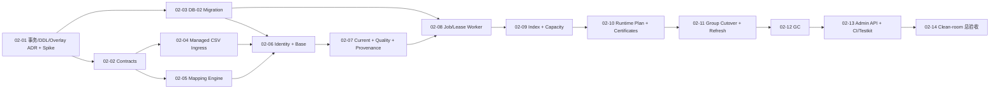

# G2-02 Materialization 可执行任务包

- 版本：1.0
- 日期：2026-08-15
- 状态：Implementation Ready，仍受本任务包 Gate、红队修订与停止条件约束
- 上游：[Ontology Kernel PRD](../product/ontology-kernel-prd.md)
- 实现蓝图：[G2 生产实现蓝图](../product/ontology-kernel-implementation-blueprint.md)
- 入口证据：[G2-01-12 Metadata clean-room 总验收](../evidence/g2-01-12-clean-room-metadata-gate.md)
- 交付容量：[G2 Owner 与容量矩阵](g2-owner-capacity-matrix.md)
- 风险审查：[G2-02 任务包红队](../reviews/g2-02-task-pack-red-team.md)
- Gate 目标：通过真实 OIDC Admin API、S3-compatible Storage、PostgreSQL 16、API 与独立 Worker，把受管 UTF-8 CSV Snapshot 可恢复地物化为不可见 Object/Link Generation，并在验证通过后原子切换 Runtime Activation
- Gate 之后：只有 PASS 才创建 G2-03 Query + Policy 任务包

## 1. 这阶段到底做什么

G2-02 建立 Ontology Kernel 的数据运行面，但不建设完整数据平台。它接收已经准备好的文件，按照 Published Snapshot Schema 与 Mapping Revision 生成通用 Object/Link 事实、Current Projection、索引和最小血缘，再把完整 Snapshot Group 一次性切换为新活动代。

完成后应能从真实入口执行：

```text
OIDC Owner / Editor
→ Create managed upload session
→ Upload and finalize an immutable UTF-8 CSV Snapshot
→ Validate Snapshot Schema + Mapping + SHA-256
→ Enqueue a durable Materialization Job
→ Worker lease + SCAN/MAP/VALIDATE/BUILD_STAGE/BUILD_INDEX
→ Produce an invisible, measured Generation
→ Owner activates a READY Snapshot Group
→ Create immutable Runtime Activation + Members
→ Atomically move Serving Head / active Channel when applicable
→ Kill and restart API/Worker without duplicate facts or pointer drift
```

这不是页面演示，也不是把 CSV 导进一张业务表的 Demo。产物使用正式 Resource Revision、Release Runtime Member Plan、公共值 Codec、永久 Object Identity、共享投影表、持久 Job/Lease、容量准入和向前 Migration。G2-03 的 Query API 尚未存在，因此本 Gate 通过受信 Repository/协议 Harness 证明活动 Activation 只会解析到完整旧代或完整新代；真实 HTTP Query 在 G2-03 复跑同一组向量。

## 2. 范围冻结

### 2.1 本 Gate 必须实现

- 受管本地上传：客户端文件通过短期上传会话进入平台管理的 S3-compatible Bucket，最终注册为不可变 UTF-8 CSV Snapshot；
- 显式 `snapshot_schema` 与 `mapping` Resource 合同、严格 Parser、Golden Fixture、确定性 Digest 与 Published Revision；
- Mapping V1 首切片：列选择/重命名、常量、简单类型转换、字符串拼接、Object Primary Key、Link 两端 Key Mapping、null 与质量阈值；
- Dataset Snapshot、Snapshot Group、Generation、Object Identity、Object/Link Base、Object/Link Current、最小 Provenance、Rejected Row Set 与 Materialization Report；
- PostgreSQL 持久 Job、Attempt、Lease、Heartbeat、Fencing、Checkpoint、Retry、Cancel、有限脱敏错误样本和独立 `apps/worker`；
- Release Runtime Member Plan、Runtime Activation Member、服务器生成的 Generation Compatibility Certificate，以及首成员 Release 和同 Release 数据 Refresh 两条激活路径；
- Shared Projection 的固定索引、Published Index Plan、Source Forecast、实测字节、容量审批和一 data-bearing Project 上限；
- Snapshot Group 的原子 Cutover、并发 Publish/Refresh CAS、失败后旧代继续服务，以及 Overlay 未落地期间的 fail-closed 兼容边界；
- Generation/Index 的 mark-plan-commit GC、最近成功代与最短保留窗、孤儿 Staging 清理和陈旧计划拒绝；
- 真实 PostgreSQL 16、S3-compatible Storage、OIDC、HTTP、API/Worker 重启、故障注入、100k Objects/1m Links 性能和 clean-room Evidence。

### 2.2 本 Gate 的渐进能力

| 能力     | G2-02 生产支持                                                      | 后续补齐                                     |
| -------- | ------------------------------------------------------------------- | -------------------------------------------- |
| 文件格式 | UTF-8 CSV；不接受压缩包                                             | NDJSON、Parquet 在 P0-A                      |
| Source   | 本地文件经受管上传会话进入平台 Bucket                               | 任意 S3 引用、Connector、CDC 在 P0-A/P1      |
| Schema   | 客户端提交并由服务器严格校验的显式 Schema                           | 抽样推断 + 用户确认在 P0-A                   |
| Mapping  | select/rename/constants/simple cast/string concat/key/link endpoint | 注册确定性 Function 与更完整 Mapping 在 P0-A |
| 数据变换 | 单输入、逐行、确定性、无副作用                                      | Join、窗口、聚合、复杂清洗属于 Data Module   |
| Current  | Base-only 生产路径；Overlay 状态必须被证明为空                      | PostgreSQL Overlay/Conflict 在 G2-04         |
| 激活验证 | Repository/Activation Harness + Admin API                           | 真实 Query API 在 G2-03                      |
| 运维     | Job 状态、报告、容量与 GC 最小管理入口                              | 完整 Health/告警/审计/恢复在 G2-06/07        |

“本地上传”表示用户选择本机文件后上传到受管对象存储，不表示 Worker 可以读取任意本地路径。G2-02 不接受请求提供的任意 Endpoint、Bucket、文件路径、SQL、代码或凭据。

### 2.3 明确不做

G2-02 不实现：

- 数据库/SaaS Connector、CDC、通用 SQL Pipeline、调度器、编排画布或完整 Data Lineage 产品；
- NDJSON、Parquet、外部任意 S3 Object Reference、Schema 自动推断或压缩文件；
- Join、窗口、聚合、用户 SQL、自定义代码和未登记 Function；
- Runtime Get/Search/Traversal/Count、Cursor、Aggregate 或业务 Policy；
- Action、Preflight、Overlay Fact、Conflict Resolution、ChangeSet、Outbox 或业务 Audit Event；
- Builder、Object Explorer、完整数据质量页面、Web、SDK 或公开 OpenAPI 兼容冻结；
- 多 Region、分布式计算、跨无关 Snapshot Group 的分布式事务或超过一个 data-bearing Project；
- PITR、对象存储灾难恢复、生产告警和 Internal Alpha 声明。

若某个验收需要以上能力，必须使用本任务包定义的受限 Port/Harness 或明确延后到拥有 Gate；不得把下游表、Endpoint 或通用队列临时塞进 Materialization。

## 3. 可实施设计边界

### 3.1 包与依赖方向

计划新增的正式 Workspace 边界为：

```text
apps/api                              composition root + admin HTTP adapters
  ├── @ontos/materialization-application
  ├── @ontos/materialization-postgres
  └── @ontos/materialization-object-storage

apps/worker                           lease loop + graceful shutdown
  ├── @ontos/materialization-application
  ├── @ontos/materialization-postgres
  └── @ontos/materialization-object-storage

@ontos/materialization-application   use cases + ports + orchestration
  ├── @ontos/materialization-domain
  ├── @ontos/object-runtime-domain
  └── @ontos/contracts

@ontos/materialization-domain        snapshot/mapping/job/report state
  ├── @ontos/object-runtime-domain
  ├── @ontos/contracts
  └── @ontos/value-codec

@ontos/object-runtime-domain         identity/generation/current/cutover invariants
  ├── @ontos/contracts
  └── @ontos/value-codec

@ontos/materialization-postgres      repositories + transaction adapters
@ontos/materialization-object-storage managed S3 + streaming CSV adapters
```

Domain/Application 不导入 PostgreSQL、S3 SDK、HTTP、OIDC、文件系统或环境变量。Object Storage Key、PostgreSQL 行和 Worker Lease 不成为公共 API 类型。`apps/api` 与 `apps/worker` 不能导入对方，也不能用内存队列协调。

动态 Property 索引由 G2-02-01 验证并冻结的 **Projection DDL Executor** 执行。它属于受信部署边界，不是 API/Worker Library：只消费服务器编译并持久化的规范 Index Plan ID/Digest，不接受客户端 SQL/Identifier，不把迁移身份交给 API/Worker，也不进入 Publish/Cutover 事务。若 PostgreSQL 16 Spike 无法同时满足 `CREATE/DROP INDEX CONCURRENTLY` 与最小权限，本 Gate 在 G2-02-01 停止。

### 3.2 DB-02 是逻辑波次，不重写 Migration 历史

当前 Migration Runner 已使用 `migrations/db-00/0001...0006` 的单一连续账本。G2-02 继续从 `0007` 增加只向前 Migration，并在文件名/文档标注逻辑 DB-02 波次；不移动、改名或重算已应用文件。实现可把代码常量 `db00MigrationDirectory` 改为中性名称，但不得创建第二本无法统一校验的 Migration 账本。

蓝图把通用 Job/GC 概念列在 DB-04，但 G2-02 的交付与退出条件已经依赖 Job/Lease、Kill/Resume 和孤儿 Staging GC。因此 G2-02 只前移 Materialization 必需的通用 `ops.jobs`、Attempt、Checkpoint、Error Sample 和 GC Run/Plan 子集，严格复用 ADR-010 Job 语义；DB-03/04 后续扩展 Job Kind、Outbox、Audit 与更多 GC Root，不替换本表、不引入第二套队列。G2-02 不前移 Outbox、Action 或完整 Audit。

### 3.3 DB-02 表责任

G2-02-01/03 冻结列级设计；以下表责任和不可变边界已经固定：

| Schema    | 表责任                                                       | 关键不变量                                                                                        |
| --------- | ------------------------------------------------------------ | ------------------------------------------------------------------------------------------------- |
| `meta`    | Release Runtime Member Plans                                 | 从不可变 Release Pins 派生；同一 Release 不因 Refresh 改 Plan                                     |
| `meta`    | Runtime Activation Members                                   | Activation 内完整成员集合不可变；成员只指向 READY/ACTIVE Generation                               |
| `runtime` | Snapshot Groups / Dataset Snapshots / Snapshot Files         | Source、Hash、Schema、Mapping、目标与前序不可变；生命周期只前移                                   |
| `runtime` | Generations / Compatibility Certificates                     | Generation 绑定 Project、Member Revision、Snapshot Group Version 和 Mapping；证书只能由服务器生成 |
| `runtime` | Object Identities                                            | `(project, object type, canonical primary key)` 永久映射到稳定 RID；并发唯一                      |
| `runtime` | Object/Link Base                                             | 按 Snapshot/Generation append-only；不被 Action 或 Refresh 原地覆盖                               |
| `runtime` | Object/Link Current / Object Heads                           | 使用 ADR-008 共享键；Staging 不可被 Serving Head 解析；只对业务变化更新 Head                      |
| `runtime` | Provenance / Rejected Row Sets / Reports                     | 受限结构、内容摘要与 Artifact Reference；普通错误不保存或回显敏感原值                             |
| `runtime` | Index Plans / Entries / Inventory / Measurements / Approvals | 计划与实际库存分离；测量只由受信 Scanner 写；硬上限不可审批突破                                   |
| `ops`     | Jobs / Attempts / Checkpoints / Error Samples                | Lease fencing；Checkpoint 幂等；终态不可伪装成功；样本数量和内容有界                              |
| `ops`     | GC Runs / Plans                                              | Dry-run 绑定完整 Inventory Revision；Commit stale 时拒绝                                          |

所有正式对象仍由 `migration_owner` 创建。`api_runtime` 只获得管理 Use Case 所需的列级权限；`worker_runtime` 只获得领取/续租 Job、写自己 Fencing Token 对应的进度和构建 Staging 所需权限；`read_only_ops` 只读脱敏运维状态。三者均无 `DELETE`、`TRUNCATE`、`ALTER`、任意 DDL 或切换 `migration_owner` 的能力。

DB-01 已存在的 metadata-only `A0(member_count=0)` 必须原样保留。Migration 只能前向增加成员结构并安全放宽“未来 Activation 必须为零成员”的旧约束；不能更新 A0/R1、伪造空 Generation 或改变历史 Manifest。最终成员计数、Digest 与 Member 行必须在同一事务的数据库最终状态中一致，并有故障注入与非 Owner 负测。

### 3.4 Snapshot、Mapping 与质量合同

- 上传完成前对象不可注册为 Snapshot；Finalize 以服务端流式 SHA-256、实际字节数、CSV 物理校验和对象版本为准，不信任客户端声明；
- 相同内容 Hash + Mapping Revision + Target + Runtime Plan 的注册键唯一，重复请求返回同一 Snapshot/Job/Generation 结果；
- Mapping 是版本化受限 AST，不是 SQL 或脚本。所有 integer/decimal/date/timestamp/enum/string/json 与 Primary Key 转换调用 `@ontos/value-codec`；
- Primary Key null/duplicate、required Property 转换失败、required Link 悬空门槛均为 0；optional Link/Property 默认 0.1%，但整行进入 Rejected Row，不把错误值变成业务 null；
- 行数相对前序 Snapshot 超出 Mapping 中的显式阈值时进入 `AWAITING_CONFIRMATION`，只有 Owner 的绑定 Snapshot/Report Digest 的确认可以继续；
- Report 保存总数、通过/拒绝数、稳定原因码、按原因聚合和有限脱敏样本；完整失败输入仍在受控对象存储，不进入 Log、Metric Label 或普通 API Error；
- 每个 Current Property Value 至少指向 Snapshot、文件、输入列、Mapping Revision 与算法版本；G2-02 不生成完整转换 DAG。

### 3.5 Job、Staging 与恢复

```text
QUEUED → LEASED → SCAN → MAP → VALIDATE → BUILD_STAGE
       → BUILD_INDEX → READY_FOR_ACTIVATION → CATCH_UP → ACTIVATE → SUCCEEDED
                   \→ RETRY_WAIT / FAILED / CANCELLED
```

- Worker 通过 PostgreSQL `FOR UPDATE SKIP LOCKED` 领取 Job；Lease Owner、Fencing Token、Expiry、Heartbeat 和 Attempt 均持久化；
- 每个阶段只在输出完整、Digest/计数已校验后提交 Checkpoint；未完成 Attempt 的临时输出不能被下次 Attempt 当成成功输出；
- 旧 Worker 在 Lease 失效后即使恢复网络，也不能用旧 Fencing Token 写进度、标 READY 或激活；
- Retry 复用同一 Job Identity，但每次 Attempt 和 Staging Ownership 可区分；重复消息、响应丢失或进程重启不得产生第二份活动 Generation；
- Cancel 在安全点生效；进入 Cutover 短事务后不接受取消，结果只能是事务全提交或全回滚；
- Worker 不拥有 Serving Head 的任意写权限。激活只能调用受控 Repository 事务，并重验 READY、证书、容量、期望旧 Activation 和控制序号。

### 3.6 Runtime Plan、激活与刷新

G2-02 必须同时证明两条路径：

```text
Definition publish:
R1 + empty plan + A0
  → R2 + immutable first-member plan
  → build all planned Generations
  → A1(members) + publish R2 atomically

Data refresh:
R2 + same immutable plan + A1
  → build replacement members for one Snapshot Group
  → A2(same plan, refreshed generations) atomically
```

- 首个 Runtime Member 必须通过新 Release R2 加入；R1/A0 不变；
- 同 Release Refresh 只能替换既有 Plan 中 Snapshot Group 的 Generation，不能增加/删除 Member 或改变 Schema/Mapping Revision；
- 定义发布只有在全部计划 Member 具有服务器签发且仍有效的 READY Compatibility Certificate 后才能 Publish；
- 数据 Refresh 沿用目标 Release，创建新 Activation，并只在目标 Release 当前为活动 Channel 时同步切换该 Channel；Serving Head 始终切到同 Release 的新 Activation；
- 仍在支持窗内的 Release 由刷新协调器显式枚举：兼容计划可复用 Generation，不兼容计划分别构建；一个旧 Release 失败不得污染其他 Release，但必须报告数据落后；G2-02 只实现显式 Admin Refresh，不实现定时调度器；
- Snapshot Group 中 Object Types 与 Base Links 同事务换代；无关 Group 不承诺分布式原子切换。

### 3.7 Overlay 尚未实现时的诚实边界

G2-04 才拥有 PostgreSQL Overlay/Conflict/Action 表。G2-02 不伪造这些表，也不宣称完整通过 AC-03。为避免未来重写 Cutover，G2-02 必须冻结并实现版本化 `OverlayInventoryPort` 与 `OverlayDeltaReader`：

- G2-02 的生产 Adapter 只在受信库存证明 `W0=W1=0` 时允许激活；库存未知、Provider 缺失或发现非零 Overlay 一律 fail closed；
- 对抗性测试 Adapter 在 `W0` 后注入 Delta，证明排序锁、`W0..W1` 重放、Head 条件更新和失败回滚算法；
- Evidence 明确标记为“生产 Base 原子性 + Overlay 合同/算法证据”，不能写成“真实 PostgreSQL Overlay 集成通过”；
- G2-04 接入正式 Overlay Store 后必须复跑 AC-02 的 Catch-up 条款和完整 AC-03，才能移除 zero-overlay 生产限制。

### 3.8 Index、容量与 DDL 信任边界

- 每个 Published Object Type Revision 编译 ADR-008 Index Plan；只允许声明的类型化 Recipe 和确定性名称，禁止全局 JSONB GIN 与“全部 Property 自动索引”；
- Build 前以 G1 外推、Source Forecast、当前完整库存中的较大风险值做准入；Build 后以实际 Heap + Index bytes 和 Inventory Revision 二次准入；
- 一 data-bearing Project、单 Release 2/3 GiB、Project steady 8 GiB、normal peak 10 GiB、hard peak 12 GiB、Index Units/数量和审批最长 30 天的边界保持不变；
- `measurementComplete`、Index Inventory 和 Root Scan 只能由受信扫描器产生；未知即拒绝，不允许请求参数自称完整；
- Dynamic DDL 不在 Materialization、Publish 或 Cutover 事务中执行；DDL Executor 对计划 Digest、目标表/Revision Predicate、实际 `pg_indexes` 定义和结果 Hash 做双向核验；
- API/Worker 运行身份无法直接或间接提交 Raw SQL、任意 Identifier、`CREATE/DROP INDEX`、`SET ROLE` 或复用 DDL Executor 凭据。

### 3.9 GC 与未来 Root Provider

G2-02 只回收它能完整证明无引用的 Generation、派生行、失败 Staging 和不再需要的 Index Signature。当前权威根包括 Channel、Serving Head、支持窗、Active Job、最近两个成功非活动代和最短 7 天 Grace。

Preflight、Query Lease、Investigation Hold、Historical Action/ChangeSet/Artifact 等后续 Root 使用版本化 Provider Registry。只要某个已激活能力的 Root Provider 缺失、失败或版本不匹配，GC 返回 `GC_REFERENCE_SCAN_INCOMPLETE` 且 Candidate 为空。后续 Gate 增加 Provider 和复跑 GC；不得因表尚不存在就把未来根永久解释为“不需要扫描”。GC 不使用 `CASCADE`，DDL Drop 仍经过受信 Executor。

## 4. 工作包依赖与规模



规模仍用理想工程日：S = 1–2 天，M = 3–5 天，L = 5–8 天。当前只有一条有效工程通道，任务按依赖顺序合并；同一任务内测试、红队与 Evidence 跟随实现，不形成第二条业务开发线。

经 G2-02 任务包红队后，蓝图/旧矩阵的 4–6 工程周调整为 **7–11 工程周的单通道规划范围**。这不是日期承诺；G2-02-03 完成真实 A0→首成员 Schema 薄切片、G2-02-06 完成 10k Object/100k Link 数据薄切片后必须各重估一次。不能通过删除恢复、DDL 隔离、容量或原子性 Gate 维持日期。

## 5. Why–What–Acceptance 工作项

### G2-02-01：冻结 Materialization 事务、DDL Executor 与 Overlay Seam

- 规模：M
- 建议 Owner：Tech Lead / Database / Security
- 依赖：G2-01 PASS

**Why**

G2-02 同时跨越 Release Publish、Snapshot Cutover、动态索引、Worker Lease 和未来 Overlay。若先建表再处理 DDL 权限、A0 兼容或锁顺序，最可能得到的是需要 Owner Worker、重写历史 Activation 或无法接入 Action 的死路。

**What**

形成 ADR-014 与纯状态/真实 PostgreSQL 16 Spike，冻结逻辑 DB-02 表边界、单一 Migration 账本、Runtime Plan、激活事务、全局锁顺序、Job/GC 前移范围、Projection DDL Executor 信任边界，以及 zero-overlay 生产 Adapter 与未来 Delta Reader 协议。

**Acceptance Criteria**

- ADR 逐项解释本任务包 §3 的表所有权、事实/控制状态、事务边界、错误恢复和后续 DB-03/04 扩展方式；
- 真实 PostgreSQL 16 Spike 证明 DDL Executor 能从规范 Plan 创建/复用/核验/删除 `CREATE/DROP INDEX CONCURRENTLY` 索引，API/Worker/Ops 登录均不能执行 DDL、提交 Raw SQL、切换 Owner 或读取 Executor Secret；
- DDL Executor 进程被终止、同一 Plan 重放、数据库已有同名异定义索引和陈旧 Plan 时分别得到幂等成功或稳定 fail-closed 结果；
- 状态 Harness 通过 `R1/A0(empty) → R2/A1(first members) → R2/A2(refresh)` 与并发 R3 Publish，R1/A0、Release Pins、Runtime Plan 和历史 Activation 全程不变；
- 冻结 Publish/Refresh/Cutover/GC 的单调锁顺序与 CAS 字段，并用逆序拒绝、并发双 Refresh、Publish 对 Refresh、GC 对 Cutover 场景证明无静默覆盖；
- Overlay Port 测试覆盖 zero、unknown、non-zero、`W0` 后注入、Provider 失败；只有受信 zero 可走 G2-02 生产激活；
- 明确 `migrations/db-00/0007+` 是逻辑 DB-02 的连续历史，不移动 0001～0006；
- 若安全 DDL 必须把 `migration_owner`/表 Owner 凭据放入 API/Worker、必须接受任意 SQL，或首成员需要修改 A0/R1，本任务 FAIL，停止 G2-02-02/03。

### G2-02-02：冻结 Snapshot、Mapping、Generation 与 Job 模块合同

- 规模：L
- 建议 Owner：Contracts / Data Runtime
- 依赖：G2-02-01

**Why**

Snapshot Hash、Mapping AST、Generation Member 和 Job Checkpoint 一旦落库，就会被 Release、Query、Action、SDK 和恢复流程长期引用。若只有数据库 JSONB 或 Worker 私有类型，跨模块会在值语义、幂等键和错误上漂移。

**What**

在 `@ontos/contracts` 激活 `snapshot_schema` 与 `mapping` Family，增加 Snapshot、Group、Mapping AST、Materialization Job/Report、Generation、Runtime Member Plan、Compatibility Certificate、Index/Capacity、GC Plan 的严格 Schema、Runtime Parser、Catalog、Golden Fixture 和稳定错误合同。

**Acceptance Criteria**

- `snapshot_schema`、`mapping` 从 deferred 变为 G2-02 active；直接 Resource API 与 Package 展开器都只能通过同一 Family Registry/Parser；
- Parser 拒绝未知字段、宽松日期/数字、任意 SQL/代码/路径/Endpoint/Credential、Join/Window/Aggregate 和未激活 Function；
- Mapping AST 只表达本任务包允许的逐行确定性操作，并引用 `@ontos/value-codec` 的 Type/Primary Key 语义；不得复制 Codec 实现；
- Snapshot/Job/Generation/Activation/GC 状态均有合法和非法转换、Terminal 不可复活、Digest 规范化与版本兼容测试；
- Idempotency Key 明确包含内容 Hash、Mapping Revision、目标 Member/Runtime Plan，不使用 Display Name、上传时间或数据库默认顺序；
- Compatibility Certificate 只能表示服务器已验证的 Snapshot Schema、Mapping、Target Revision、Index Plan、Generation Digest 和 Validator Version；请求不能提交“已兼容”布尔值；
- Golden Fixture 覆盖 Object、Link、组合 Snapshot Group、optional rejection、required failure、相同输入稳定 Digest 和所有稳定 Error Code；
- Foundation 合同 Manifest 与 Breaking-change Gate 更新；HTTP OpenAPI/SDK 字段仍不在本任务冻结为公开兼容承诺。

### G2-02-03：实现逻辑 DB-02 前向 Migration 与最小权限

- 规模：L
- 建议 Owner：Database / Runtime
- 依赖：G2-02-01、G2-02-02

**Why**

G2-01 的零成员 Activation、Migration Hash 和 Runtime Role 已是正式历史。DB-02 必须增加数据运行表而不改旧记录，并在数据库层阻止 Staging 泄露、伪造证书、越权更新和孤儿 Member。

**What**

从 `0007` 开始实现 §3.3 的表、约束、索引、Trigger/受控函数和显式 Grant；演进 Migration Runner 的中性命名但保留一套连续账本。提供空库、G2-01 已部署库、并发迁移和向前修复运行手册。

**Acceptance Criteria**

- 同一提交在全新 PostgreSQL 16 和停在 0006 的 G2-01 数据库均升级成功；重复运行 no-op，0001～0006 名称/Hash/账本不变；
- 预置 R1/A0 后升级，A0 仍为零成员且逐列/逐 Digest 不变；新 R2/A1 可以在单事务建立非零 Member，成员数/Digest/Release/Generation 跨 Project 错配被数据库拒绝；
- Shared Object/Link Current 键、Canonical PK、Link Endpoint、Generation/Revision 和 Project 复合约束与 ADR-008/009 一致；无每类型、每 Release 或每领域表；
- Snapshot、Base、Identity、Report、Plan、Certificate、Job Checkpoint 和 Activation Member 的不可变/受控可变边界有 Trigger/权限负测；
- `api_runtime`、`worker_runtime`、`read_only_ops` 使用真实非 Owner 登录完成允许和拒绝矩阵；三者不能 DDL、删除事实、写 Migration 账本或绕过 Fencing；
- 用两个真实 `worker_runtime` 登录完成最小 `QUEUED → LEASED → one staged batch → CHECKPOINT` Smoke：Lease 过期后第二 Worker 接管，第一 Worker 的旧 Fencing Token 不能再写；Checkpoint 前后 Kill 均不把半批输出当成完成；
- 每个 Migration 中途故障整批回滚；已提交语义错误只能用更高版本向前修复；
- 两个 Migration Runner 并发仍只有一套完整结果；数据库领先、文件缺号、Hash 漂移继续 fail closed；
- 完成 `A0 → R2 Runtime Plan → one READY empty Generation → A1` 数据库薄切片后，更新容量矩阵和实际返工记录；未完成不开始 G2-02-04。

### G2-02-04：实现受管 UTF-8 CSV Snapshot Ingress

- 规模：L
- 建议 Owner：Data / Security
- 依赖：G2-02-02、G2-02-03

**Why**

让 Worker 读取任意路径、Bucket 或客户端声明的 Hash 会形成 SSRF、路径穿越、凭据和完整性旁路；把大文件塞进普通 JSON 请求也无法可靠重试或限流。

**What**

实现短期上传会话、平台受管 Object Key、S3-compatible 版本化对象、流式 Finalize、CSV 物理扫描、不可变 Snapshot/File 注册和安全清理。生产只接受未压缩 UTF-8 CSV 与显式 Schema。

**Acceptance Criteria**

- 上传会话绑定 Actor、Project、允许媒体类型、最大字节、过期时间、随机受管 Key 和一次性 Finalize Token；客户端不能指定 Bucket、Host、绝对/相对路径或服务端 Credential；
- Finalize 从 Object Storage 重新读取对象版本并流式计算 SHA-256/字节数；客户端 Hash 只用于比较，不能成为服务器事实；
- UTF-8 BOM、换行、引号、转义、列数、Header 重复、NUL、过长单元格、超行/列/文件上限和截断上传均有固定行为；G2-02 明确拒绝压缩、NDJSON、Parquet 和伪装媒体类型；
- Object 不存在、版本变化、Session 过期、重复 Finalize、响应丢失和 API 重启分别得到稳定错误或同一 Snapshot 结果；
- Snapshot File 保存受管 Object Version、Digest、Size、Row Count/扫描状态和 Source Label，不保存 Presigned URL、Secret 或任意用户路径；
- 未 Finalize/失败对象有有界保留和清理计划；清理不删除已注册 Snapshot 引用的 Object Version；
- 真实 S3-compatible Integration 覆盖上传中断、Storage 暂停/恢复、错误 Hash、并发 Finalize和 API 重启；已物化数据在 Storage 不可用时不受影响；
- Log、Metric、Error Envelope 不包含文件内容、Presigned URL、Token、Primary Key 或自由文本样本。

### G2-02-05：实现确定性 Mapping 编译与流式执行

- 规模：L
- 建议 Owner：Data Runtime / Contracts
- 依赖：G2-02-02、G2-02-04

**Why**

Mapping 是外部数据进入 Object Identity 的唯一解释层。若允许 DuckDB/PostgreSQL 隐式 Cast、用户 SQL 或不稳定函数，同一 Snapshot 重跑会产生不同 RID、Current Value 或错误结果。

**What**

实现 Mapping AST Validator/Compiler、DuckDB/流式 CSV Scan Adapter 与纯确定性 Row Evaluator。Object 与 Link Mapping 共用公共 Codec、规范 Key 和结构化错误；不把用户输入拼成 SQL。

**Acceptance Criteria**

- 支持列选择/重命名、常量、简单显式 Cast、字符串拼接、null 规则、Object PK 和 Link Source/Target Key；未列入 allowlist 的节点稳定拒绝；
- integer/decimal/date/timestamp/enum/string/string[]/json 和 PK 通过 `@ontos/value-codec` Golden Vector；DuckDB/PostgreSQL 不能另行宽松转换；
- Compiler 输出包含 Compiler Version、Input Schema Digest、Mapping Revision Digest、Target Revision 和规范 Plan Digest；相同输入跨进程/重启结果逐字节一致；
- CSV 行号/列名只作为有界定位信息；Value、完整 PK 和敏感列不进入普通错误。错误按稳定 Codec/Mapping Code 聚合；
- Object 先生成 Canonical PK Candidate；Link 两端只输出受控 Identity Lookup，不把 Display/API Name 当身份；
- 固定种子 property-based 测试覆盖 null、Unicode、64-bit、decimal scale、时区、拼接边界、碰撞和 1,024-byte PK；
- 同一 Snapshot/Mapping 连续执行两次，Mapped Stream Digest、接受/拒绝计数、每行结果与错误顺序完全一致；
- Source 行数和内存测试证明执行为有界流式处理，不把整个 100k/1m 文件读入 Node Heap；无法保持有界时停止并先修 Reader/批次模型。

### G2-02-06：实现永久 Object Identity 与不可变 Object/Link Base

- 规模：L
- 建议 Owner：Runtime / Database
- 依赖：G2-02-03、G2-02-04、G2-02-05

**Why**

相同业务对象跨 Snapshot/Generation 必须保持同一 RID，同时不同代的 Base 事实必须可追溯且不可覆盖。若身份依赖行号、时间或当前 Release，Refresh 会变成重复对象或历史丢失。

**What**

实现 Object Identity Repository、批量 Resolve/Create、Object Base 与 Link Base 的不可变写入、Generation Staging Ownership 和 10k Object/100k Link 的首个真实数据薄切片。

**Acceptance Criteria**

- `(project, object type resource, canonical PK)` 唯一映射到稳定 Object RID；同一对象跨两个 Snapshot/Generation RID 不变，不同 Project/Type 隔离；
- 批内 PK Collision 在写库前被发现；并发 Worker 的数据库 `23505` 被映射为稳定身份冲突或同一合法 RID，不泄露 SQL/PK；
- Object/Link Base 包含 Snapshot、Generation、Target Revision、RID/Endpoints、规范值 Digest 和 Provenance Ref；创建后 API/Worker 均不能 UPDATE/DELETE；
- Link Source/Target 必须解析到同 Project、正确端点 Object Type 的 Identity；required/optional 悬空交由质量规则处理，不创建假对象；
- Attempt 中断留下的数据只归属于不可见 Staging/Attempt；重试不会把半成品计作完整 Generation，也不产生第二套身份；
- 使用两个不同领域的确定性 Fixture 证明相同 Kernel 表/代码工作，无领域列、领域表或 Package API Name 分支；
- 10k Object/100k Link 从上传到 Base 完成，记录吞吐、批次、WAL、Heap、索引和 Node 内存；API/Worker 各重启一次后结果 Digest 不变；
- 完成后根据实际吞吐和返工更新 7–11 周规划；若外推无法接近 30 分钟基线，先优化批次/COPY/索引策略，不继续堆 Cutover。

### G2-02-07：实现 Staging Current、质量报告与最小血缘

- 规模：L
- 建议 Owner：Runtime / Data Quality
- 依赖：G2-02-06

**Why**

Base 写成功不等于可服务。系统必须在不可见 Generation 中得到完整 Current、质量结论和来源证据，且任何坏行或阈值例外都不能静默变成 null 或泄露到活动代。

**What**

从 Base-only 生产路径构建共享 Object/Link Current、Object Heads Candidate、Provenance、Rejected Row Artifact 和不可变 Materialization Report；实现 required/optional/row-count 质量门槛与 Owner Confirmation 状态。

**Acceptance Criteria**

- Staging Current 使用 ADR-008 共享表键并绑定 Generation/Revision；任何 Serving Head/Activation Resolver 在 READY 前均无法返回该 Generation；
- zero-overlay 生产 Adapter 下 Current 等于已接受 Base；Overlay Inventory unknown/non-zero 时 Build 或 Activate fail closed，不把 Base 当作覆盖结果；
- PK null/duplicate、required conversion、required dangling Link 任一非零即失败；optional 默认 0.1%，通过阈值的错误整行 Rejected；
- optional Property 错误不会写业务 null；Rejected 行导致 required Link 悬空时仍按 required Link 失败；
- 行数异常只进入 `AWAITING_CONFIRMATION`，确认记录绑定 Actor、Snapshot/Report Digest、阈值和过期控制序号；输入变化后旧确认无效；
- Report 的总数、接受/拒绝、原因聚合、Hash 与固定样本顺序可重跑一致；样本按列分类脱敏且受数量/字节硬上限；
- 每个 Current Property 可解析到 Snapshot/File/Input Column/Mapping Revision/Algorithm Version；缺失 Provenance 的 Generation 不能 READY；
- 坏 Snapshot、质量失败、确认拒绝和构建中断均保持旧 Activation/Generation 完整，普通 Resolver 不出现新行；
- 真实 PostgreSQL 查询证明只按 `(project, generation, member revision)` 读取 Candidate，无跨 Project/Generation 泄露和无解释全表扫描。

### G2-02-08：实现 PostgreSQL Job/Lease Worker 与 Kill/Resume

- 规模：L
- 建议 Owner：Backend / Platform
- 依赖：G2-02-03、G2-02-07

**Why**

Materialization 横跨对象存储、长批次和多个数据库事务，不可能依靠一次 HTTP 请求安全完成。没有持久 Lease、Fencing 和阶段 Checkpoint，进程崩溃会造成重复构建、双激活或只能人工清库重跑。

**What**

落地 ADR-010 的通用 Job 子集和独立 `apps/worker`，实现领取、Heartbeat、Fencing、Attempt、Checkpoint、Retry Backoff、Cancel、Terminal、Graceful Shutdown 与每阶段故障恢复。

**Acceptance Criteria**

- 两个 Worker 并发领取同一队列时一个 Job 同时只有一个有效 Lease；`SKIP LOCKED` 不造成永久饥饿，排序与租约上界固定；
- Heartbeat/Expiry 使用数据库时间；旧 Owner、旧 Attempt 或旧 Fencing Token 的任何进度、Checkpoint、READY 和 Activate 写入均被数据库拒绝；
- SCAN、MAP、VALIDATE、BUILD_STAGE、BUILD_INDEX、READY、CATCH_UP、ACTIVATE 前后分别 Kill 进程，重启后从最后完整 Checkpoint 恢复并得到同一最终 Digest；
- 响应丢失、重复领取、数据库短断、S3 短断、Lease 过期、Worker Graceful Shutdown 和 API 重启均不会重复激活或暴露半成品；
- Retryable/terminal 错误有固定分类、最大 Attempt、指数退避和人工重试入口；输入/合同错误不能无限重试；
- Cancel 在安全点产生 `CANCELLED` 并留下可 GC Staging；Cutover 已开始时返回不可取消并等待事务结果；
- Error Sample 数量/单项/总字节有硬上限并脱敏；Job/Metric Label 不含 PK、行内容、文件 Key、Token 或 SQL；
- `apps/worker` 使用 `worker_runtime`，无 HTTP Bearer、OIDC Admin 身份、Migration/DDL 凭据或 Serving Pointer 任意写权限；
- 进程级 Integration 不是只调用 Domain 函数：测试真实启动/终止 Worker PID、租约过期、另一个 Worker 接管和 PostgreSQL 已提交结果。

### G2-02-09：实现 Index Plan、容量准入与受信 DDL 执行

- 规模：L
- 建议 Owner：Runtime / Database / Platform
- 依赖：G2-02-01、G2-02-08

**Why**

没有类型化索引，G2-03 Query 会在共享 JSON Projection 上退化；无容量上界则历史 Release、Staging 和索引库存会持续增长。相反，把 DDL 放进 Worker 或 Cutover 会扩大权限并让短事务失控。

**What**

把 ADR-008 的 Index Compiler、物理 Inventory、Source Forecast、二次测量、审批和 Projection DDL Executor 接入 Release Staging/Materialization；用真实 100k Objects/1m Links 做首轮容量与构建基准。

**Acceptance Criteria**

- Published Property 声明编译为规范 Index Plan；Revision Predicate、Recipe、Evidence Ref、稳定名称与预算逐项等价 ADR-008，缺 Evidence/覆盖或未知 Recipe 阻断；
- 相同物理签名跨 Release 复用；同名不同定义、Catalog/Plan 不一致、库存扫描失败或 DDL 中断均 fail closed，不“假装索引存在”；
- API/Worker 只能请求计划状态，无法提供 SQL/Identifier 或直接触发计划外 DDL；Executor 只消费已签名/持久化 Plan 并以独立最小网络与 Secret 边界运行；
- `CREATE/DROP INDEX CONCURRENTLY` 不进入 Publish/Cutover/普通 Materialization 数据事务；失败可安全重试且不把 Invalid Index 当 READY；
- Build 前使用 G1 外推、Source Forecast、当前 Serving/Recent/Protected/Staging/Orphan 完整库存重新准入；Build 后使用实际 Heap/Index bytes 与较大值二次准入；
- 强制一个 data-bearing Project、8 GiB steady、10 GiB normal peak、12 GiB hard peak、Index Units/Count 与最长 30 天审批；硬上限和不完整测量不可审批；
- 100k Objects/1m Links 在记录硬件、PostgreSQL/S3/Node/DuckDB 版本、冷/热状态、WAL、Heap、Index、内存与配置后完成首轮构建；若超过 30 分钟或 Project Peak 超硬上限，本任务 FAIL，先收紧 Plan/优化实现；
- 基准后再次从 `pg_total_relation_size`/Catalog 扫描实际库存，准入下界不能小于实测；
- 非活动 Index Drop 仅生成待执行计划，直到 GC 证明所有引用消失；本任务不提前删除。

### G2-02-10：实现 Runtime Member Plan 与受信兼容证书

- 规模：L
- 建议 Owner：Metadata / Runtime
- 依赖：G2-02-02、G2-02-09

**Why**

Release 定义了“应该服务什么”，Generation 证明“已经构建了什么”。若只凭客户端 Generation ID 或一个 `ready=true` 发布，Release 可能绑定错误 Schema、Mapping、Snapshot Group 或索引计划。

**What**

扩展 Metadata Release Validate/Stage，服务器从 Published Pins 派生不可变 Runtime Member Plan，协调需要的 Materialization，并为完整 Generation 生成绑定 Digest 的 Compatibility Certificate。实现首成员、复用和支持窗内多 Release 刷新计划。

**Acceptance Criteria**

- Runtime Plan 只由服务器从 Release 的 Object/Link/Snapshot Schema/Mapping Pins 与 Snapshot Group 定义派生，排序和 Digest 确定；请求不能提交 Member 列表或 Plan Digest 作为事实；
- R1 空 Plan/A0 保持不变；加入首 Member 必须新建 R2；同 R2 Refresh 的 Member Key/Revision/Mapping/Group 集合与 Plan 完全相同；
- Certificate 绑定 Project、Release Plan、Member Revision、Generation、Snapshot/Group Version、Mapping、Index Plan、质量报告、容量测量和 Validator Version；任一变化使旧证书失效；
- Release 只有全部 Member READY 且证书有效时才能 READY/PUBLISHED；一个失败 Member 不产生部分 Activation；
- 定义 Publish 可为不同 Revision 构建新 Generation；纯数据 Refresh 在兼容的受支持 Release 之间复用相同 Generation，不兼容计划分开构建；
- 显式 Refresh 协调器枚举所有受影响且仍支持的 Serving Release，逐个报告 `ready/reused/failed/stale`；一个失败不移动其他 Release Pointer；
- 伪造 Certificate、跨 Project Generation、陈旧 Inventory/Plan、已失败 Job、已过期审批或 Snapshot Digest 变化均稳定拒绝；
- Metadata-only Release、一个 Member、多个 Object + Base Link Group 和两个并存 Release 有真实 PostgreSQL 集成向量。

### G2-02-11：实现 Snapshot Group 原子 Cutover 与数据 Refresh

- 规模：L
- 建议 Owner：Runtime / Database
- 依赖：G2-02-10

**Why**

Materialization 的产品价值不在“生成了新表数据”，而在用户永远不会看到半套新 Object、旧 Link 或丢失并发修改。Cutover 必须短、可重试，并与 Release Publish、Refresh 和未来 Action 锁顺序兼容。

**What**

实现 Definition Publish 和 same-Release Data Refresh 的统一 Activation Commit：重验 Plan/证书/库存/CAS，按固定顺序取得控制锁与 Object Type advisory locks，执行 W0/W1 协议，创建不可变 Activation/Members 并原子切换 Serving Head/活动 Channel。

**Acceptance Criteria**

- Cutover 前所有网络、文件读取、大批写入、测量和 DDL 已结束；短事务只读取/锁定受控数据库事实、执行小型 Catch-up、写 Activation/Pointer/状态；
- Snapshot Group 中全部 Object/Link Member 全旧或全新；任意 Observer/Resolver 只能解析 A1 完整集合或 A2 完整集合，无交叉 Generation；
- 对每个 SQL 边界注入故障，Snapshot、Generation、Activation、Member、Serving Head、Channel、Job 和控制序号全部保持旧或全部提交；
- 双 Refresh、Refresh 对 R3 Publish、陈旧 expected Activation、陈旧 Inventory/Certificate/审批和逆序锁均返回稳定冲突，不覆盖胜者；
- zero-overlay 生产 Adapter 只有 `W0=W1=0` 才提交；unknown/non-zero 维持旧代；对抗 Adapter 注入 `W0..W1` Delta 后，候选 Current 包含全部且只包含一次重放结果；
- 只有业务值、生命周期或可见 Link 实际变化才更新 Object Head Version；纯 Provenance/Index 重建不制造业务版本变化；
- 重复 Activate 同一 Snapshot/Plan 返回同一 Activation/结果；响应丢失重试不创建第二 Activation；
- 20 次固定规模 Cutover 记录锁等待与事务耗时，P95 < 1 秒且最大 < 5 秒；超过阈值先减少事务工作，不扩大锁超时掩盖；
- `kill -9` API/Worker、PostgreSQL 连接断开和提交响应丢失后，可由幂等状态读取确定结果，不需要手工改 Pointer；
- Evidence 清楚区分 Base 生产原子性、Overlay 对抗 Port 证据和待 G2-04 的真实 Overlay 集成，不宣称 AC-03 已完成。

### G2-02-12：实现 Generation/Index mark-plan-commit GC

- 规模：L
- 建议 Owner：Platform / Database
- 依赖：G2-02-11

**Why**

不可变 Generation、失败 Staging 和按 Revision 建立的索引会累积；直接按“不是当前代”删除则可能破坏支持窗、在途 Job、历史 Activation 或未来 Action/调查引用。

**What**

实现完整 Inventory Snapshot、Root Provider Registry、保留分类、GC Dry-run、Plan Digest、陈旧检测、分阶段幂等 Commit 与 Index Drop Plan。G2-02 只回收能形成完整负面证明的内容。

**Acceptance Criteria**

- Inventory 覆盖 Serving、Recent Success、Protected、Staging、Failed Staging、Orphan、实际字节和物理索引；缺失测量/分类时 Candidate 为空；
- Channel、所有受支持 Serving Head、Active Job、最近两个成功非活动代和至少 7 天 Grace 均被保护；引用中 Generation 不能成为 Candidate；
- 未激活的后续 Root Provider 有明确 Capability 状态；已激活 Provider 缺失/失败/版本错时 `GC_REFERENCE_SCAN_INCOMPLETE`，不得按空集合继续；
- Dry-run 列出每项 Candidate/Retained/Protected 原因、预计字节、Index 影响、Inventory Revision 和 Plan Digest；普通调用方不能篡改 Candidate；
- Commit 在事务和每个物理批次前重验 Inventory/反向引用/保留窗；新增 Serving Head、Job 或生命周期变化使旧 Plan `GC_PLAN_STALE`；
- 删除顺序先不可见派生数据、再 Base/Provenance/Report/Generation 状态；不使用 `CASCADE`，不触碰任何可由 Activation 解析的行；
- Index 只有在所有 Serving/Recent/Protected/Staging 均不再需要签名时才交给 DDL Executor；Executor 失败可重试且不把数据误标为完全 Collected；
- 在每个批次 Kill 进程并重试，最终结果与一次完成相同；部分 GC 不破坏旧代读取 Harness、容量总账或后续计划；
- 孤儿上传、Attempt Staging 与失败 Generation 使用各自保留策略；GC API 不成为任意 Object Key 删除接口。

### G2-02-13：接入 Admin API、Testkit 与统一 CI Gate

- 规模：L
- 建议 Owner：Backend / Quality / Security
- 依赖：G2-02-04～12

**Why**

只有内部函数和脚本不能证明真实用户身份、HTTP 限制、对象存储、Worker 与数据库能形成生产边界闭环；若每项各跑一套脚本，也无法防止 Foundation/G2-01 回归被新 Gate 绕过。

**What**

在现有 `apps/api` 接入最小 Materialization Admin HTTP，用真实 OIDC 和 ManagementAuthorizer 管理上传、Snapshot、Job、报告、激活、容量确认与 GC；扩展 Testkit、范围策略、CI 清单和 Evidence Manifest。

**Acceptance Criteria**

- 最小 Endpoint 覆盖 Upload Session/Finalize、Snapshot/Group 注册与查询、Materialization Start/Status/Cancel、Report、Activate/Refresh、行数异常确认、容量状态/审批、GC Dry-run/Commit；
- Owner 可激活、审批与 GC；Editor 可上传/注册/启动并查看授权 Project；Viewer 只读；Executor/Auditor 不因角色名称隐式获得管理写权；所有跨 Project 枚举同形拒绝；
- HTTP Adapter 验证 OIDC，Application 只接收 Foundation Identity + Authorizer Decision，不接触 Bearer/原始 Claims；Worker 不接收用户 Token；
- 所有写请求有 Body/字符串/数组/深度限制、未知字段拒绝、幂等键或强 ETag/CAS；大文件不经过 2 MB JSON Body；
- Error Envelope 只返回稳定 Code、Correlation、可修复信息和有界位置；不泄露 SQL、内部表、Object Key、Presigned URL、Secret、PK 或错误行内容；
- Testkit 增加两个领域的 CSV/Schema/Mapping、坏格式、碰撞、悬空 Link、质量阈值、100k/1m 与并发 Delta Fixture，全部有来源与稳定 Hash；
- Scope/Dependency Gate 只加入本任务包允许的 App/Package/Migration/Table/Endpoint，明确阻止 Query/Policy/Action/Overlay/UI/SDK；
- 统一 `npm run verify` 同时执行 G2-00、G2-01 与 G2-02 快速 Gate；真实 PG/S3/OIDC/API/Worker Gate 使用唯一 CI 入口并产生机器报告；
- 故意破坏 OIDC、Migration、Job Fencing、Staging Visibility、Plan Digest、容量、Cutover Atomicity 和 Scope 的检查分别能让 CI 失败。

### G2-02-14：执行 clean-room Materialization 总验收

- 规模：L
- 建议 Owner：Quality / Independent Reviewer
- 依赖：G2-02-13

**Why**

单项通过不能证明一个全新环境能恢复性地完成“上传到原子激活”，也不能证明文档中的 DDL、容量、Overlay 边界与代码实际一致。总 Gate 是开始 Query/Policy 前最后的真实性检查。

**What**

从独立 Clone 和空持久卷启动 PostgreSQL/S3/OIDC/API/Worker/DDL Executor，执行两个领域的好坏 Snapshot、首成员 Publish、数据 Refresh、Kill/Resume、容量、GC、100k/1m 和重启恢复；生成机器 Manifest、Evidence 与 Intended-vs-Implemented 红队。

**Acceptance Criteria**

- clean checkout 一条受控命令完成依赖启动、Migration、OIDC 配置、API/Worker/Executor 启动、Fixture 导入、Gate、报告和 Teardown；不依赖开发机已有数据库、Bucket、缓存或未提交文件；
- 从 R1/A0 开始，以新 R2 发布首个 Object/Link Snapshot Group；坏 v2 不影响旧代；好 v2 Refresh 后 Resolver 全旧或全新；重复请求状态一致；
- 在所有 Job 阶段和 Cutover/GC 边界 Kill/Resume，最终无双 Lease、双 Activation、重复事实、悬空 Pointer、泄露 Staging 或手工修库；
- 100k Objects/1m Links 端到端 Materialization < 30 分钟；20 次 Cutover P95 < 1 秒且 max < 5 秒；记录支持硬件、版本、配置、冷/热、字节、WAL、内存、错误率与原始报告 Hash；
- 一个 data-bearing Project、容量/索引 normal/hard/审批、Source Forecast/实测取大、第二 Project 拒绝和 GC 回收后总账均有真实 PostgreSQL 证据；
- API/Worker/Ops 最小权限、DDL Executor 隔离、OIDC/RBAC、上传安全、敏感错误/日志和跨 Project 负测全部通过；
- 进程与环境整体重启后，Migration no-op，Snapshot/Job/Generation/Activation/Serving Head/GC 状态与 Manifest Hash 一致；
- AC-02 的非 Overlay 条款获得生产证据，W0/W1 获得对抗 Port 证据；报告明确保留 G2-04 的 PostgreSQL Overlay/AC-03 复跑义务；
- 独立 Reviewer 逐条核对本任务包声明与代码/测试/Evidence，无未记录偏差、P1/P2 偷渡、领域分支或临时身份旁路；
- G2-02 总 Manifest 绑定 Git Commit、Migration Hash、Contract/Fixture/Container/Image Digest、测试/性能/故障报告和未关闭风险；任一必需项缺失即 FAIL。

## 6. G2-02 总 Gate

G2-02 只有同时满足以下条件才可标记 PASS：

| Gate             | 必须证明                                                     | 失败处理                              |
| ---------------- | ------------------------------------------------------------ | ------------------------------------- |
| Scope            | 只实现 CSV Materialization Kernel；无 Query/Action/UI 等越界 | 删除越界实现或正式变更 PRD/蓝图后重审 |
| Contracts        | Snapshot/Mapping/Job/Generation/Plan 严格、确定、版本化      | 停止持久化，先修合同和 Golden         |
| Migration        | G2-01 数据前向升级；A0/历史 Hash 不变；最小权限              | 停止 DB-02，新增向前修复或修 ADR      |
| Ingress          | 受管 S3、服务端 Hash、无任意路径/Endpoint/Credential         | 关闭上传入口，先修信任边界            |
| Determinism      | 同输入得到同 RID、事实、报告、Generation Digest              | 停止激活，不把不确定结果标 READY      |
| Recovery         | 每阶段 Kill/Resume 无重复、泄露或手工修库                    | 只保留 CSV，先修 Checkpoint/Fencing   |
| Atomicity        | Group 与 Pointer 全旧或全新；失败旧代可服务                  | 停止 G2-03，修事务/锁/CAS             |
| Overlay boundary | 生产只接受受信 zero；对抗 Port 不丢 W0..W1                   | 禁止 Refresh；不得声称 AC-03          |
| Index/Capacity   | DDL 隔离、Inventory 完整、硬上限和实测准入                   | 停止发布/刷新，收紧 Plan 或容量       |
| GC               | 完整 Root 才生成计划；stale/部分失败安全                     | 禁用 Commit，保留内容而非冒险删除     |
| Performance      | 100k/1m < 30 分钟；Cutover P95 < 1 秒、max < 5 秒            | 优化批次/索引/事务或缩小已声明包络    |
| Clean-room       | 空环境真实 PG/S3/OIDC/API/Worker/Executor 全链路可复现       | Gate FAIL，不用本机状态或截图替代     |

通过 G2-02 不等于产品已能供最终用户查询，也不等于完整 Data 产品、Overlay/Conflict、Recovery 或 Operations 已完成。它只证明正式数据运行面能够安全产生并激活可供 G2-03 Query 消费的 Generation。

## 7. 证据分类与不得夸大项

G2-02 Evidence 必须使用以下标签：

- **Production-boundary evidence**：真实 PostgreSQL/S3/OIDC/API/Worker/DDL Executor 已通过；
- **Contract/adversarial-port evidence**：未来 Overlay Delta 使用对抗 Port 验证算法，但尚无 PostgreSQL Overlay Store；
- **Deferred integration**：G2-03 Query、G2-04 Overlay/Conflict/Action、G2-06 Recovery、G2-07 Operations 尚未执行。

因此 G2-02 可以声明“Base Snapshot 生产原子切换通过、W0/W1 算法与锁协议通过”，不能声明“AC-03 已通过”“完整 AC-02 的真实 Overlay 集成已通过”“产品已生产可用”或“完整 P0 已完成”。

## 8. 停止条件

出现以下任一情况，停止后续任务并修正模型，不继续堆功能：

1. Dynamic Index 必须让 API/Worker 持有 Migration/Table Owner 凭据、接受任意 SQL，或无法安全恢复 Concurrent DDL；
2. 加入首 Runtime Member 必须 UPDATE 历史 R1/A0，或 same-Release Refresh 必须改变 Runtime Plan；
3. Migration 必须移动/修改 0001～0006 或出现两套无法统一验证的账本；
4. Worker Kill/Lease 过期后会重复事实、双 READY、双 Activation，或恢复依赖手工删表/改 Pointer；
5. 坏 Snapshot、部分 Group 或任一 Cutover 故障能被活动 Resolver 观察到；
6. Overlay 库存 unknown/non-zero 仍能激活，或 W0/W1 对抗测试丢失/重复 Delta；
7. 必须创建领域表、每 Object Type/Release 表或 Package 名称分支才能完成第二领域；
8. 100k/1m 超过 30 分钟、Cutover 超阈值或容量超过 12 GiB 硬上限，且无法通过有限批次/索引优化解决；
9. GC 无法证明 Root 扫描完整，仍需要按“不是当前代”或 `CASCADE` 删除；
10. 为赶进度必须删掉 OIDC、最小权限、故障注入、clean-room 或真实性 Evidence。

处理方式是收窄格式/Mapping/Index 能力、修订 ADR、重做事务/恢复模型或调整规划，不把失败包装成增加 Endpoint、页面或手工运维步骤。

## 9. G2-02 完成后的唯一下一步

G2-02 PASS 后唯一允许的新任务是创建 **G2-03 Query + Policy 任务包**：OIDC 业务身份、Policy Compiler/Gateway、Activation-aware Get/Search/Traversal/Count、Cursor 与真实 HTTP 协议 Harness。

在 G2-03 任务包通过红队并冻结前，不直接编码 Query Endpoint；在 G2-04 前不移除 zero-overlay 生产限制；在 G2-05 前不开始 Web/SDK/第二领域完整闭环。
