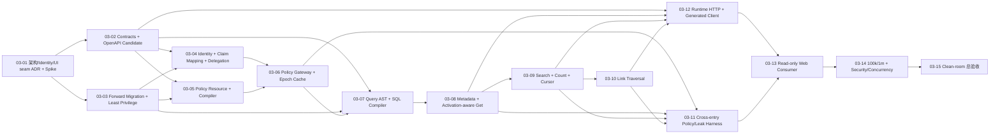

# G2-03 Query + Policy 可执行任务包

- 版本：v1
- 日期：2026-08-17
- 状态：Frozen；可行性复审与红队修订已写回权威文档
- 执行进度：2/15；G2-03-01～02 已 PASS，当前只放行 G2-03-03，未 PASS 前不得开始 G2-03-04 或正式 Runtime Endpoint
- 上游 Gate：G2-00、G2-01、G2-02 已 PASS
- 目标 Gate：正式 Runtime Read Kernel + 统一 Policy Gateway + 真实只读 Web 消费者
- 配套边界：[G2-03 UI/API 早期消费者合同](../architecture/g2-03-ui-api-consumer-contract.md)

## 1. 这阶段到底做什么

G2-03 把 G2-02 已原子激活的 Object/Link Current Generation 变成一条可被真实用户安全读取的生产路径：

```text
OIDC human / service / trusted delegation
→ Project + Resource authorization
→ Release / Activation resolve once
→ Policy compile + Gateway decision
→ typed Get / Search / Count / Link traversal
→ public Runtime HTTP + generated read client
→ generic read-only Object Explorer consumer
```

完成后，用户可以登录、选择有权 Ontology，通过通用 List/Search/Detail/Link 页面读取已激活的 Object 与 Link。所有入口在数据库执行前使用同一 Policy Gateway；不可见对象、属性和关系不能通过列表、Count、Cursor、Link 数量、错误或日志泄露。

这不是内存 Repository 的 Query Demo，也不是只看到页面就算完成。G2-03 必须使用正式 Resource Revision、Release/Activation、Current Projection、PostgreSQL 索引、真实 OIDC、参数化 SQL、签名 Cursor、5 秒撤权上界、真实 HTTP 和真实浏览器验收。

## 2. 范围冻结

### 2.1 本 Gate 必须实现

- 人类 OIDC、Service Identity 和受信 Delegation 交集；
- 可版本化的受信 Claim Mapping 最小实现，不接受客户端任意属性；
- Resource/Object/Property/Link Policy AST、Compiler、Artifact、Release Test 和唯一 Gateway；
- Action Resource/Target Policy 的协议 Harness，为 G2-04 冻结同一授权边界，但不实现 Action；
- Activation-aware Object Get、Search、`count`、一/二跳 Link Traversal；
- PRD V1 Query AST 操作符、限制、类型检查、参数化 SQL 和请求取消；
- opaque keyset Cursor，绑定 Release Revision、Object Type、Query Hash、Policy Context Hash 和 Sort；
- 请求级 Activation/Generation 绑定与 GC Query Lease/Root，不读交叉代；
- Runtime Metadata/Get/Search/Aggregate(count)/Link HTTP Endpoint；
- OpenAPI 3.1 Runtime Read Candidate 和仓内 Generated TypeScript Read Client；
- 只读、通用 Web 消费者：登录、Object Type 导航、List/Search/Filter/Sort/Cursor、Detail、懒加载一跳 Link；
- Work Management 与 Commerce 两组 Fixture 使用同一代码的消费验收；
- 100k Objects / 1m Links 查询性能、30 分钟混合负载、Policy 泄露、撤权、Cutover/GC 并发与 clean-room 总 Gate。

### 2.2 本 Gate 的渐进能力

- Aggregate Endpoint 只激活 `count`；`sum/avg/min/max/group` 保留合同 Owner，在 P0-A 补齐；
- Object Policy 激活 Object Property、Actor 受信 Attribute、常量/集合/时间和一跳受限 Link Exists；依赖 Policy Function 的 Revision 在 Function Runtime 激活前 fail closed；
- Runtime Read OpenAPI Candidate 从首次实现开始运行 Diff 和消费者编译，但可发布 SDK 与对外支持承诺仍归 G2-05；
- Web 只对核心流程实现 Loading/Empty/Error/Restricted/Focus/Disabled 基线，视觉系统、全量双语与完整 WCAG 收敛仍归 G2-05/P0-B；
- 只有结构化、脱敏的 Query/Policy Telemetry 和可执行 Harness；完整持久 Audit 产品、查询页和保留策略在 DB-04/G2-07 补齐。

### 2.3 明确不做

- Action Preflight/Apply、Overlay、Conflict、ChangeSet、Outbox；
- Function Invoke、Dynamic/Static Saved Object Set、Bulk Query/Action；
- 非 `count` Aggregate、任意 SQL、GraphQL、任意深度图遍历或图算法；
- Redis、Elasticsearch、图数据库或外部授权引擎；
- Object View、Application Config、Builder、Activity、完整 Provenance/Conflict UI；
- 可发布 SDK、SDK 下载页、客户端 90 天二进制支持承诺；
- 行业页、自定义布局、自定义 JavaScript、拖拽组件或主题市场；
- 为 Web 新增领域专用 Endpoint/BFF、前端 Policy 或浏览器 Service Credential；
- 重写 G2-00～02 历史 Migration、导入 G1 生产代码或移除 zero-overlay 生产限制。

## 3. 可实施设计边界

### 3.1 包与依赖方向

G2-03-01 的 ADR 可根据真实 Spike 合并同层 Package，但不能改变以下责任和依赖方向：

| 责任                                            | 建议落点                                              | 允许依赖                                                       | 禁止                                |
| ----------------------------------------------- | ----------------------------------------------------- | -------------------------------------------------------------- | ----------------------------------- |
| Query/Policy/Identity 机器合同                  | `packages/contracts`                                  | Foundation Contract                                            | DB/HTTP/Web                         |
| Policy AST、Decision、Predicate/Mask 不变量     | `packages/policy-domain`                              | Contracts                                                      | PostgreSQL、OIDC、HTTP              |
| Policy Gateway、Epoch/Cache、Artifact Port      | `packages/policy-application`                         | Policy Domain、Contracts                                       | 直接 SQL/HTTP                       |
| Policy/AuthZ PostgreSQL Adapter                 | `packages/policy-postgres`                            | Policy Application/Domain、Contracts                           | Web、领域分支                       |
| Query AST、Hash、Cursor 语义                    | `packages/query-domain`                               | Contracts                                                      | PostgreSQL、HTTP                    |
| Query Use Case / Port                           | `packages/query-application`                          | Query Domain、Policy Application、Contracts                    | Web、页面 DTO                       |
| SQL Compiler/Executor、Activation/Lease Adapter | `packages/query-postgres`                             | Query Application/Domain、Policy Application/Domain、Contracts | G1 运行包、Raw SQL 输入             |
| Runtime HTTP/OIDC 组合                          | `apps/api`                                            | Application + Adapter + Contracts                              | 手写第二套 Policy                   |
| 只读消费者                                      | `apps/web`                                            | Public Runtime HTTP + generated client                         | Workspace 内部包、DB/S3/Admin Store |
| 共享向量与 Gate                                 | `packages/testkit`、`tools/query-*`、`tools/policy-*` | 公共 Port/Adapter                                              | 领域特例生产代码                    |

`apps/web` 的框架、构建、路由、数据层和浏览器测试工具在 G2-03-01 用可执行 Spike 冻结并锁版。选型必须服务于当前 npm/TypeScript 单仓、OpenAPI 生成、OIDC、可访问性和浏览器自动化，不以个人喜好作为证据。

### 3.2 逻辑 G2-03 Migration 波次

Migration 继续使用 `migrations/db-00/0022+` 的单一只向前账本，不创建“DB-03”第二目录，也不修改 0001～0021。这是 Query/Policy 拥有的逻辑波次，不占用蓝图中属于 Action/Overlay 的 DB-03 语义。

候选 Migration 必须覆盖的事实责任：

- 在保留已有 Principal/Binding/Epoch 历史的前提下补齐 `human|service` 身份类型；
- 可版本化、可审计、有输入上界的 OIDC Claim Mapping 事实；
- 精确绑定 Project/Release/Policy Revision/Compiler Version/Digest 的不可变 Policy Compilation/Test 产物引用；
- 请求级 Query Lease/Generation Root 与 G2-02 GC Provider Registry 扩展；
- Policy Resource 到 Object/Property/Link/Action Target 的确定性 Dependency Type；
- 所有 Kernel 内有效授权变化在同一事务增加 Project Authorization Epoch 并发出有界通知。

Policy 正文和测试向量仍以不可变 Resource Revision 为事实，不在编译表复制另一份可编辑 JSON。完整 Query Audit、分布式 Rate Limit、Action/Overlay/Outbox 表不在本波次前移。

### 3.3 Identity 与 Delegation 边界

- OIDC Adapter 仅接受配置 Issuer/Audience/Algorithm/Scope 下签名成功、未过期的 Token；
- Subject 解析到 Kernel Principal，Principal State/Type 由服务端事实决定，客户端不提交 `principalId` 或 `identityType`；
- Group/Role/业务 Attribute 只能通过已发布 Claim Mapping 从受信 Claim 白名单派生；不将原始 Claims Map 传入 Query/Policy；
- Delegation 不接受普通浏览器自报 Header。它必须由受信边界验证来源、链长、时效、Audience 和防重放，再构建 Foundation `authorizationMode=intersection` 摘要；
- Service 与 Delegation Chain 中任一 Principal 拒绝，最终即 Deny；
- Browser 以终端用户会话调用 Runtime，Bearer/Service Credential 不进 URL、Local Storage、Log 或生成静态文件。

### 3.4 Policy 语义与编译顺序

唯一决策顺序是：

```text
Authenticate Identity
→ Project/Resource permission
→ Object Type visibility
→ Object row predicate
→ Property read/filter/sort/search permission
→ Link predicate + source/target object predicate
→ Action resource/target decision (Harness only in G2-03)
→ default deny on unknown/failure
```

- Object Predicate 编译为 Query Compiler 可组合的受限中间表示，不将客户端或 Policy Author 的 Raw SQL 作为 Artifact；
- Query PostgreSQL Adapter 将 Client Predicate 与 Object Predicate 一起渲染为参数化 SQL，行策略在 Count、Sort、Limit 和返回前生效；
- Property `deny` 不进响应实例，`mask` 只返回声明脱敏表示；二者都不能过滤/排序/分组/搜索；
- Link 只在 Link Type、Link Predicate、Source Object 和 Target Object 全部 Allow 时可见；
- 每个 Published Policy 至少有 allow、deny、null/missing、Link（适用时）、mask/deny（适用时）向量；
- Artifact 精确绑定 `(project, release, policyRevision, compilerVersion)`，缺失、过期、编译失败或依赖失败全部 fail closed；
- Authorization Epoch + 最长 5 秒内存缓存 + PostgreSQL NOTIFY Hint 继承 ADR-012，不引入 stale-while-revalidate 或 `allowOnError`。

### 3.5 Query 语义与运行上限

- 查询只读请求开始时解析一次的 Release/Activation 对应 `runtime.object_current` / `runtime.link_current`；
- 逻辑嵌套最多 5 层，`in` 最多 500 项，最多 50 Predicate，`searchText` 最多 256 Unicode 字符；
- `page.size` 默认 50、最大 500；一个业务排序字段 + Canonical Primary Key Tie-breaker；
- `eq/ne/lt/lte/gt/gte/in/isNull/contains/prefix/containsAny` 与 `and/or/not` 只对允许类型生效；
- 未声明 `filterable/sortable/searchable` 或被 Property Policy 限制的字段在编译前拒绝；
- Cursor 使用服务端签名、版本化、有寿命和可轮换 Key，客户端不读或修改内容；
- 一跳默认/单页最多 200 目标，二跳最多展开 5,000 候选；中间不可见节点不进数量或错误；
- G2-03 Aggregate 仅 `count`，必须在 Object Policy 之后计算；
- 请求必须有 SQL Statement Timeout、复杂度上限、响应大小上限、连接池上限、HTTP Abort 到 PostgreSQL Cancel 传播和有界重试。

### 3.6 Activation、Cursor 与 GC

一次 Query 请求的 Release、Runtime Plan、Activation、Generation Member、Policy Artifact 和 Authorization Snapshot 必须形成一个不可变 Execution Context。开始后的 Channel Cutover/Refresh/Policy Change 只能导致该请求继续完成旧上下文或明确失败，不能中途换代。

Query Lease 必须在读取前持久化或用等价可证明机制保护，并进入 G2-02 GC Root Provider；过期/孤儿 Lease 有有界回收。GC Provider 缺失、扫描失败或版本不匹配时继续返回 `GC_REFERENCE_SCAN_INCOMPLETE` 且无候选。

Cursor 是下一次请求的上下文证明，不是数据快照租约。Release、Query、Sort 或 Policy Context 变化时返回 `CURSOR_CONTEXT_CHANGED`，不允许为了继续翻页延长旧 Allow。

### 3.7 Runtime HTTP 与 Web 消费者

- Runtime Token Scope 与 Admin Token Scope 分离，拥有管理权不等于可读业务 Object；
- HTTP Adapter 只做认证、大小/形状限制、Contract Parse、Application Port 调用和 Error Mapping；
- Web 只通过 Public Runtime HTTP 和生成 Read Client，不依赖 Query/Policy/Metadata 内部 Workspace Package；
- Runtime Metadata 只显示当前身份可发现的 Object/Link/Property 描述和查询能力，不返回 Policy AST/SQL/Rule Detail；
- List 首屏不为每行 Get，Detail 不预加载全部 Link；请求预算按消费者合同强制；
- 正式验收使用真实浏览器、OIDC、API 和 PostgreSQL，Mock 只能做快速组件/故障单测。

### 3.8 证据声明分层

| 层级                | G2-03 可声明                                                    | G2-03 不可声明                                 |
| ------------------- | --------------------------------------------------------------- | ---------------------------------------------- |
| Production boundary | 真 OIDC/PG/HTTP/Web 的只读 Query + Policy 路径                  | Action/Overlay/Function 已生产可用             |
| Policy consistency  | Get/Search/Count/Link/Web/Read Client 与后续入口 Harness 同向量 | G2-04/05 的真实 Action/Function/SDK 入口已通过 |
| Portability         | 两组 Fixture 无领域分支读取                                     | AC-10 双 Package 独立安装完整闭环              |
| UI                  | 只读消费者接缝可用                                              | 完整 Object Explorer/Builder 或 Internal Alpha |
| SDK                 | 仓内生成 Client 防 DTO 漂移                                     | 对外可发布 SDK 和支持窗口                      |

## 4. 工作包依赖与规模



规模使用理想工程日：S = 1–2 天，M = 3–5 天，L = 5–8 天。当前只有一条有效工程通道，任务按依赖顺序合并；测试、红队和 Evidence 跟随当前项，不伪装成第二条开发线。

旧矩阵的 3–4 工程周没有计入真实 Identity/Delegation、Query Lease/GC、OpenAPI 生成、只读 Web 消费者和浏览器 Gate。按下方 5 个 L + 10 个 M 顺序任务逐项相加，任务包候选重估为 **11–18 工程周单通道规划范围**（55–90 理想工程日）。这不是日期承诺，也不用自动化的历史墙钟速度代替风险容量；03-03 真实 Migration/Identity 薄切片和 03-09 的 10k/100k 查询薄切片后必须各重估一次。

## 5. Why–What–Acceptance 工作项

### G2-03-01：冻结 Query/Policy/Identity/Consumer 架构边界

- 执行状态：**PASS**；见 [ADR-020](../architecture/adr/020-query-policy-identity-consumer-boundary.md) 与 [Evidence](../evidence/g2-03-01-query-policy-architecture.md)

- 规模：M
- 建议 Owner：Tech Lead / Runtime / Security / Web
- 依赖：G2-02 PASS；本任务包与红队冻结

**Why**

当前正式库只有 Admin OIDC、Management RBAC、Current Projection 和 Policy Epoch Harness，没有生产 Query/Policy 包、Service/Delegation 信任协议、Query Lease 或前端栈。如果直接建 Endpoint，最可能在 SQL、权限、GC 和 Web 之间冻结出互相不兼容的边界。

**What**

形成 ADR-020 与真实 PostgreSQL 16 / 生成 Client 薄切片，冻结包边界、Identity/Delegation 信任链、Policy IR/SQL 组合、Execution Context、Query Lease/GC、Cursor Key、OpenAPI Candidate 和 Web 栈选型。

**Acceptance Criteria**

- ADR 给出本任务包 §3 的事实 Owner、Port、依赖方向、事务/请求边界和后续扩展点；
- 真实 PostgreSQL 16 薄切片在当前 G2-02 Shared Projection/Index 上运行一个 typed Get、一个带 Object Predicate 的列表、一个 Count 和一个一跳 Link，输出参数化 SQL 形状和 `EXPLAIN (ANALYZE, BUFFERS)`；
- Spike 不按 Fixture API Name 分支，不向生产包导入 `spikes/g1`，不绕过 Current Generation；
- Threat Model 覆盖伪造 Principal/Identity Type/Claim/Delegation、Service 扩权、Token/URL/Log 泄露、Cursor 篡改、Policy Artifact 替换和缓存撤权；
- 前端选型记录至少比较当前 Node/TypeScript/npm 适配、OpenAPI 生成、OIDC、数据表格、可访问性、浏览器测试、构建与维护成本，并锁定版本；
- 用最小 OpenAPI Fixture 生成 Read Client，在候选 Web 栈中完成类型编译；这不是生产页或 SDK 发布；
- 明确 Foundation/G2-02 范围 Gate 如何只向前接纳 G2-03 包、Migration 和 `apps/web`，又不失去历史范围证据；
- 如果安全 Delegation 必须信任客户端自报属性、Policy 只能应用层后过滤、Query 必须领域 SQL/BFF，或 Web 必须直连内部包，本项 FAIL 并停止 02/03。

### G2-03-02：冻结 Query、Policy、Identity 与 Runtime Read 合同

- 状态：PASS（以同一 commit 的 `g2-03-02-evidence-manifest.json=CLEAN_ROOM_PASS` 为准）
- 规模：M
- 建议 Owner：Contracts / Runtime / Policy / Web
- 依赖：G2-03-01

**Why**

Query AST、Cursor、Property 受限状态和 Policy Decision 将同时被 SQL、HTTP、Web、G2-04 Action 和 G2-05 SDK 使用。如果它们只是 Adapter 私有类型，前后端必然在真实对接时重写。

**What**

在 `@ontos/contracts` 增加严格 Query/Policy/Identity/Runtime Read Schema、Parser、Catalog、Golden Fixture、错误码和兼容基线；从同一字段源生成 OpenAPI 3.1 Candidate 和仓内 TypeScript Read Client。

**Acceptance Criteria**

- Query AST 表达本任务包允许的 Operator、Select、Search、Where、Sort、Page、Count/Link 及全部上限，写入拒绝未知字段；
- Identity Context 只包受信 Principal/Type、有界 Delegation Chain、Claims Fingerprint、Authenticated At 和 `intersection`，不包 Bearer/Raw Claims；
- Policy Contract 覆盖 Resource/Object/Property/Link/Action Target、测试向量和有界 IR；禁止 Raw SQL、Network、非确定 Function、任意递归与两跳以上 Policy Traversal；
- Cursor Envelope 只在服务端 Parser/Verifier 中可解析，绑定项、Key Version、发行/过期和长度上限均有篡改/过期向量；
- Runtime Read Response 明确 Release/Read Timestamp/Correlation/Warnings/Cursor/Object Version 和 allow/mask/restricted/null 的可区分语义，不暴露 Policy 规则细节；
- `RELEASE_RETIRED` 与本 Gate 需要的有界 Query/Policy 错误进入核心错误 Catalog，HTTP/Category/Retryable 分类自洽；
- OpenAPI 路径与 PRD 一致，Spec/Schema/Runtime Parser 协议检查防止 Required、Enum、Limit 或 Nullability 漂移；
- Generated Client 由可重现命令生成，重新生成无 Diff；Web 编译必须消费它，不存在手写平行 DTO；
- Golden 至少覆盖两领域、5 Actor、空/null/missing、mask/deny、Cursor Context 变化、未知字段、过限和 Injection Payload；
- Breaking Diff 能拒绝删除/改名/类型/必填变化；Candidate 状态不能被文档误报为已发布 SDK。

交付记录：[Runtime Read 合同](../architecture/g2-03-runtime-read-contract.md)、[Evidence](../evidence/g2-03-02-runtime-read-contracts.md)与[Intended-vs-Implemented](../reviews/g2-03-02-intended-vs-implemented.md)。

### G2-03-03：实现 Query/Policy 前向 Migration 与最小权限

- 规模：L
- 建议 Owner：Database / Identity / Security
- 依赖：G2-03-01、G2-03-02

**Why**

G2-02 已经形成不可重写的 21 个 Migration、Principal/Role/Epoch 和 Generation/GC 事实。Query/Policy 如果通过应用层补丁添加身份类型、Artifact 或 Lease，会在撤权、GC 和故障恢复中失真。

**What**

从 0022 起实现 §3.2 的只向前 Schema、约束、索引、Trigger/受控函数、RLS Project 纵深防御和显式 Grant；提供历史升级、并发、故障和向前修复证据。

**Acceptance Criteria**

- 全新 PostgreSQL 16 与已完成 G2-02-14 的真实历史库均前向升级；重复执行 no-op，0001～0021 名称/Hash/事实不变；
- 旧 Principal 安全获得明确兼容身份类型，无任意默认 Service；跨 Project/Issuer/Subject/Type 伪造被约束拒绝；
- Claim Mapping/Policy Compilation/Test/Lease 的 Revision、Release、Project、Digest 与 Compiler Version 不能错配或原地改写；
- 授权事实有效变化、Principal disable、Claim Mapping 切换和 Binding 变更与 Epoch 增加/通知同事务；故障不出现“新事实+旧 Epoch”；
- Query Lease 只能绑定真实可服务 Activation/Generation，有有界时效/心跳/终结；GC Provider 对活跃 Lease 保护完整 Generation；
- `api_runtime` 只能通过受控 Application/Repository 读写需要的 Identity/Lease，不能修改 Published Policy Artifact、Epoch 结果、Current/Base 事实或 GC Plan；
- `worker_runtime` 不获得业务 Object Query/Policy Allow；`read_only_ops` 不默认获得受限业务 Property；三者均无 Owner/Migration Membership；
- 两个 Migration Runner 并发只有一套完整结果；每个 SQL 边界故障回滚，语义错误只用更高 Migration 向前修复；
- 用真实非 Owner 登录完成 Principal Type、Claim Mapping、Policy Artifact 和 Query Lease 薄切片后重估剩余工期；未完成不开始 04。

### G2-03-04：实现 Runtime Identity、Claim Mapping 与 Delegation 交集

- 规模：M
- 建议 Owner：Identity / Security / Backend
- 依赖：G2-03-02、G2-03-03

**Why**

现有 Admin OIDC 只将 Issuer/Subject 解析为基础 Principal，没有生产 Service Type、版本化 Claim Mapping 或 Delegation 信任链。用这个身份直接做 Object Policy 会把伪造 Claims 和 Service 扩权带进所有入口。

**What**

建立从 Bearer 到受信 Runtime Identity Context 的唯一 Adapter/Application 路径：OIDC 验签、Principal 解析、Claim Mapping、Service/Human 类型、受信 Delegation 校验和交集摘要。

**Acceptance Criteria**

- 错 Issuer/Audience/Algorithm/Scope、过期/未生效 Token、过大 Token/Claim、未知/disabled Principal 均在 Policy/DB Query 前拒绝；
- Human/Service Type 来自 Kernel 事实并与 OIDC Client/Subject 约束匹配，更改 Type 不允许原地伪造历史；
- Claim Mapping 只读白名单 Claim、有类型/长度/数量上限和确定性 Fingerprint；未映射 Claim 不进 Policy Context；
- Claim Mapping 变更产生新 Revision/切换事实、Epoch 增加和脱敏审计事件，不修改历史 Mapping；
- Delegation 验证 Audience、Issuer/Signer、Actor/Subject、Chain 长度、过期、Nonce/重放和允许的 Service Capability；普通 Browser Header 不能创建 Delegation；
- Effective Permission 对 Service + 终端用户 + 链中 Principal 取交集；任一无权时同形 Deny，不返回哪一环拒绝；
- Identity Context 只传入精简契约，Bearer/Raw Claim/Delegation Credential 不进 Application、Log、Trace、Error 或 Fixture 输出；
- 真实 OIDC 集成测试覆盖 human、service、delegated、disabled、mapping change/revocation 和两个 API 进程。

### G2-03-05：激活 Policy Resource、Compiler 与 Release Gate

- 规模：L
- 建议 Owner：Policy / Contracts / Metadata
- 依赖：G2-03-02、G2-03-03

**Why**

`policy` 目前仍是 Deferred Resource Family，ADR-012 也只证明缓存/故障语义。如果 Query 在没有不可变 Policy Revision、Dependency、Compiler Artifact 和 Release Test 时上线，就只能把权限写死在 Endpoint/SQL。

**What**

激活 `policy` Family 的严格 Parser、Dependency Extractor、兼容性、受限 Compiler/IR、Artifact Store 和 Published Policy Test Gate，并将其接入 Package/Release 生命周期。

**Acceptance Criteria**

- 直接 Resource API 与 Package Expander 只能通过同一 Policy Parser/Registry 进入 Validated/Published；
- Policy Target 引用必须指向同 Project/Release Closure 中的精确 Object/Property/Link/Action Revision，缺失/跨 Project/错 Family 同形失败；
- Compiler 仅接受§3.4 允许 AST，输出确定性、有版本/上限/Digest 的 IR；相同输入跨 Locale/Timezone/Process 字节稳定；
- Object Predicate 只引用声明可索引 Property/受信 Actor Attribute/一跳受限 Link Exists；不可编译或超复杂度时 Release 不得 READY；
- Property `allow/mask/deny` 与 Link/Action Target Decision 有显式 default deny；未激活 Policy Function 不被当成 true/no-op；
- 每个 Published Policy 的必需测试向量在 Stage/Publish 运行；向量缺失、结果不一致或 Artifact 绑定错误阻止 Release；
- Policy 兼容评估识别放宽/收紧对下游的影响，不原地替换 Published Revision/Artifact；
- 伪造已编译布尔值、Raw SQL/Identifier、外部网络、递归、非确定时间或无界集合被合同/编译器拒绝。

### G2-03-06：实现生产 Policy Gateway 与 5 秒撤权

- 规模：M
- 建议 Owner：Policy / Runtime / Security
- 依赖：G2-03-04、G2-03-05

**Why**

有 Policy Compiler 不等于每个入口会一致执行。如果 Epoch、Binding、Delegation、Artifact 从不同快照读取，或依赖失败时续用过期 Allow，撤权和跨入口一致性会直接失败。

**What**

将 ADR-012 的 Harness 语义落到真实 Identity/Policy PostgreSQL Adapter、两个 API 进程、精确 Artifact Loader、进程内 TTL Cache 和 NOTIFY Listener，形成 Query/Action/Function/Adapter 唯一 Gateway Port。

**Acceptance Criteria**

- 缓存未命中时在同一 PostgreSQL MVCC Snapshot 读取 Project Epoch、Principal/Delegation 授权事实和必要版本绑定；
- 决策键覆盖 Project、Identity/Delegation Fingerprint、Resource/Permission、Release、Policy Revision、Compiler Version 和 Epoch；
- 硬 TTL 使用进程单调时钟且 `<=5,000ms`，Cache Hit/后台刷新/依赖错误都不延长原到期时间；
- NOTIFY 丢失/重复/乱序/跳变/重连只影响提前失效，不破坏 5 秒上界；
- Snapshot/Epoch/Artifact/Clock/Compiler 任一无法确认时 Deny；不回退旧 Revision、“最新”Artifact 或 stale allow；
- 两进程在 Human、Service、Delegated 向量上同结果；撤权后目标下一请求、最迟 5 秒全进程拒绝；
- 入口只能调用 Gateway，不暴露裸 Binding Reader、裸 Current Reader 或“internal allow”标志；
- Telemetry 只记录服务端 Correlation Ref、不可逆 Project Ref、Decision Code、延迟和 Cache Outcome，不记 Subject/Claim/Token/Predicate/Property Value/SQL。

### G2-03-07：实现 typed Query AST 与参数化 SQL Compiler

- 规模：L
- 建议 Owner：Query / PostgreSQL / Security
- 依赖：G2-03-02、G2-03-03、G2-03-06

**Why**

G1 证明有限 AST + 类型化索引在原型上可行，但正式 G2 有新的 Current/Activation/Index/Policy/Value Codec 合同。直接搬运 G1 代码或在 Route 里拼 SQL 都会丢失正式边界。

**What**

实现 Query Parser/Normalizer/Hash/Complexity Analyzer、Schema Registry、Policy Predicate 组合和 PostgreSQL SQL Renderer/Executor，仅读当前 Execution Context 绑定的 Current Generation。

**Acceptance Criteria**

- 所有 AST 结构与§3.5/Contract 上限在执行前检查；未知字段、类型错误、NaN/浮点欺骗、过深/过多、过大文本稳定拒绝；
- 所有值使用公共 Value Codec 解析为类型参数，SQL 不拼客户值、原始 Identifier、Operator 或 Raw Fragment；
- Client Predicate 与 Object Policy IR 在同一 SQL `WHERE` 中、在 Sort/Limit/Count 前执行，不读全量后过滤；
- Property Read/Filter/Sort/Search 同时检查 Metadata Capability 和 Policy Decision；mask/deny 字段无过滤侧信道；
- Query Hash 由规范 AST、Object Type/Release/Sort/Select 等语义生成，对 JSON Key 顺序/空白稳定，对任一语义变化改变；
- Statement Timeout、Row/Byte/Complexity 上限和 Abort 传播有资源回收测试；取消后连接可复用、无后台长 SQL；
- 固定 Corpus 的 Get/List/Policy/Count/Link 候选 SQL 使用 G2-02 Published Index Plan，无未解释顺序扫描；
- Production Package 不导入 `spikes/g1`；G1 只作为向量/指标/输入来源并记录 Provenance。

### G2-03-08：实现 Runtime Metadata 与 Activation-aware Object Get

- 规模：M
- 建议 Owner：Query / Metadata / Runtime
- 依赖：G2-03-07

**Why**

Get 是最小真实读路径，但它必须同时证明 Release/Activation、Metadata 发现、Object Policy、Property Mask 和 GC 在一次请求内不漂移。

**What**

实现 Query Execution Context Resolver、Query Lease、策略感知 Runtime Metadata 和 Object Get Application Use Case/Repository，覆盖显式 Release 与 `stable` Channel。

**Acceptance Criteria**

- 请求开始只解析一次 Project/Release/Activation/Runtime Plan/Generation/Policy Artifact，响应返回实际 Revision；
- 显式支持窗口内 Release 使用其 Serving Head；退役 Release 返回 `410 RELEASE_RETIRED`，不静默换到 stable；
- Query Lease 在读取前保护所有使用 Generation，请求完成/取消/超时后终结；进程 Kill 后过期回收；
- Runtime Metadata 只返回当前 Actor 可发现的 Published Object/Link/Property 和声明查询能力，不泄露隐藏 Resource/Policy Detail；
- Get 使用 Canonical Primary Key 和精确 Object Type Revision、Generation 定位；不存在/不可见都返回同形 `404 OBJECT_NOT_ACCESSIBLE`；
- Property allow/mask/deny/null/missing 按合同返回；Serializer 再次拒绝未获授权字段和无界 Warning/Detail；
- 在 Get 执行中并发 Cutover/Refresh/Policy Change/Release Retire，结果只是完整旧上下文或明确失败，不读交叉 Revision/Generation；
- API/Worker/Ops 最小权限负测证明只有 Runtime Query Adapter 可通过 Gateway 读必要 Current，无裸表对外授权。

### G2-03-09：实现 Search、Count 与签名 Cursor

- 规模：M
- 建议 Owner：Query / PostgreSQL
- 依赖：G2-03-08

**Why**

List/Search 是 Web/SDK 最常用的读路径，也是 Policy 数量泄露、排序不稳定、Cursor 越权复用和索引退化最易出现的地方。

**What**

在同一 Query Application Port 上实现 Filter/Search/Sort/Keyset Page 与 Policy-aware `count`，并用服务端签名 Cursor 绑定全部上下文。

**Acceptance Criteria**

- PRD V1 所有本 Gate Operator、类型组合、大小写语义、Unicode Case Folding、固定 Collation 和 Search Length 有正反测试；
- 只允许一个声明 Sort，自动追加 Canonical Primary Key；无显式 Sort 时遵守 Release Metadata 的默认/搜索相关性语义；
- Cursor 绑定 Release Revision、Object Type、Query Hash、Policy Context Hash、Sort/Last Values、Key Version 和 Expiry；篡改/跨 Actor/跨查询/过期拒绝；
- Release/Policy/Query/Sort 变化统一返回 `CURSOR_CONTEXT_CHANGED`；客户端不能选择忽略某一绑定项；
- 并发 Object 更新的普通翻页返回 `readTimestamp`，不伪称跨页 Snapshot Isolation；无重复/遗漏的语义边界有文档；
- `count` 与 Search 使用同一 Object Predicate 且不返回不可见总数；mask/deny Property 不能被 Count Filter 探测；
- 过限 Query 在 SQL 前拒绝，超时/取消/连接中断后无残留 Lease/长运行 Backend；
- 10k Objects/100k Links 真实 G2 薄切片记录 Get/List/Count P50/P95、扫描行数、Buffer、返回字节、连接和实际返工，完成后重估剩余工期。

### G2-03-10：实现一/二跳 Policy-aware Link Traversal

- 规模：M
- 建议 Owner：Query / Policy / PostgreSQL
- 依赖：G2-03-09

**Why**

Link Traversal 要同时处理 Link Type、方向、Source/Target Object Policy、中间对象不泄露、分页和高基数上限。它不能用“先查边再批量过滤对象”的应用层简化替代。

**What**

使用 Published Link/Object Revision 和同一 Execution Context 编译一/二跳 SQL，每一跳注入 Link + Target Object Policy、复杂度/页大小上限与签名 Cursor。

**Acceptance Criteria**

- 路径只引用当前 Release Closure 中的 Link API Name 和允许方向，错 Object/Link Revision、跨 Project/代/方向拒绝；
- 每一跳要求 Link Type Visibility、Link Predicate、Source 与 Target Object Predicate 全部 Allow；任一 Deny 时该边等同不存在；
- 中间/目标不可见对象不出现在行、计数、Cursor、空占位、Error Detail、Log 或 Explain 对外结果；
- 每跳默认/单页最多 200，二跳展开最多 5,000 候选；超限在无部分业务结果的情况下返回稳定复杂度错误；
- 一跳分页与二跳路径的 Cursor 绑定路径、方向、所有 Revision/Generation 与 Policy Context；
- 高基数节点、环、双向边、无边、目标被删除/退役和中途 Cutover 有固定测试；
- 真实 G2 索引支撑一/二跳候选计划，无领域专用 SQL、N+1 Object Get 或应用层全量过滤。

### G2-03-11：建立跨入口 Policy 与泄露共享 Gate

- 规模：M
- 建议 Owner：Security / Policy / Quality
- 依赖：G2-03-06、G2-03-08～10

**Why**

单个 Endpoint 测试通过不能证明无旁路。PRD AC-04 要求 Get/Search/Count/Link、Web/SDK、Function、Action 和后续 Adapter 在同一向量上一致；G2-03 需要先为未实现入口建立协议 Harness，避免 G2-04/05 重建 Gateway。

**What**

将 G1 Policy Actor/Leak Corpus 转换为正式 Testkit，通过唯一 Query/Policy Application Port 运行 HTTP、Generated Client Adapter、Function Context、Action Target Loader、Export、Automation 和 AI Tool 协议 Harness。

**Acceptance Criteria**

- 固定 Actor 至少包含 `all`、`region`、`masked`、`service`、`delegated`，两领域同一组语义向量；
- Get/Search/Count/Link 与所有协议 Harness 在 Allow/Deny/Mask/Object Set/Count/Error Category 上 100% 一致；
- Function/Action/Export/Automation/AI Harness 只证明调用同一 Port，不执行函数、修改数据、导出文件或发送 Prompt；
- 泄露向量覆盖猜 Primary Key/objectRid、deny Property 过滤/排序/搜索、Count、Link 数量、Cursor、Error Detail、Warning、Log/Trace、Prompt/Tool Fixture；
- Property mask/deny 在 SQL 编译和 Serializer 双重防御；故意移除任一层时 Gate 失败；
- 故意给某个 Adapter 插入裸 Repository、默认 Link Allow、Service-only Allow 或过期 Cache，Mutation Guard 能失败；
- 不可见与不存在 Object 的公共响应形状、大小等可控特征不暴露内部原因；时序侧信道作为专项数据记录，不伪称数学等时。

### G2-03-12：接入 Runtime HTTP、OpenAPI Candidate 与 Generated Client

- 规模：M
- 建议 Owner：Backend / Contracts / Security
- 依赖：G2-03-02、G2-03-08～10

**Why**

Application Port 正确不等于网络边界正确。Body 限制、OIDC Scope、取消、错误映射、OpenAPI 和 Generated Client 任一漂移都会在 UI/SDK 对接时形成返工或权限旁路。

**What**

在现有 `apps/api` 接入 §4.2 的 Runtime Read Endpoint、专用 Runtime Scope、限额/超时/取消和 Error Envelope；生成并编译仓内 Read Client。

**Acceptance Criteria**

- Metadata/Get/Search/Aggregate(count)/Link 路径与 PRD 一致，Ontology/Object/Link API Name 由 Contract 检查，不接受任意 SQL/Path/Field Name；
- Runtime Scope 与 Admin Scope 分离；Admin Token 不因角色自动读业务对象，Runtime Token 不能调 Admin API；
- Body/URL/Header/数组/嵌套/响应大小有上限，未知字段拒绝；HTTP Abort/超时传播到 Query Executor/Lease 清理；
- 每个成功响应包含实际 Release/Read Timestamp/Correlation/Warnings/Cursor 语义，每个失败使用核心 Error Envelope 和正确 Retryable 分类；
- Object 不可见、Resource 无权、身份无效、Cursor 变化、Release 退役、Rate Limit 和依赖失败有真实 HTTP 正反向量；
- Read Request 对明确 retryable 503 只有有界策略，429 返回受控 `Retry-After`；无部分业务结果；
- OpenAPI Candidate 与 Runtime Parser 协议检查 PASS，生成 Client 重建无 Diff，用 Client 跑完同一 HTTP Corpus；
- HTTP Adapter 没有领域 SQL、Policy 复制、直连 Store 或 Web-specific DTO；任一绕过被架构/Mutation Gate 拒绝。

### G2-03-13：实现真实只读 Web 消费者

- 规模：L
- 建议 Owner：Web / Runtime / Quality
- 依赖：G2-03-11、G2-03-12

**Why**

如果 Query/Policy 只由 curl 和协议 Harness 消费，无法证明 Metadata 足以生成页面、错误可恢复、受限 Property 可表达、Cursor 交互正确，也无法及时发现 N+1 或 DTO 漂移。

**What**

按 [UI/API 消费者合同](../architecture/g2-03-ui-api-consumer-contract.md)实现 `apps/web`：OIDC/Project 上下文、Object Type 导航、通用 List/Search/Filter/Sort/Cursor、Detail 和懒加载一跳 Link。

**Acceptance Criteria**

- Web 只依赖 Public Runtime HTTP 和 Generated Client；没有 Query/Policy/Metadata/PostgreSQL 内部包导入、手写 DTO 或 Service Credential；
- Work Management 和 Commerce 使用同一组组件/路由/查询构造器，扫描代码无 Fixture API Name/字段分支；
- 导航/List/Detail/Link 仅使用 Published Object/Link Metadata，不提前激活 Object View/Application Config 或建立私有 View Schema；
- Search/Filter/Sort/Cursor 只生成合同允许 AST，取消过时请求，只接受当前 Query Hash 匹配的响应；
- allow/mask/restricted/null/missing 按服务端显式状态展示，浏览器不猜 Policy、不用 CSS 隐藏已返回敏感值；
- `401/403/404/409 Cursor/410/429/retryable 503` 均按合同保留/清理/重试页面状态，不显示 stale protected data；
- List 首屏/翻页/条件变化各1次 Search，Detail 1次 Get，每个显式打开 Link 区块1次 Link Search；无行级 N+1 或预加载全部 Links；
- Loading、无数据、无筛选结果、无权、可/不可重试错误、Disabled Reason、可见 Focus、Keyboard、Label、非纯色状态和宽表格可滚动有浏览器断言；
- 真实浏览器从登录到 List→Detail→Link 连接真 OIDC/HTTP/PostgreSQL；整体 API/Web 重启后流程仍通过；
- 页面不出现 Action/Activity/Conflict/Builder/SDK 下载的假入口，不宣称完整产品 UI 或 Internal Alpha。

### G2-03-14：执行 100k/1m 性能、安全与并发 Gate

- 规模：L
- 建议 Owner：Performance / Security / Runtime
- 依赖：G2-03-13

**Why**

10k 薄切片和单用户浏览器流程不证明高基数 Link、Policy Predicate、Cursor、撤权、Cutover/GC 在生产数量级下仍有界。G1 指标必须在 G2 正式 Schema/Policy/HTTP 上重跑。

**What**

在 Ubuntu 24 / x86_64 / 8C16G 独立环境用正式 100k Objects / 1m Links Corpus 运行固定 Query/Policy/Web Corpus、30 分钟混合负载、撤权/依赖故障、Cutover/GC 和攻击向量。

**Acceptance Criteria**

- Get P95 < 300ms，常用 List P95 < 1s，一跳 P95 < 300ms，二跳 P95 < 1.5s，Count P95 < 2s；记录 P50/P95/P99、吞吐、并发、超时和硬件/配置；
- 30 分钟混合负载非预期错误率 < 0.1%；Rate Limit/取消/超时是有界预期结果，不被删除以美化数字；
- 固定 Query Corpus 无未解释全表扫描；记录 Explain/Buffer/Index 使用、DB CPU/RSS、API RSS、连接池、响应字节和 Cursor 长度；
- 两个 API 进程在撤权通知丢失时仍最迟 5 秒 Deny；DB/Artifact/Listener/Clock 失败无 stale allow；
- 连续 Query 与 20 次 Snapshot Refresh/Cutover 并发，每次结果只属于完整旧/新 Activation，无交叉 Object/Link/Policy Revision；
- 活跃 Query Lease 期间执行 GC 不回收它使用的 Generation/Index；Kill API 后孤儿 Lease 可有界回收，Provider 失败时 GC fail closed；
- SQL/JSON/Unicode/Regex-like/Path/Cursor/Header 注入、对象枚举、Property/Count/Link 侧信道、伪造 Delegation、Token/Log 泄露和超限资源耗尽向量通过；
- 真实 Web List/Detail/Link 遵守请求预算，无因 100k/1m 改用全量前端缓存、页面 Endpoint 或领域分支；
- 任一 SLO 失败时先优化有限 AST/Index/Batch/Plan；若只能移除 Policy/约束、增加领域 SQL 或超过目标部署硬件才通过，停止 15 并正式重审。

### G2-03-15：执行 clean-room Query + Policy + Consumer 总验收

- 规模：M
- 建议 Owner：Quality / Independent Reviewer / Security
- 依赖：G2-03-14

**Why**

分项通过不能证明全新环境可从 Published Package/Snapshot/Policy 走到真实页面，也不能证明文档中的唯一 Gateway、请求预算和延后范围与代码一致。

**What**

从独立 Clone/空卷启动 PostgreSQL/S3/OIDC/API/Web/Worker/DDL Executor，安装/发布两组 Fixture 与 Policy，物化数据并执行 HTTP/Client/Web/Policy/Performance/Restart 全链路，生成 Manifest、Intended-vs-Implemented 和专项红队。

**Acceptance Criteria**

- clean checkout 一条受控命令完成 Lockfile Install、Migration、OIDC、Fixture Publish/Materialize、Policy Compile/Test、API/Web、Gate、报告和 Teardown；
- 空环境不依赖开发机登录、宿主缓存、未提交文件、手工 DB/S3/OIDC 状态或共享 Secret；
- Human 通过浏览器完成 Login→Object Type→List/Search/Filter/Sort/Page→Detail→Link；Service/Delegated 通过 HTTP/Client 完成交集向量；
- Work Management/Commerce 同代码运行，无 Kernel/Web 领域分支、页面专用 Endpoint、Mock-only 通过或手写 DTO；
- AC-04 在 G2-03 真实读入口上形成基线，Function/Action/Export/Automation/AI 仅标记 Harness；报告保留 G2-04/05 真实入口复跑义务；
- 100k/1m 指标、30 分钟负载、5 秒撤权、Cutover/GC 并发、Injection/Leak 和 Web 请求预算使用同一 Commit 的原始报告 Hash；
- 整体进程/环境重启后 Migration no-op，Published Policy Artifact、Activation/Generation、Index、Epoch 和可服务 Web 流程不变；
- 独立 Reviewer 逐条对照本任务包、UI/API 消费者合同与实现，无未记录偏差、P1/P2 偷渡或未关闭 Kill Criterion；
- G2-03 总 Manifest 绑定 Commit、Migration/Contract/OpenAPI/Generated Client/Fixture/Policy Artifact/Container Digest、测试/性能/安全报告和未关闭风险；
- 文档明确“只读 Query + Policy + 消费者接缝 PASS”不等于 Action、完整 UI/SDK、Internal Alpha 或完整 P0 已完成。

## 6. G2-03 总 Gate

| 维度          | PASS 条件                                                                      | FAIL 后处理                                   |
| ------------- | ------------------------------------------------------------------------------ | --------------------------------------------- |
| Scope         | 只有 Query/Policy/Identity/只读 Consumer；无 Action/Overlay/Builder/可发布 SDK | 删除越界或正式修订 PRD/蓝图后重审             |
| Identity      | Human/Service/Delegation 受信解析，交集不扩权                                  | 停止所有 Runtime Endpoint，修信任链           |
| Policy        | 唯一 Gateway，SQL 前行过滤，Property 双重防御，故障 fail closed                | 停止新入口，修 Compiler/Gateway               |
| Revocation    | 两 API 进程通知丢失仍最迟 5 秒 Deny                                            | 不发布，不延长 TTL                            |
| Query         | Get/Search/Count/1–2 hop/Cursor 语义与限制通过                                 | 修 AST/Compiler，不增加 Raw SQL/领域 Endpoint |
| Activation/GC | 每请求只一个完整上下文，Lease 阻止活跃 Generation 回收                         | 停 Cutover/GC 并发，修 Context/Root           |
| Contracts     | Schema/Parser/OpenAPI/Generated Client/Web 一致，Breaking Diff 失败            | 修唯一字段源，不维护平行 DTO                  |
| HTTP          | 真 OIDC/Scope/限额/取消/错误语义通过                                           | 修 Adapter，不绕应用 Port                     |
| Web           | 两 Fixture 通用 List/Detail/Link、全状态、无 N+1/领域分支                      | 修 Public API/Metadata/通用组件，不加 BFF     |
| Security      | 枚举、Property/Count/Link/Cursor/Log 泄露和 Injection 向量通过                 | 停 Gate，补漏泄或收紧语义                     |
| Performance   | G1 目标在正式 100k/1m/30 分钟负载通过，无未解释 Seq Scan                       | 优化有限 AST/Index；仍失败则重审支持包络      |
| Recovery      | 空环境、进程重启、Migration no-op、Manifest 一致                               | 修恢复/持久化，不用手工步骤掩盖               |
| Review        | Intended-vs-Implemented + 独立红队 PASS                                        | 关闭偏差/Kill Criterion 后再准入 G2-04        |

## 7. 证据分类与不得夸大项

- **Production evidence**：真实 PostgreSQL/OIDC/API/Web 的 Query + Policy 只读路径；
- **Protocol evidence**：Function/Action/Export/Automation/AI 调用同一 Application Port 的 Harness，不是产品功能；
- **Consumer evidence**：两领域 Fixture 在只读 Web/Generated Client 上通过，不是 AC-10 完整可移植结论；
- **Candidate contract**：Runtime Read OpenAPI 已被真实消费，不是已发布、完整 SDK 承诺；
- **UI evidence**：只读接缝与核心状态可用，不是完整 Universal Delivery Surface 或 Internal Alpha；
- **Deferred integration**：Action/Overlay 在 G2-04，Function/完整 UI/SDK/第二 Package 完整闭环在 G2-05，完整 Audit/Operations 在 G2-07；
- **Security claim**：只声明已实现的 OIDC、Resource/Object/Property/Link/Action-target Harness 和 fail-closed，不声明 Palantir marking、强制多级安全或监管认证。

## 8. 停止条件

任一条触发即停止下游任务，回到拥有的 ADR/Contract/Schema 修正：

1. 有效 Delegation 需要相信普通客户端自报 Principal/Claim/Identity Type；
2. Object Policy 无法编译进参数化 SQL，只能读出后应用过滤；
3. 任一 Get/Search/Count/Link/Web/Harness 向量结果不一致或出现裸 Repository 旁路；
4. Property/Link/Object 可通过过滤、排序、Count、Cursor、错误、Warning 或 Log 泄露；
5. 撤权无法在通知丢失时 5 秒内全进程生效，或依赖失败继续 stale allow；
6. Query 在 Cutover/Policy Change 中能读到交叉 Release/Generation/Policy，或 GC 能删除活跃 Query 使用代；
7. Cursor 篡改、跨 Actor/Release/Query 复用或 Key 轮换可绕过上下文绑定；
8. 两个 Fixture 需要 Query/Policy/Web 核心领域分支、页面专用 Endpoint 或 BFF DTO；
9. Web 无法通过 Public API/Generated Client 实现基础 List/Detail/Link，或必须 N+1 才可用；
10. 100k/1m 达标需要删除 Policy/数据约束、使用领域 SQL 或超过目标硬件包络；
11. OpenAPI/Contract/Runtime/Web 无法从单一字段源保持一致，只能长期维护平行 DTO；
12. G2-03 需要修改 0001～0021、移除 zero-overlay 限制或提前吸收 Action/Builder/完整 SDK 才能关闭。

处理方式是修身份信任链、Policy/Query 语义、Public API/Metadata、索引/容量或重新分配 Gate；不把失败包装成新增领域 Endpoint、前端权限或手工运维步骤。

## 9. G2-03 完成后的唯一下一步

G2-03 总 Gate PASS 后，唯一新业务 Gate 是先创建并红队审查 **G2-04 Action 任务包**：Standard/Trusted Plan、Preflight、Lock/Version Recheck、Overlay/Conflict、ChangeSet、Outbox/Audit 与在现有只读 Web 壳上的 Action Form/Apply 消费者。

在 G2-04 任务包冻结前，不直接创建 Overlay/Action 表或 Endpoint；在 G2-05 前，不将 G2-03 只读 Web 壳扩张为 Builder、Function、完整 UI/SDK 或对外产品。
