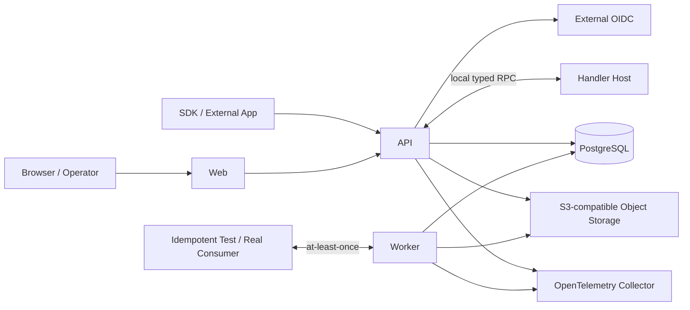

# Ontology Kernel G2 生产实现蓝图

- 版本：0.2
- 日期：2026-08-13
- 状态：Red-team Reviewed / G2-00 Authorized
- 上游产品基线：[Ontology Kernel PRD](ontology-kernel-prd.md)
- 可行性基线：[G1 Feasibility Report](../../spikes/g1/docs/g1-feasibility-report.md)
- 架构基线：[G1 Architecture Decisions](../../spikes/g1/docs/architecture-decisions.md)
- G2 准入基线：[G2 Implementation Readiness](../../spikes/g1/docs/g2-implementation-readiness.md)
- 红队结论：[G2 Blueprint Red-Team](../reviews/g2-blueprint-red-team.md)
- 当前任务包：[G2-00 Foundation](../delivery/g2-00-foundation-task-pack.md)

## 0. 蓝图结论

实现路线冻结为：**先冻结完整 P0 的总架构、核心语义和跨模块基础合同，再在同一正式代码库中完成一条生产纵向切片，随后沿拥有 Gate 渐进冻结模块字段合同并横向补齐完整 P0。**

这意味着：

1. 第一个闭环不是演示项目，不使用临时表、假权限、内存状态或只为某个领域编写的 Endpoint。
2. 第一个闭环与完整产品共用同一数据库事实模型、Release、Policy Gateway、Query Compiler、Action 事务和 API 合同。
3. 首切片只减少功能覆盖面，不降低正确性要求；后续通过增加 Adapter、Resource 类型、页面和运维能力完成 P0，不重写核心。
4. 本蓝图中的“完整产品”特指 PRD 的 **P0 Kernel Alpha**，不是复制 Palantir 全产品，也不包含 P1/P2。
5. G1 Spike 只复用算法、SQL 结论、Fixtures 和测试向量；不把 Spike 的进程组织、凭据和脚本直接当生产代码。

红队后的放行结论是 **Conditional Go**：现在只允许执行 G2-00 Foundation。G2-00 不包含 DB-01、Resource/Release Store、业务 Endpoint 或页面；其 Gate 未通过前不得用“先写一点业务代码”绕过基础验证。

### 0.1 对“先闭环还是先做全核心”的最终回答

两者不是二选一：

- 先在蓝图中冻结全核心的边界，避免局部最优；
- 再按一条完整业务链实现正式纵向切片，尽早暴露模块交界问题；
- 每通过一个 Gate，再沿已经冻结的模块边界横向补齐。

如果先分别完成所有核心引擎，最后才集成，Release、Materialization、Policy 和 Action 的接口问题会过晚出现；如果只做闭环而没有全局蓝图，又容易形成不可扩展的 Demo。当前路线同时规避这两类风险。

## 1. 成功边界与范围冻结

### 1.1 P0 完成的业务闭环

```text
定义 Resource
→ 校验 Dependency 和兼容性
→ 发布不可变 Release
→ 注册 Snapshot 与 Mapping
→ 构建不可见 Staging Generation
→ 原子激活 Current Projection
→ 按 Policy 查询 Object / Link / Function
→ Action Preflight / Apply
→ Overlay + ChangeSet + Outbox 单事务提交
→ 在 Object Explorer、SDK 和 Audit 中读取同一结果
```

第二个结构不同的 Domain Package 必须只增加 Manifest、Definitions、Handlers、Views 和测试数据，不能修改 Kernel Query、Action、Policy 或存储分支。

### 1.2 三层范围

| 能力 | 首个生产纵向切片 | 完整 P0 补齐 | 本轮不实现 |
|---|---|---|---|
| Project / Resource / Revision / Release | API/CLI 创建、校验、原子发布、回滚新 Release | 基础 Builder 页面、完整依赖影响展示 | Release 审批、复杂协作工作流 |
| Object / Property / Link | 全部核心类型语义；Fixture 使用有限字段 | 完整 P0 校验、显示元数据、Interface Schema/模板复用 | Interface 多态查询 |
| Snapshot Ingress | UTF-8 CSV、本地上传到 S3-compatible Storage、显式 Schema | NDJSON、Parquet、S3 引用、Schema 推断确认 | Connector、CDC、SQL Pipeline、调度器 |
| Mapping | 选择、重命名、常量、简单转换、拼接 | 确定性 Function、完整错误阈值配置 | Join、窗口、聚合、复杂清洗 |
| Materialization | Object + Base Link、Staging、W0/W1 Catch-up、Group Cutover、失败恢复 | 全格式、Rejected Rows、完整血缘与容量治理 | 分布式计算平台 |
| Query | Get、Search、一/二跳、`count` Aggregate、Cursor | 全部 P0 Aggregate、Dynamic Saved Object Set、完整搜索语义 | GraphQL、任意 SQL、图算法 |
| Policy | Human OIDC、Service Identity、delegated 权限交集、Resource/Object/Property/Link/Action；全部入口同向量 | Claim Mapping 管理体验、策略测试管理、缓存硬化 | 外部授权引擎适配 |
| Function | expression + 一个受信 `trusted_code` Fixture，真实 Policy Query | 完整 Manifest、超时/配额/缓存、生成 SDK 类型 | 在线代码 IDE、不可信代码沙箱 |
| Action | standard Handler + 一个受信代码 Handler；Preflight/Apply、并发、幂等、Outbox | 全部标准 Mutation、完整 Criteria/Result Schema 和处置页面 | Composite、Bulk Action |
| Delivery | 登录、生成 List/Detail/Link/Action/Activity、最小 TS SDK | 基础 Builder、完整 Object View/Application Config、双语和可访问性 | 自由画布、组件市场、定制 BI |
| Package | CLI/API 安装、升级、定义回滚；两个 Fixture Package | Artifact 保留、兼容性报告、输入映射完善 | Catalog、Marketplace、自动依赖解析 |
| Operations | Health、Job、Trace、日志、指标、一次备份恢复演练 | 保留策略、告警、容量预算、安全专项测试 | Kubernetes 产品化、多区域 |
| AI / Automation / Data 产品 | 只有 Policy 一致性测试 Harness | 无 | 所有产品功能 |

说明：Export、Automation 和 AI Adapter 在首切片中只是调用同一 Policy Gateway 的测试 Harness，用于证明不存在旁路；不形成对用户可见的新产品模块。

### 1.3 不可违反的实现合同

- Query 只读活动 `object_current` / `link_current` Generation。
- Base Snapshot 与 Overlay Operation 是不可变事实；Current、Conflict 和 Index 可重建。
- 全量 Materialization 由 Worker 分阶段完成；数据库过程只在 Cutover 中追平小型变更集。
- Policy Gateway 是 Runtime 唯一入口；Resolver 缺失、编译失败或依赖不可用时 fail closed。
- Published Resource Revision、Release、Package Revision 和 Handler Artifact 不原地修改。
- Action Handler 只返回 Mutation Plan，不获得数据库连接，不直接写状态或执行外部副作用。
- Overlay、Current、ChangeSet、`COMMITTED` ActionExecution 和 Outbox 在一个 PostgreSQL 事务中全有或全无。
- 单组织、单租户、单 PostgreSQL 区域；不得预埋未经验证的多租户分支。
- 第二领域不得在 Kernel 中出现专用表、API Name、条件分支或 Endpoint。

## 2. 系统形态

### 2.1 部署拓扑



采用模块化单体，而不是微服务：

- `api`：同步 Admin/Runtime API、OIDC、Policy Gateway、Query、Function、Action。
- `worker`：Materialization、Outbox Delivery、Generation GC、Audit Checkpoint、异步索引任务。
- `handler-host`：执行受信 Function/Action Artifact；无数据库凭据，默认无网络出口。
- `web`：Builder 的基础页面和通用 Runtime 页面。
- `cli`：Package、Release、SDK 和运维命令。
- 五个进程共用一个版本化代码库和数据库合同，可以独立部署和扩容；`handler-host` 可以与 API 同机但保持独立 OS 进程和凭据边界。
- P0 不引入 Redis、消息队列或 Workflow Engine；持久化 Job、租约和 Outbox 都使用 PostgreSQL。

### 2.2 技术基线

| 层 | 冻结选择 | 原因 |
|---|---|---|
| API / Worker / CLI | TypeScript + 当前 Node.js LTS；版本在仓库工具文件中锁定 | 与 G1 算法接近，统一合同和 SDK 类型 |
| Web | React + TypeScript | 适合声明式 Object View 和生成式表单 |
| 数据库 | PostgreSQL 16 或部署时验证过的更高兼容版本 | 事务、JSONB、索引、行锁、Advisory Lock、PITR |
| Snapshot Scan | Worker 内 DuckDB Adapter，数据以流式 COPY 进入 Staging | 同时覆盖 CSV、NDJSON、Parquet，不自研分布式执行器 |
| 文件与 Artifact | S3-compatible Object Storage，启用版本化 | Snapshot 与签名 Artifact 不依赖本地磁盘 |
| API Contract | OpenAPI 3.1 + 版本化 JSON Schema | Web、CLI、SDK 与测试共用 |
| 身份 | 外部 OIDC/OAuth2 | 不实现账号、密码、MFA、找回 |
| 可观测性 | OpenTelemetry | Trace、Metric、Log 相关联 |

具体框架和第三方库只在满足以下条件后锁版本：维护状态可接受、支持当前 Node LTS、可生成 SBOM、许可证可接受、关键故障可替换。公共合同不得暴露框架类型。

### 2.3 首版明确不拆微服务

拆分条件不是代码量，而是出现独立扩缩容、不同信任域或独立发布责任。达到条件前，拆服务会引入分布式事务、身份透传和版本兼容成本，却不能改善本产品的核心风险。模块边界必须先通过代码依赖检查和数据库表所有权实现。

## 3. 正式仓库结构

首个实现建立新的生产仓库目录，不在 `ontology-kernel-spikes` 内继续堆代码：

```text
ontos/
├── apps/
│   ├── api/                    # HTTP composition root
│   ├── worker/                 # durable jobs / materializer / outbox / GC
│   ├── handler-host/           # trusted Function/Action artifacts, no DB identity
│   ├── web/                    # Builder + generated runtime UI
│   └── cli/                    # package/release/sdk/ops commands
├── packages/
│   ├── contracts/              # JSON Schema, DTO, IDs, errors, event schemas
│   ├── metadata/               # Project/Resource/Revision/Dependency/Release/Package
│   ├── identity-policy/        # OIDC context, roles, policy compiler/evaluator
│   ├── object-runtime/         # identity, base, overlay, current, link, conflict
│   ├── materialization/        # ingress, mapping, jobs, generations, cutover
│   ├── query-runtime/          # AST validator/compiler, cursor, aggregate
│   ├── function-runtime/       # expression/trusted code invocation
│   ├── action-runtime/         # preflight, planning, locks, commit, idempotency
│   ├── audit-outbox/           # audit read/write and external delivery
│   ├── sdk-generator/          # release-pinned TypeScript SDK
│   ├── db/                     # migrations, transaction manager, repositories
│   ├── object-store/           # S3-compatible ports/adapters
│   ├── telemetry/              # trace/metric/log conventions
│   └── testkit/                # fixtures, policy vectors, fault injection
├── packages-fixtures/
│   ├── work-management/
│   └── commerce/
├── migrations/
├── deploy/
│   ├── local/
│   └── single-region/
├── docs/
│   ├── adr/
│   ├── api/
│   ├── runbooks/
│   └── test-evidence/
└── tools/
```

### 3.1 依赖方向

```text
apps
  → application modules
    → contracts + pure domain rules
      ← infrastructure adapters implement declared ports
```

规则：

- `contracts` 不依赖数据库、HTTP、React 或云 SDK。
- 模块不得导入另一个模块的 Repository 实现或直接读写其表；只能调用公开 Application Port。
- `db` 提供 Transaction/Connection 基础设施，不包含业务规则。
- API Handler 只做协议解析、身份建立和响应映射，不写业务 SQL。
- Web 和 SDK 只能调用公共 API，不得连接数据库。
- CI 使用依赖图规则阻止循环和越层导入。

### 3.2 数据所有权

| 模块 | 负责写入 | 允许读取 |
|---|---|---|
| metadata | Resource、Revision、Dependency、Release、Package、Runtime Activation/Serving Pointer | 自有表；通过端口读取索引/物化就绪状态 |
| identity-policy | Principal、Role Binding、Claim Mapping、Policy Compilation、Auth Epoch | Resource Metadata、调用上下文 |
| object-runtime | Object Identity、Base/Overlay Facts、Current/Conflict/Provenance、Generation | Release Pins、Activation Members、Policy 编译结果 |
| materialization | Snapshot、Files、Jobs、Staging Generation、Rejected Rows | Mapping、Overlay Watermark、Object Identity |
| query-runtime | 不拥有业务事实；只写 Query Audit/Metric | 活动 Current/Link Projection，经 Policy Gateway |
| function-runtime | Function Execution 记录 | 仅通过 Policy-aware Query Port |
| action-runtime | Preflight、ActionExecution、ChangeSet、Idempotency | 经 Policy Gateway 读取；在统一事务中调用 object-runtime 写端口 |
| audit-outbox | Audit、Outbox Delivery Attempt、Checkpoint | 经授权后的 ChangeSet/Action 摘要 |

`action-runtime` 的业务提交是唯一跨表事务协调点，但仍通过模块端口写入，不允许把业务 SQL散落在 HTTP 层。

## 4. 持久化模型

### 4.1 PostgreSQL Schema 分区

使用逻辑 Schema 隔离，不在 P0 为每个领域或 Package 建表：

| Schema | 主要表 |
|---|---|
| `meta` | `projects`, `resources`, `resource_revisions`, `resource_dependencies`, `releases`, `release_pins`, `release_channels`, `release_serving_heads`, `runtime_activations`, `runtime_activation_members`, `packages`, `package_revisions`, `package_installations`, `artifact_references` |
| `authz` | `principals`, `service_identities`, `role_bindings`, `claim_mapping_revisions`, `policy_compilations`, `authorization_epochs` |
| `runtime` | `object_type_runtime`, `object_identities`, `snapshot_groups`, `dataset_snapshots`, `snapshot_files`, `generations`, `object_base`, `link_base`, `object_overlay_operations`, `link_overlay_operations`, `object_heads`, `object_current`, `link_current`, `object_conflicts`, `provenance_refs` |
| `action` | `preflight_records`, `action_executions`, `action_attempts`, `changesets`, `changeset_entries`, `idempotency_records`, `outbox_events`, `outbox_delivery_attempts` |
| `ops` | `jobs`, `job_attempts`, `job_checkpoints`, `job_error_samples`, `rate_limit_buckets`, `gc_runs` |
| `audit` | `audit_events`, `audit_checkpoints` |

不为 Package 建专用业务表。`object_base`、`object_current` 等共享表用 `object_type_resource_id`、`generation_id` 和 `object_rid` 区分类型与代际。

### 4.2 ID 与值编码

- Resource、Revision、Release、Snapshot、ActionExecution、ChangeSet、Event 使用应用生成的 UUID；ID 一经分配永不复用。
- `objectRid` 是 UUID，由 `(objectTypeResourceId, canonicalPrimaryKey)` 映射表首次生成并永久保留。
- Primary Key 在 Mapping/Action 边界按 Property 的大小写和类型规则规范化；P0 规范值最多 1,024 UTF-8 bytes，数据库唯一约束覆盖 Object Type 与规范值。更长业务标识必须在 Mapping 中生成稳定紧凑键，原值仍可保存为普通 Property。
- API 中 `integer` 和 `decimal` 使用规范字符串传输，防止 JavaScript 精度损失；进入索引表达式前已完成范围与 scale 校验。
- `date` 使用 `YYYY-MM-DD`。
- `timestamp` 冻结为 UTC、六位小数秒、固定宽度 RFC 3339 文本，例如 `2026-08-13T08:01:02.123456Z`。Snapshot、Action、Query 三个入口复用一个 Codec；不合法值在边界拒绝。
- 元数据时间使用 PostgreSQL `timestamptz`；动态 Property 时间保持上述规范文本，并以受控表达式/生成列支持索引。
- JSON Property 整体大小和可查询路径在合同层验证，不允许客户端提交任意 JSON Path。

该 Timestamp 选择直接采用 G1 已验证的规范文本方案，避免把时间顺序留给查询层猜测。未来改为类型化投影列时需要 ADR 和无损迁移，不改变公共编码。

### 4.3 事实与投影

事实表：

- Published Revision / Release / Package Revision；
- Dataset Snapshot 与文件 Hash；
- `object_base` / `link_base`；
- `object_overlay_operations` / `link_overlay_operations`；
- ActionExecution / ChangeSet / Outbox Event；
- Audit Event。

可重建表：

- `object_current` / `link_current`；
- `object_conflicts`；
- Policy Compilation；
- Property Index；
- Audit Checkpoint。

事实内容只插入，不更新。允许更新的是显式控制状态，例如 Job 租约、Snapshot 生命周期、Outbox Delivery 状态和 Active Pointer；状态转换必须使用乐观版本或条件更新并留下审计。

### 4.4 Runtime Activation

Release Pointer 和 Generation Pointer 不允许分别切换。每次可服务状态由一个不可变 `runtime_activation` 表示：

```text
activationId
├── project + channel
├── releaseId + release manifest hash
└── members[]: object/link type → generationId + snapshotId
```

- `release_serving_heads` 为每个仍在支持窗内的 Published Release 保存 `active_activation_id`；显式 Release 请求通过它解析。
- `release_channels` 保存其 `active_activation_id`；一次原子指针更新同时确定定义和全部活动 Generation。
- 定义变更发布时，Release Staging 先产生兼容的 Generation Members，再创建 Activation，最后切换 Channel。
- 同一 Release 下的数据刷新创建新的 Activation，只替换 Snapshot Group 对应的 Members，Release Pin 保持不变。仍受支持且使用兼容 Mapping 的旧 Release 可复用同一 Generation；不兼容时用其自身 Pin 重新物化。
- Query 在请求开始按显式 Release 或 Channel 解析一次 Activation，并在整个请求中使用；旧 Activation 和 Generation 在请求/兼容保留窗结束前不回收。
- Action Preflight Token 绑定 Activation；Apply 时 Channel 已变化则返回 `PREFLIGHT_STALE`。
- 一个 Snapshot Group 的多个 Object/Link Generation 作为同一 Activation 变更提交，因此不会出现定义和数据或组内成员交叉版本。

### 4.5 Current Projection 与索引

- P0 沿用 G1 已验证的共享表方案，不先引入 PostgreSQL 原生按领域分区。
- 主键/唯一索引以 `(generation_id, object_type_resource_id, object_rid)` 和 `(generation_id, object_type_resource_id, canonical_primary_key)` 为核心。
- 每个声明为 `filterable`、`sortable`、`searchable` 或 `unique` 的 Property 进入 Release Index Plan；未声明字段不建二级索引。
- 索引以 Object Type 条件和规范类型表达式生成；命名包含 Resource/Revision 的稳定短标识，不含业务 Display Name。
- 新索引在 Staging 阶段建立并验证查询计划；Release Pointer 不等待中的 Release 不可发布。
- 不使用一个全局 GIN 索引替代类型化索引。
- 非活动 Generation 默认保留最近两个成功代和一个可配置时间窗；引用中的恢复点、调查 Hold 和未完成 Action 不得被 GC。

### 4.6 Migration 波次

| 波次 | 内容 | 退出条件 |
|---|---|---|
| DB-00 | Schema、迁移账本、数据库角色、扩展检查 | 全新库可前向部署；重复执行无副作用 |
| DB-01 | Metadata、Release、Package、AuthZ | 可发布空数据 Release；故障不产生部分 Pin |
| DB-02 | Snapshot、Generation、Base/Current/Identity | 可构建不可见 Staging 并原子切换 |
| DB-03 | Overlay、Conflict、Action、ChangeSet、Outbox | 故障注入证明业务事务全有或全无 |
| DB-04 | Audit、Job、GC、Rate Limit | Worker 可恢复，审计可校验，旧代可安全回收 |
| DB-05 | P0 补齐索引和兼容迁移 | 旧 Release 仍可读，迁移 dry-run 通过 |

数据库迁移只支持前向恢复，不自动降级 Schema。每次生产迁移包含 dry-run、备份检查、兼容窗口和失败后的向前修复步骤。

## 5. 核心状态机

### 5.1 Resource Revision

```text
DRAFT --validate--> VALIDATED --release publish--> PUBLISHED
  |                       |                           |
  +--new draft on edit----+                           +--> DEPRECATED --> ARCHIVED
```

- Draft 使用 `etag` 防止 Builder 相互覆盖。
- Release Staging 开始后，Pin 的 Revision 以内容 Hash 封存；继续编辑必须创建新 Draft。
- Published 内容由数据库权限和约束共同阻止更新。

### 5.2 Release

```text
DRAFT → VALIDATING → STAGING → READY → PUBLISHED → SUPERSEDED
            |           |
            +→ FAILED ←-+
```

- `FAILED` Release 不复活；修复后创建新 Release Draft。
- Publish 只做短事务：验证 READY 状态、Manifest Hash 和 Generation Members，写审计，创建不可变 Activation 并原子切换 Channel Pointer。
- Rollback 复制历史 Pins 创建新 Release，再经过兼容性/就绪检查；不移动旧 Pointer 回历史记录。

### 5.3 Snapshot 与 Materialization Job

Snapshot：

```text
UPLOADING → UPLOADED → VALIDATED → MATERIALIZING → ACTIVE → SUPERSEDED
                 |             |
                 +→ FAILED ←---+
```

Job：

```text
QUEUED → LEASED → SCAN → MAP → VALIDATE → BUILD_STAGE
       → BUILD_INDEX → READY_FOR_ACTIVATION → CATCH_UP → ACTIVATE → SUCCEEDED
                   \→ RETRY_WAIT / FAILED / CANCELLED
```

- Worker 用 `FOR UPDATE SKIP LOCKED` 领取 Job，保存 lease owner、expiry 和 heartbeat。
- 每个阶段写幂等 Checkpoint；崩溃后从最后完成阶段恢复，不重用不完整输出。
- 相同 Snapshot Hash + Mapping Revision + Target 的注册键唯一，重复请求返回原结果。
- 错误样本有数量上限，按 Property Policy 脱敏；完整失败文件留在受控对象存储。
- 孤儿 Staging 只有在无活动 Job、无 Pointer、超过保留期时进入 GC。
- 定义变更触发的 Job 到 `READY_FOR_ACTIVATION` 后由 Release Publish 统一激活；同 Release 的纯数据刷新可由 Snapshot 激活命令创建新 Activation。
- Snapshot 刷新调度器枚举仍在支持窗内且引用该 Source/Mapping 的 Release：兼容 Schema 复用 Generation，不兼容 Mapping 分别运行；某个旧 Release 失败不会污染其他 Release 的 Activation，但必须在 Health 中标为数据落后。

### 5.4 Action

Preflight Record：`VALID → USED / EXPIRED / STALE`。

ActionExecution 使用两个正交状态：

- `execution_status`：`COMMITTED | REJECTED | CONFLICTED | FAILED_BEFORE_COMMIT`；
- `delivery_status`：`NOT_APPLICABLE | PENDING | PARTIAL | COMPLETE | DEAD_LETTER`。

Commit 后下游失败只改变 Delivery 状态，不把业务事务伪装成回滚。

### 5.5 Outbox

```text
PENDING → LEASED → DELIVERING → COMPLETE
              |          |
              +→ RETRY_WAIT → DEAD_LETTER
```

- 至少一次投递；消费者按 `eventId` 去重。
- 同一 `objectRid` 按 ChangeSet Sequence 投递，不保证不同对象全局顺序。
- Dead Letter 必须在 Admin Health 中可见，并提供重试或显式 Compensation Action 指引。

## 6. 关键并发与事务设计

### 6.1 Snapshot Cutover

1. Worker 创建不可见 Generation，记录 Overlay High-watermark `W0`。
2. 分批写 Base、Current、Link、Conflict、Provenance 和索引；每批短事务。
3. 校验行数、唯一性、Link Cardinality、质量阈值和查询计划。
4. 对 Snapshot Group 中的 Object Type Lock Key 按升序获取 PostgreSQL transaction-level exclusive advisory locks。
5. 记录 `W1`，只重放 `W0..W1` 涉及的 Object/Link。
6. 仅对业务值、生命周期或冲突状态实际变化的 `object_heads` 做条件更新。
7. 创建不可变 Runtime Activation；同一短事务切换目标 `release_serving_heads.active_activation_id`、需要时切换 `release_channels.active_activation_id`，并更新 Snapshot/Generation 状态和 Audit Event。若是定义发布，该 Activation 同时绑定新 Release；若只是数据刷新，则沿用目标 Release。
8. Commit 后异步处理旧 Generation 保留与 GC。

普通 Query 在整个过程中读旧 Activation；Action Apply 对目标类型获取 shared advisory lock，Cutover 期间等待到超时或返回 `503 SNAPSHOT_CUTOVER_IN_PROGRESS`。Cutover 提交前必须再次验证期望的旧 Activation，防止并发 Release/Snapshot 更新互相覆盖。

### 6.2 Action Apply

固定顺序：

1. 认证、解析 Release/Action Revision、Resource/Action Policy。
2. 验证参数、`Idempotency-Key` 和签名 Preflight Token。
3. 对涉及的 Object Type Lock Key 按升序获取 shared advisory lock。
4. 对 Preflight Read Set 和 Write Set 的 `object_heads` 按 `objectRid` 升序 `FOR UPDATE`。
5. 重验版本、Policy、Submission Criteria；使用锁定后的数据重新运行 Handler Plan。
6. 新查询、扩大 Read/Write Set、提高风险或增加外部命令均返回 `PREFLIGHT_STALE`，不能临时追加无序锁。
7. 校验 Mutation 类型、writeMode、唯一性、Cardinality、范围和 Policy。
8. 同一事务写 Overlay Facts、活动 Current、Object Version、ChangeSet、ActionExecution、Idempotency Record、Outbox 和 Audit。
9. Commit 后返回已提交引用；响应丢失时用原幂等键读取同一 ActionExecution。

创建对象没有可锁 Head，依赖 `(object_type_resource_id, canonical_primary_key)` 唯一约束；冲突映射为 409，不返回数据库错误。

### 6.3 Trusted Handler / Function

- P0 只接受 Platform Admin 部署、带 Digest 和签名记录的 Artifact；不是不可信代码沙箱。
- TypeScript Artifact 在独立 `handler-host` OS 进程的受控 Worker Pool 中运行；进程环境不含数据库/对象存储凭据，验收部署默认阻断外部网络，Runtime Context 是唯一读取接口。
- API 与 Host 使用本机 Unix Domain Socket 或等价私有传输上的版本化 Typed RPC；Host 不提供公开网络 Endpoint。
- 部署器先从 Artifact Registry 获取并校验签名/Digest，再以只读内容寻址目录挂载给 Host；Host 自身没有 Registry 凭据，也不接受请求携带的任意代码。
- 超时后终止执行 Worker；CPU/内存/读取数计量进入 Execution 记录。
- Preflight 记录 Handler 的 Query Hash、对象集合、版本和计划 Hash。
- Apply 重跑时只允许相同 Query 请求，并从已经锁定、重新授权的数据集中读取；出现新请求或集合扩大即判 stale。
- Handler 不能导入 Kernel Repository、网络 Client 或 Secret；构建期依赖白名单、凭据隔离、网络策略和运行期 Context 共同限制。由于 Artifact 是 trusted，P0 仍不声称构成面向恶意租户的代码沙箱。

### 6.4 Policy Cache 与撤权

- Resource/Role/Claim Mapping 变更在同一事务中递增 Project Authorization Epoch 并发送失效通知。
- API 内存缓存同时受 Epoch 和最长 5 秒硬 TTL 约束；通知用于加速，TTL 用于保证上界。
- Object/Link Policy 编译产物绑定 Policy Revision、Release 和编译器版本。
- Policy 不能编译为受限 SQL Predicate 时 Release 不可发布；运行时找不到正确编译产物时 fail closed。
- 每个 Published Policy 必须携带正例、拒绝、null/missing 及适用的 Link/Property 用例；Release Gate 用相同向量运行所有 Runtime 入口。
- Property Deny/Mask 同时在 Query 编译阶段限制选择/过滤/排序，并在返回序列化阶段再次执行。
- On-behalf-of Identity 的最终权限是 Service 与终端用户权限的交集；Context 由受信认证层构建，客户端不能提交任意身份属性。

## 7. 公共合同与 API

### 7.1 合同先行

`packages/contracts` 采用两层渐进冻结，避免把未经实现验证的字段猜测变成兼容负担。

G2-00 必须先冻结 Foundation Contract：

- ID、Release Binding、Correlation 和 Identity/Delegation 摘要；
- Property Value Codec；
- Error Envelope、稳定错误分类和 Schema Version/兼容规则；
- 跨模块 Artifact Digest、幂等与时间编码语义。

模块字段合同由拥有 Gate 冻结：

- G2-01：Resource/Revision/Release/Package Manifest；
- G2-02：Snapshot、Mapping、Validation Report 和 Job State；
- G2-03：Query AST、Cursor、Policy Decision/Predicate/Mask；
- G2-04：Function Context、Action、ReadSet、MutationPlan、Preflight、ChangeSet、Outbox 和 Audit Event；
- G2-05：OpenAPI、SDK 和 Web 所需的发布合同。

G2-00 可以为后续合同建立 seam fixture、Owner 和语义不变量，但不得提前宣称全部字段稳定。所有合同从首次出现起都有 `schemaVersion`、Golden Fixture、兼容性测试和禁止未知写入字段策略。数据库 JSONB 不能替代公共 Schema。

### 7.2 Admin API

```text
POST /api/v1/admin/projects
GET  /api/v1/admin/projects/{project}

POST /api/v1/admin/projects/{project}/resources
GET  /api/v1/admin/projects/{project}/resources
POST /api/v1/admin/resources/{resourceId}/revisions
GET  /api/v1/admin/revisions/{revisionId}
PATCH /api/v1/admin/revisions/{revisionId}   # DRAFT only, requires If-Match
POST /api/v1/admin/revisions/{revisionId}/validate
GET  /api/v1/admin/revisions/{revisionId}/validation-report

POST /api/v1/admin/projects/{project}/releases
POST /api/v1/admin/releases/{releaseId}/validate
POST /api/v1/admin/releases/{releaseId}/stage
POST /api/v1/admin/releases/{releaseId}/publish
POST /api/v1/admin/releases/{releaseId}/rollback
GET  /api/v1/admin/releases/{releaseId}

GET  /api/v1/admin/projects/{project}/role-bindings
PUT  /api/v1/admin/projects/{project}/role-bindings
POST /api/v1/admin/projects/{project}/claim-mapping-revisions

POST /api/v1/admin/snapshot-upload-sessions
POST /api/v1/admin/snapshots
POST /api/v1/admin/snapshot-groups/{groupId}/materializations
GET  /api/v1/admin/jobs/{jobId}
GET  /api/v1/admin/jobs/{jobId}/report

POST /api/v1/admin/packages/validate
POST /api/v1/admin/projects/{project}/package-installations
POST /api/v1/admin/package-installations/{id}/upgrade
POST /api/v1/admin/package-installations/{id}/rollback

GET  /api/v1/admin/runtime/health
GET  /api/v1/admin/audit/events
```

Snapshot 文件通过短期上传会话进入对象存储，不能把大文件放进普通 2 MB JSON 请求。
Draft Revision 和 Role Binding 的修改都必须携带 `If-Match`/版本号；批量替换失败时不得留下部分授权。

### 7.3 Runtime API

沿用 PRD 的稳定路径：

```text
GET  /api/v1/ontologies/{ontology}/metadata
GET  /api/v1/ontologies/{ontology}/objects/{objectType}/{primaryKey}
POST /api/v1/ontologies/{ontology}/objects/{objectType}/search
POST /api/v1/ontologies/{ontology}/objects/{objectType}/aggregate
POST /api/v1/ontologies/{ontology}/objects/{objectType}/{primaryKey}/links/{linkType}/search
GET  /api/v1/ontologies/{ontology}/objects/{objectType}/{primaryKey}/activity
POST /api/v1/ontologies/{ontology}/functions/{function}/invoke
POST /api/v1/ontologies/{ontology}/actions/{action}/preflight
POST /api/v1/ontologies/{ontology}/actions/{action}/apply
GET  /api/v1/ontologies/{ontology}/action-executions/{id}
GET  /api/v1/ontologies/{ontology}/action-executions/by-idempotency?action={action}
GET  /api/v1/ontologies/{ontology}/changesets/{id}
```

约束：

- Runtime 请求绑定显式 Release Revision 或 `stable` Channel；响应永远返回实际 Revision。
- Published Release 的 API/SDK 支持窗至少 90 天。支持窗内的显式 Release 通过独立 Serving Head 获得兼容 Current Generation；Release 退休后返回 `410 RELEASE_RETIRED`。历史 Action/ChangeSet 对原 Revision 的解析不随服务窗删除。
- 不可见对象统一返回 `OBJECT_NOT_ACCESSIBLE`，不区分不存在和无权。
- Cursor 签名并绑定 Release、Object Type、Query Hash、Policy Context Hash 和排序。
- SDK、Web、Function、Action Target 和测试 Adapter 全部调用相同 Application Port，不复制授权逻辑。
- 管理 Token 与 Runtime Token Scope 分离。
- `by-idempotency` 从 `Idempotency-Key` Header 读取键并按 Actor/Action 限定，网关与日志必须脱敏该 Header。

### 7.4 TypeScript SDK

首切片先从 OpenAPI 和 Release Metadata 生成：Object Reference、Get/Search、Cursor Iterator、Link、Preflight/Apply 和 Error Union。完整 P0 再补齐所有 Function、Aggregate、Saved Set、兼容性提示和开发文档。

生成 SDK 必须固定 Release Revision；破坏性变更在生成或 TypeScript 编译阶段可见，不能悄悄改变运行语义。

## 8. 产品页面

### 8.1 首切片页面

1. OIDC 登录与 Project 入口；
2. Object Type 导航；
3. 自动生成 List：搜索、声明字段过滤/排序、分页、受限字段状态；
4. 自动生成 Detail：属性、Conflict、Provenance、Link；
5. 自动生成 Action Form：参数校验、Preflight 影响、确认、Apply 状态；
6. Activity：Action、ChangeSet、Snapshot 来源和 Outbox 状态；
7. Admin Job/Health：Materialization、Outbox、依赖健康；
8. Release/Snapshot 的最小状态页。

这些页面必须调用公共 API。页面展示不完整不能成为绕过类型、Policy 或 Action 的理由。

### 8.2 完整 P0 页面

- Project/Resource 列表；
- Object/Property/Link/Interface/Function/Action/Policy/Object View/Application Config 的约束式表单编辑；
- Validation Report 与 Dependency Impact；
- Release Draft、Staging、Publish、Rollback；
- Snapshot Upload、Mapping、质量报告、Rejected Rows；
- Package 安装/升级输入；
- SDK 下载与 API 文档；
- Identity/Role/Claim Mapping/Secret Reference 管理；
- Audit 查询与 Runtime Health。

不实现自由像素布局、自定义 JavaScript、拖拽组件市场和行业专用页面。

## 9. 首个生产纵向切片

### 9.1 切片定义

使用两个无业务特例 Fixture Package：

- Work Management：Site、Asset、WorkItem、Person、Inspection；
- Commerce：Customer、Order、Product、Shipment、Return。

每包至少 5 Object Types、5 Links、3 Actions、2 Policies、2 Object Views。Package B 由不同实现者仅使用公开扩展点接入。

纵向验收路径：

```text
Package Manifest
→ Draft Definitions
→ Immutable Release
→ CSV Snapshot + Mapping
→ Staging / Atomic Activate
→ Policy-aware Search / Traverse / Count
→ Function Invoke
→ Action Preflight / Apply
→ Overlay / ChangeSet / Outbox
→ UI / SDK / Audit Readback
```

### 9.2 “生产”最低含义

切片只有同时满足以下条件才可称为生产纵向切片：

- 真实 PostgreSQL、S3-compatible Storage、外部 OIDC 测试 Provider、API/Web/Worker/Handler Host 和 OpenTelemetry；
- 所有状态持久化，进程重启后可恢复；
- 真实数据库迁移、连接池、超时、取消、限流和结构化错误；
- 无默认账号、示例 Secret、裸数据库入口或 Handler 旁路；
- Action 故障注入无部分写入；
- Worker kill/restart 能继续 Job/Outbox；
- 至少完成一次隔离环境备份恢复；
- 固定 100k Objects / 1m Links 基准和 Policy 泄露向量通过；
- 两个 Package 不修改 Kernel 核心。

只完成页面演示、Happy Path 或单 Package 不算通过。

## 10. 实施里程碑与任务顺序

以下日历只是 4–6 人、至少四条有效责任线并行时的情景值，不是当前项目承诺。G2-00 退出前必须记录真实 Owner、容量和第二审查人，再根据实际吞吐重算。若人力更少，保持依赖顺序并延长时间，不能通过删掉安全、事务或恢复 Gate 来压缩。

### 10.1 第 1–6 周：架构集成 Gate

| Gate | 主要交付 | 前置 | 可验收退出条件 |
|---|---|---|---|
| G2-00 Foundation | 正式仓库、CI、合同包、迁移框架、DB 角色、Fixture、ADR | G1 PASS | 空环境一键建库；合同 Golden Test；禁止跨层依赖 |
| G2-01 Metadata | Project/Resource/Revision/Dependency/Release/Package Store 与 API | G2-00 | 原子发布/失败回滚；兼容性矩阵；历史 Revision 不变 |
| G2-02 Materialization | Upload、Mapping、Job/Lease、Base/Current、Staging/Cutover、GC | G2-01 | 坏 Snapshot 不影响旧代；W0/W1 不丢 Overlay；Kill/Resume |
| G2-03 Query + Policy | OIDC、Roles、Policy Compiler/Gateway、Get/Search/Traversal/Count/Cursor | G2-02 | HTTP Query 与协议 Harness 同向量；保存待后续真实入口复跑的基线 |
| G2-04 Action | Standard/Trusted Plan、Preflight、Locks、Overlay、ChangeSet、Outbox、Audit | G2-03 | AC-05/06 故障与并发用例通过 |
| G2-05 Portability | 两包安装、最小 UI、Function、SDK、基准回归 | G2-04 | 真实 HTTP/UI/SDK/Function/Action/Adapter 向量 100%；无核心领域分支；100k/1m 性能不退化 |

六周 Gate 的结果是“正式架构闭环已集成”，还不能直接对内部用户宣布可用。

### 10.2 第 7–10 周：生产化 Gate

| Gate | 主要交付 | 退出条件 |
|---|---|---|
| G2-06 Recovery | PITR/对象版本、恢复 Runbook、Generation/Artifact 保留 | 隔离恢复后 Release Hash、对象数、Action 引用、Outbox 风险校验通过 |
| G2-07 Operations | Health、Metrics、Trace、审计 Checkpoint、告警、容量报告 | 组件故障可定位；敏感值不进入 Metric/普通 Log |
| G2-08 Security | OIDC 校验、Scope 分离、上传安全、Injection/CSRF/SSRF/枚举专项 | 无已知高危旁路；Policy fail-closed 用例通过 |
| G2-09 Internal Alpha | 可用性、浏览器、Runbook、发布演练、用户走查 | 首切片“生产最低含义”全部满足 |

因此，在上述团队前提成立时，合理情景是：**6 周获得架构集成证据，8–10 周获得可供受控内部试用的生产纵向切片**。实际团队并行度未确认前，不对外承诺该日期。第 6 周的技术闭环也不能包装为成品。

### 10.3 首切片之后：完整 P0

| 阶段 | 增量，不重写核心 | 主要 Gate |
|---|---|---|
| P0-A Read/Data Coverage | NDJSON/Parquet/S3 引用、完整 Mapping、Aggregate、Dynamic Saved Set、完整 Function | Query、质量门槛、格式一致性 |
| P0-B Builder/Delivery | 基础 Definition Builder、Object View、生成 List/Detail/Form、双语、可访问性 | AC-01、真实用户无需手写基础页 |
| P0-C SDK/Package | 完整 TS SDK、Package 输入/升级/回滚、Artifact 生命周期、第二领域独立安装 | AC-07、AC-10 |
| P0-D Hardening | 性能、恢复、审计、容量、安全、兼容升级、运维文档 | AC-02–09 全量 |

4–6 人团队的完整 P0 仍按 24–32 周估算。首切片能消除大部分跨模块风险，但不等于已完成 Builder、所有数据格式、完整 SDK 和全部运维体验。

### 10.4 最低责任覆盖

| 责任 | 建议投入 | 首要 Owner |
|---|---:|---|
| 架构、Metadata、Action 事务 | 1–2 | Backend/Tech Lead |
| Query、Policy、PostgreSQL 性能 | 1 | Runtime Engineer |
| Snapshot、Materialization、Worker | 1 | Data/Backend Engineer |
| Web、Object View、SDK | 1 | Frontend/Full-stack Engineer |
| CI、部署、可观测、恢复、安全测试 | 1，可与上面部分复用 | Platform/Quality Engineer |

人数少于四人时可以一人承担多个责任，但同一人不能让设计、实现和关键安全/恢复 Gate 完全没有第二视角。日历估算应按实际并行度重新计算；任务依赖和退出条件保持不变。

### 10.5 PRD 验收追踪

| PRD AC | 首次形成证据 | P0 最终 Gate |
|---|---|---|
| AC-01 定义到页面/SDK | G2-05 | P0-B |
| AC-02 Snapshot 原子性 | G2-02，G2-05 集成复跑 | P0-D |
| AC-03 Overlay/Conflict | G2-04 | P0-D |
| AC-04 Policy 跨入口 | G2-03 基线，G2-05 真实入口 | P0-D |
| AC-05 Action 原子/幂等 | G2-04 | P0-D |
| AC-06 并发/过期确认 | G2-04 | P0-D |
| AC-07 Release/兼容性 | G2-01，G2-05 集成复跑 | P0-C |
| AC-08 故障/恢复 | G2-06/G2-07 | P0-D |
| AC-09 性能 | G2-05 | P0-D |
| AC-10 第二领域 | G2-05 | P0-C |

## 11. 测试与发布门禁

### 11.1 测试层次

| 层 | 内容 |
|---|---|
| Contract | JSON Schema Golden、OpenAPI breaking diff、值 Codec、错误码、Event 兼容性 |
| Unit | Query/Policy 编译、兼容性、Mapping、合并表、Criteria、Mutation Validation |
| Repository | 真 PostgreSQL 约束、事务、锁顺序、迁移、执行计划 |
| Integration | OIDC、S3-compatible、DuckDB Adapter、API/Worker 重启、Outbox Consumer |
| E2E | 定义到页面/SDK/Action/Audit 的两 Package 闭环 |
| Fault Injection | Publish、Materialization 各阶段、Action 事务各阶段、响应丢失、Worker 崩溃 |
| Security | 对象枚举、Policy 侧信道、敏感错误/日志、上传、CSRF、SSRF、Injection |
| Performance | G1 固定 Corpus、30 分钟持续负载、读写混合、索引写放大、Cutover |
| Recovery | PostgreSQL PITR、对象存储版本、Artifact、Outbox 重投评估 |

单元测试不能替代真 PostgreSQL/S3/OIDC 集成测试；SQLite 或内存 Repository 只可用于纯领域单测，不能作为 Gate 证据。

### 11.2 每个任务的 Definition of Done

- 代码、Migration、Contract、测试和 Telemetry 同时提交；
- 正常、拒绝、冲突、超时、重试和恢复路径均有测试；
- API 错误符合统一 Envelope，不泄露 SQL、路径、Secret 或不可见对象；
- 新表有 Owner、保留/GC 策略、索引预算和备份分类；
- 新 Job 有幂等键、租约、Heartbeat、Retry、Dead Letter/终态和运维入口；
- 新 Runtime 入口通过同一 Policy 向量；
- 文档包含部署、回滚/向前恢复和已知限制；
- 不出现 Fixture/Package API Name 的 Kernel 条件分支。

### 11.3 Gate 证据

每次 Gate 保存：

- Git Commit 与 Artifact Digest；
- Migration Version、Release Hash、Fixture Hash；
- 环境规格和配置摘要；
- 测试报告、性能分位数、错误率；
- 故障注入点与恢复结果；
- Policy Vector 入口矩阵；
- 未关闭风险与 Owner。

没有可复现证据，不以演示视频或截图代替通过结论。

## 12. 安全、审计与运维底线

- 外部通信 TLS；生产无默认 Secret，Secret 只存 Reference。
- 数据库至少分 `migration_owner`、`api_runtime`、`worker_runtime`、`read_only_ops` 角色；Handler 没有数据库身份。
- Published/Fact/Audit 表通过权限阻止普通 UPDATE/DELETE。
- PostgreSQL RLS 只做系统/Project 边界纵深防御；业务 Object/Property/Link Policy 仍由统一 Compiler/Gateway 负责，不能复制为两套手写规则。
- Audit Event append-only；按固定时间窗生成校验 Root，避免逐事件全局 Hash 锁。
- PII、Primary Key、邮箱和自由文本不得成为 Metric Label。
- Object Storage 中 Snapshot/Artifact 开启版本化和服务端加密；上传校验真实格式、压缩炸弹和路径穿越。
- API、DB、Object Storage、Worker、OIDC、Index 分别暴露健康状态；依赖不确定时写入拒绝、Policy fail closed。
- Internal Alpha 目标 RPO ≤ 15 分钟、RTO ≤ 4 小时；上线前必须真实恢复一次。
- Outbox 明确为 at-least-once；界面区分业务已提交和外部投递状态。

## 13. 可行性复审

### 13.1 已由 G1 证明

- 有限 Query AST + 类型化索引在 100k Objects / 1m Links 上满足交互目标；
- Base/Overlay 的 Staging、Catch-up 和原子 Pointer 切换成立；
- Policy Gateway 可以跨多入口保持一致并 fail closed；
- 两个不同 Package 可以通过 Manifest/Definition/Handler 扩展且不污染核心；
- 条件更新 `object_heads` 后 Cutover P95 回到可接受范围。

### 13.2 尚未被 G1 证明，必须由首切片证明

- Runtime Activation 在多 Release、数据刷新、Rollback 和 GC 下的一致性与容量上界；
- 真实 OIDC、HTTP、连接池、取消和限流组合；
- 持久化 Job 的崩溃恢复、租约和孤儿 Staging GC；
- 完整 Action Transaction、Preflight Token、幂等和锁顺序；
- DuckDB Adapter 的 CSV 生产路径和错误样本处理；NDJSON/Parquet 在 P0-A 继续证明；
- Trusted Handler 的 Timeout、Context 和 Artifact 生命周期；
- OpenAPI/SDK 与 Web 的合同一致性；
- PITR、对象存储版本和 Outbox 重投后的恢复正确性；
- 实际用户是否能直接使用生成式页面。

其中 Activation 状态模型、基础合同冻结粒度、数据库角色、生产边界等价环境和 Handler Host seam 必须前移到 G2-00；其余未知项进入 G2-01 至 G2-09，没有被隐藏到最后。

### 13.3 主要风险与控制

| 风险 | 早期指标 | 处理 |
|---|---|---|
| Foundation 吸收业务内核 | G2-00 出现 DB-01、业务 Store/Endpoint | 移回拥有 Gate；G2-00 只冻结跨模块基础语义 |
| 合同过早冻结 | 未实现模块频繁破坏 Schema 或加入占位字段 | 采用 Foundation/Module 两层渐进冻结 |
| Release/Generation 保留无界 | 每个不兼容 Release 独立物化且无法给出容量上限 | ADR-007/008 先冻结服务上限、复用与退休规则 |
| Materialization Job 复杂度失控 | 不能从阶段恢复、Staging 泄露 | 暂停新格式，只保留 CSV，先过恢复 Gate |
| 索引数量/写放大过高 | Index Plan 超预算、Action 延迟上升 | 限制声明字段，不自动索引所有 Property |
| Handler 运行模型不稳定 | Timeout 不能终止、读取集合漂移 | 保留 standard 路径做诊断，但首切片与 P0 均判 Gate 未通过，不把降级结果称为生产闭环 |
| Policy 出现旁路 | 任一入口向量不同 | 停止新增入口，修复统一 Gateway |
| UI 仍需大量定制 | 新类型必须手写页面 | 收紧 Object View，而不是增加行业页面 |
| 单 PostgreSQL 成为瓶颈 | 锁等待、WAL、表膨胀超预算 | 先优化批次/索引/GC；不得提前用微服务掩盖模型问题 |
| 工期被 P1/P2 稀释 | Connector、AI、工作流进入迭代 | 直接移回 Deferred 清单，不占 P0 Gate |

### 13.4 停止条件

出现以下任一情况，不继续堆功能：

1. 第二 Package 必须修改 Query、Action、Policy 或存储核心；
2. 同一 Policy 无法跨 API、UI、SDK、Function、Action 和 Harness 一致；
3. Snapshot 刷新会静默覆盖或丢失 Overlay；
4. Action 无法在一个数据库事务中保证事实、Current、ChangeSet 和 Outbox 原子性；
5. 100k/1m 在支持规格上无法达到 PRD 基线；
6. 生成页面不能覆盖多数基础 List/Detail/Form；
7. 为赶进度必须让 Handler、App、AI 或运维脚本绕过 Runtime；
8. 团队实际能力无法承担 24–32 周 P0。

处理方式是缩小承诺、重做抽象或转为垂直应用，不把失败包装成更多页面。

## 14. 编码前的冻结清单

只有以下条目全部完成才开始 G2-01 业务功能编码：

- [x] 正式仓库确定为 `wyd-git/ontos`；
- [ ] 各责任 Owner、第二审查人和实际并行度确定；
- [x] 本蓝图完成红队审查，P0/P1/P2 范围保持不变；
- [x] ADR-007：Runtime Activation、Release Serving Head 与 90 天支持窗；
- [x] ADR-008：共享 Generation 表与索引计划；
- [x] ADR-009：Timestamp/Integer/Decimal/Primary Key 公共编码；
- [x] ADR-010：PostgreSQL Job/Lease 与 Outbox；
- [ ] ADR-011：Trusted TypeScript Artifact + 独立 Handler Host 信任声明；
- [ ] ADR-012：Policy Epoch、5 秒 TTL 和 fail-closed；
- [ ] OpenAPI/JSON Schema 合同骨架和错误码冻结；
- [ ] 数据库迁移、角色和本地生产等价环境跑通；
- [ ] 两 Package Fixture、固定数据生成器和 G1 向量移入 `testkit`；
- [ ] CI 能运行 Contract、真实 PostgreSQL Integration 和依赖边界检查；
- [ ] 单区域验收环境、OIDC 测试 Provider、S3-compatible Storage 和 OTEL 可用。

这里的“冻结”是对公共合同和架构方向冻结，不是一次性写完所有实现细节。任何偏离必须新增 ADR，并说明对 Gate、迁移和兼容性的影响。

## 15. 蓝图之后的第一批可执行任务

蓝图通过后，不立刻写页面或 Metadata Store。第一批工作以 [G2-00 Foundation 任务包](../delivery/g2-00-foundation-task-pack.md) 为唯一执行清单：

1. 在 `ontos` 建立实际使用的工具链骨架、依赖规则和本地生产边界等价环境；
2. 编写 ADR-007 至 ADR-012，并用状态模型、容量模型或 seam proof 验证；
3. 建立渐进式 `contracts`，只冻结 Foundation Contract，登记模块合同的 Owner 和最晚 Gate；
4. 只实现 DB-00 Migration、逻辑 Schema 与数据库角色；DB-01 明确属于 G2-01；
5. 把 Handler Host 的凭据隔离、版本化 RPC、硬超时和 Read Set 边界作为 seam proof 前移验证；
6. 迁移 G1 Fixtures 和测试向量，禁止生产包导入 Spike 的凭据、进程脚本或运行代码；
7. 用 clean-room bootstrap、强制 CI 和 Evidence Manifest 判定 G2-00 PASS/FAIL；
8. 只有 PASS 后才创建 G2-01 Resource/Release Store 任务包。

第一批任务的最终产物不是“有几个接口能跑”，而是一个可以安全承载后续所有 P0 模块、能够从空环境重复构建的正式工程底座。
