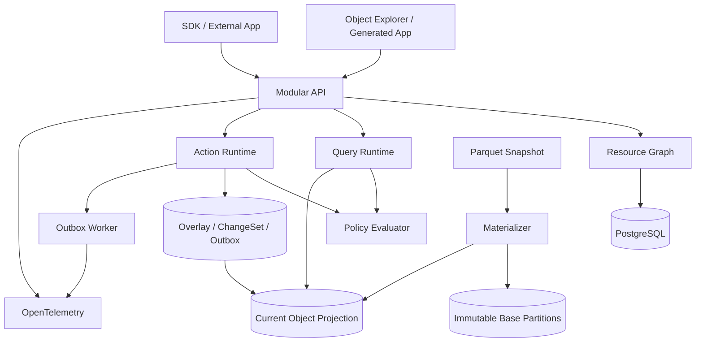

# Ontology Kernel 产品需求文档

- 文档版本：0.3
- 状态：G1 Feasibility Passed / Ready for G2 Implementation
- 日期：2026-08-13
- 产品代号：Operational Ontology Platform（临时）
- 文档范围：领域无关的 Ontology Kernel
- 不包含：完整 Data、Automation、AI、Apollo 或行业应用 PRD

## 0. 文档约定

本文中的规范词具有以下含义：

- **必须（MUST）**：V1 不能缺少，否则核心闭环或安全边界不成立。
- **应该（SHOULD）**：默认实现；只有明确记录理由后才能推迟。
- **可以（MAY）**：不影响 V1 成立的增强能力。
- **不做（WON'T）**：明确排除在本 PRD 之外。

所有性能数字都是目标，不是未经验证的承诺。涉及对象存储、查询、Overlay 和 Policy 的指标必须通过本文定义的技术 Spike 后才能冻结。

## 1. 决策摘要

### 1.1 产品定义

Ontology Kernel 是一个统一的业务运行时。它允许组织：

1. 将来源数据定义为真实业务对象、属性和关系；
2. 使用统一查询协议读取、过滤、聚合和遍历对象；
3. 使用受控 Action 修改对象与关系；
4. 让业务人员通过自动生成或声明式应用开展工作；
5. 让外部应用、自动化和 AI 使用完全相同的 Query、Action 和 Policy；
6. 对每次定义变更、读取决策和业务修改进行追溯。

### 1.2 核心产品闭环

```text
Source Snapshot
    ↓ mapping + materialization
Object / Property / Link
    ↓ query + function
Operator Decision
    ↓ action + policy + transaction
Writeback Overlay
    ↓ merged current view
Updated Operational World
    ↓ event + audit
External Application / Automation / AI
```

### 1.3 V1 的四个组成部分

| 组成部分 | 职责 |
|---|---|
| Resource Graph | 统一资源、依赖、Revision、Release、权限和审计入口 |
| Ontology Language & Query Runtime | 定义并查询 Object、Property、Link、Function 和 Interface |
| Action & Policy Runtime | 受控修改、提交条件、事务、幂等、并发、ChangeSet 和 Outbox |
| Universal Delivery Surface | Object Explorer、生成式运营页面、API 和 TypeScript SDK |

### 1.4 Go / No-Go 判定

G1 已于 2026-08-13 通过：通用查询、Base/Overlay、权限一致性和第二领域 Package 四项 Spike 全部 PASS。决策为 **Go to G2 Kernel Implementation**；这不是生产上线结论，G2/G3 仍受本文验收条件约束。

## 2. 用户问题

企业已有数据库、数据仓库、SaaS、报表、审批系统和 AI 助手，但这些系统通常存在以下断裂：

- 数据表的字段不能直接表达业务人员理解的对象和关系；
- 分析结果与后续业务动作分离；
- 同一种业务规则在 API、页面和工作流中重复实现；
- 数据来源、人工修改和系统建议混在最终状态中；
- AI 可以回答问题，却缺少受控、可确认、可审计的执行能力；
- 新场景仍然需要重新开发查询、权限、表单和审计。

结果是组织拥有大量数据和工具，却没有一个可以被人、软件和 AI 共同使用的业务世界模型。

## 3. 产品目标与非目标

### 3.1 V1 目标

#### G1：业务建模

Builder 能创建并发布 Object Type、Property、Link Type、Function 和 Action Type，而不需要修改 Kernel 核心代码。

#### G2：通用读取

同一个 Query Runtime 能服务不同领域的对象搜索、过滤、排序、聚合和有限关系遍历。

#### G3：受控写入

所有业务修改都通过 Action Runtime，执行身份、授权、Submission Criteria、预检、并发控制、事务、审计和 Outbox。

#### G4：事实与决策分离

来源 Snapshot 不被业务 Action 原地覆盖；用户、系统和 AI 的修改进入 Writeback Overlay，并能与来源版本共同追溯。

#### G5：可直接使用

每个已发布 Object Type 自动获得可配置的列表、详情、关系、活动和 Action 表单；V1 不能只提供 API 或建模后台。

#### G6：统一扩展边界

内部 UI、外部应用、后续 Automation 和后续 AI 都通过同一 Query、Action、Policy 和 Audit 接口工作。

#### G7：跨领域复用

第二个结构不同的领域包可以只增加定义、Handler 和页面配置，而不修改 Query Engine、Action Engine 或 Policy Engine。

### 3.2 V1 非目标

V1 明确不做：

- 完整数据湖、数据仓库或分布式 ETL 平台；
- Spark、Flink、CDC 和通用实时流计算；
- 任意深度图算法和大型知识图谱分析；
- 自由拖拽式低代码页面设计器；
- 平台内浏览器 IDE、Jupyter 或代码托管；
- 通用模型训练、MLOps、Agent Builder 或 AI Evals；
- 多 Agent 自主协作；
- Apollo 式多云、边缘、隔离环境软件舰队；
- Gotham 军事、情报、目标和传感器任务功能；
- 与 Palantir marking、purpose-based 或涉密安全能力等价的声明；
- 公共 Marketplace、多租户计费和生态分成；
- 为任意行业预置完整业务流程。

## 4. 目标用户与部署边界

### 4.1 首个目标用户群

V1 面向需要构建一至三个跨系统运营场景的单一组织，典型规模为：

- 5–50 名高频操作用户；
- 最多 100 名注册用户；
- 2–10 名 Builder/Developer；
- 10–30 个 Object Types；
- 20–60 个 Link Types；
- 10–30 个 Action Types。

### 4.2 用户角色

| 角色 | 主要任务 |
|---|---|
| Platform Admin | 管理身份、项目、Secret、运行状态和全局策略 |
| Ontology Builder | 定义 Object、Link、Function、Action 和展示配置 |
| Developer | 编写 Function/Action Handler，使用 SDK 开发定制应用 |
| Operator | 搜索对象、查看上下文并执行被授权的 Action |
| Auditor | 查看定义版本、ActionExecution、ChangeSet 和访问审计 |
| Integration Service | 通过受控凭据导入 Snapshot 或调用 Query/Action API |

### 4.3 部署边界

- V1 必须支持单组织、单租户部署。
- V1 应该支持 Docker 部署。
- Kubernetes 可以在 Beta 加入，但不是 Kernel 成立条件。
- V1 只承诺单区域部署。
- 身份认证必须通过外部 OIDC Provider；Kernel 不自研密码、MFA 或账号找回。

## 5. 产品原则

1. **Ontology 是运行时契约，不是静态数据字典。**
2. **所有写入默认只允许通过 Action。**
3. **来源事实与运营写回分离。**
4. **权限必须在查询计划和 Action 执行中生效，不能只隐藏按钮。**
5. **定义、代码、页面配置和策略都必须有版本。**
6. **内部 UI 不享有绕过公共运行时的特权。**
7. **复杂业务逻辑允许写代码；平台不承诺一切无代码。**
8. **外部副作用不得占用核心数据库事务。**
9. **领域包是平台资源的组合，不是核心代码分支。**
10. **能力边界以可测试协议定义，不以页面数量定义。**

## 6. 核心概念

### 6.1 Resource

平台中可拥有、授权、版本化或产生依赖的实体。包括：

- Project；
- Dataset Snapshot Reference；
- Mapping；
- Object Type；
- Link Type；
- Interface；
- Function；
- Action Type；
- Object View；
- Saved Object Set；
- Application Config；
- Policy；
- Release；
- Package。

Resource 拥有稳定 `resourceId`；具体内容保存在不可变 `revisionId` 中。

### 6.2 Revision

Resource 的不可变内容版本。Revision 一旦发布不得原地修改。草稿保存为新的 Draft Revision，发布后得到 Published Revision。

### 6.3 Release

一组相互兼容的 Resource Revision Pin。Release 发布必须原子完成：要么所有引用切换到新 Revision，要么全部保持原状态。

Release 回滚只回滚定义和运行时引用，不反向撤销已经发生的业务 Action。

### 6.4 Object Type 与 Object

- Object Type 定义现实实体或事件的类型；
- Object 是具有稳定 Primary Key 的类型实例；
- Object 的当前状态由 Base Snapshot 和 Writeback Overlay 合并得到；
- Object 具有 Kernel 生成的稳定内部 `objectRid`，但外部 API 主要使用 `objectType + primaryKey`。

`objectRid` 必须由 Kernel 对 `(objectTypeResourceId, canonicalPrimaryKey)` 的稳定映射产生并永久保留；Primary Key 是否区分大小写由 Property 定义决定，不得随数据库默认 Collation 漂移。

### 6.5 Property

Object Type 上的类型化字段。V1 支持：

- `string`；
- `boolean`；
- `integer`；
- `decimal`；
- `date`；
- `timestamp`；
- `enum`；
- `string[]`；
- `json`，仅允许展示和整体读写，不保证任意内部查询。

基础值语义：

- `integer` 为有符号 64 位整数；
- `decimal` 必须声明 precision/scale，V1 上限为 precision 38、scale 18；
- `date` 使用 ISO `YYYY-MM-DD`，不含时区；
- `timestamp` 接受 RFC 3339，存储时规范化为 UTC，并保留到微秒；
- `string` 默认最大 64 KiB；更大内容应进入后续 Attachment/Document 能力；
- `string[]` 默认最多 1,000 项，单项遵守 string 限制；
- `enum` 保存稳定代码，Display Name 可以本地化；
- `json` 单值默认最大 1 MiB。

部署可以收紧限制，但不得在同一 Release 中改变值语义。

每个 Property 可以声明：

- required / nullable；
- default value；
- unique；
- filterable；
- sortable；
- searchable；
- sensitivity classification；
- display metadata；
- base/overlay ownership policy。

### 6.6 Link Type 与 Link

Link Type 定义两个 Object Types 之间的双向关系。每一侧具有独立 API Name 和 Display Name。

V1 支持：

- one-to-one；
- one-to-many；
- many-to-one；
- many-to-many；
- Base Link；
- Action 创建或删除的 Overlay Link。

带业务属性的关系必须建模为 Object，而不是给 Link 动态增加属性。

### 6.7 Interface

Interface 描述多个 Object Types 共同具备的 Property 和 Action 能力。

- V1 Alpha 只要求 Schema 校验和页面模板复用；
- 跨 Object Type 的多态查询属于 P1；
- Interface 不允许定义物理存储。

### 6.8 Function

Function 是版本化、类型化、无业务写入副作用的计算单元。

V1 Function：

- 必须声明输入和输出类型；
- 必须绑定实现版本；
- 可以读取调用者有权限查看的 Object；
- 不得直接修改 Object、Link、Policy 或 Resource；
- 不得获得裸数据库连接；
- 默认不得访问外部网络；
- 可以被 Query、Action 和外部 API 调用。

### 6.9 Action Type 与 ActionExecution

- Action Type 是可执行业务操作的版本化契约；
- ActionExecution 是一次具体执行，记录 Actor、参数摘要、结果、ChangeSet、错误和 Correlation ID；
- Action Type 可以使用标准生成式 Handler，或引用已注册的代码 Handler；
- 所有内部与外部写入都必须进入相同 Action Runtime。

### 6.10 Base Snapshot

从来源系统获得的不可变数据版本。Kernel 不负责完整连接器和 Pipeline，但必须定义接收 Snapshot、验证 Schema、映射和物化的协议。

### 6.11 Writeback Overlay

由 Action 创建的属性、对象或 Link 修改层。Overlay 不修改 Base Snapshot；Current Object View 在逻辑上由 Base 与 Overlay 合并，但查询请求不得临时扫描历史并动态拼接。Action 事务即时维护活动 Current Projection；Snapshot Materializer 在不可见的 Staging Generation 中重建并原子切换。

### 6.12 ChangeSet

一次成功 Action 对 Object、Property 和 Link 产生的不可变修改集合。ChangeSet 用于审计、活动时间线、事件和故障分析，不等同于完整事件溯源数据库。

## 7. 产品信息架构

Kernel V1 只有五个一级入口：

```text
Workspace
├── Projects
├── Resources
├── Dependencies
└── Releases

Ontology
├── Object Types
├── Link Types
├── Interfaces
├── Functions
├── Action Types
└── Policies

Explore
├── Object Search
├── Object Detail
├── Relationship View
├── Saved Object Sets
└── Activity

Build
├── Object Views
├── Application Configs
├── SDK & API
└── Packages

Admin
├── Identity & Roles
├── Audit
├── Runtime Health
├── Snapshot Jobs
└── Secrets References
```

Data、Automation 和 AI 在各自模块交付时成为新增一级入口，不塞入 Kernel 页面。

## 8. 核心用户旅程

### 8.1 Builder 创建并发布 Ontology

1. Builder 创建 Project。
2. Builder 创建 Object Type Draft，定义 Primary Key、Properties 和展示信息。
3. Builder 创建 Link Type Draft，选择两端类型、基数和双向 API Name。
4. Builder 注册 Function 和 Action Type，关联实现版本。
5. 系统持续执行引用、类型、命名和兼容性校验。
6. Builder 创建 Release Draft。
7. 系统展示依赖图、破坏性变更和迁移要求。
8. Builder 发布 Release。
9. Runtime 原子切换到新定义。
10. Object Explorer 自动出现对应对象入口。

### 8.2 Integration Service 导入 Base Snapshot

1. Integration Service 创建 Snapshot Upload Session。
2. 上传 Parquet、CSV 或 NDJSON 文件，或提交受支持的对象存储引用。
3. Kernel 计算 Hash，推断并验证 Schema。
4. Service 选择已发布 Mapping Revision。
5. Materialization Job 校验 Primary Key、Property Type 和 Link Reference。
6. Job 成功后原子切换 Object Type 的 Active Base Snapshot。
7. 失败时旧 Snapshot 继续服务查询。
8. 新 Base 与已有 Overlay 发生同字段变化时创建 Conflict。

### 8.3 Operator 查找对象并执行 Action

1. Operator 进入 Object Explorer。
2. 系统只显示其可见的 Object Types。
3. Operator 通过关键词、属性或 Saved Object Set 查找对象。
4. Query Runtime 在数据库查询前注入行级 Policy。
5. 返回结果时应用 Property Policy。
6. Operator 打开 Object Detail，查看属性、Links、Activity 和可用 Actions。
7. Operator 填写 Action 参数。
8. 系统执行 Preflight，展示 Submission Criteria、影响对象和确认级别。
9. Operator 确认。
10. Action Runtime 在事务内生成 Overlay、ChangeSet、ActionExecution 和 Outbox。
11. 页面基于新的 Current Object View 刷新。

### 8.4 Auditor 追溯一个业务状态

1. Auditor 从 Object Detail 进入 Activity。
2. 查看当前状态来自哪个 Base Snapshot 和哪些 Overlay Edits。
3. 打开 ActionExecution，查看 Actor、Action Revision、参数摘要和结果。
4. 打开 ChangeSet，查看修改前后值及关联对象。
5. 使用 Correlation ID 跳转到 API Trace、Outbox Delivery 或后续 Action。
6. Auditor 无权删除或修改上述记录。

### 8.5 Developer 构建定制应用

1. Developer 为目标 Release 生成 TypeScript SDK。
2. SDK 只包含其 Project 有权引用的 Object、Link、Function 和 Action 类型。
3. 应用使用 SDK 搜索对象、遍历 Link 和执行 Preflight/Apply。
4. Runtime 使用终端用户身份授权，不能因应用凭据扩大用户权限。
5. 所有结果与内部 Object Explorer 保持一致。

## 9. 范围优先级

### 9.1 P0：Kernel Alpha 必须具备

- Project、Resource、Revision、Dependency 和 Release；
- Object Type、Property、Link Type；
- Function 注册与调用；
- Action Type、标准 Handler、代码 Handler；
- Base Snapshot 接收和 Mapping；
- Base/Overlay Current View；
- 通用 Object Query；
- 一至两跳 Link Traversal；
- Object Explorer；
- 自动生成 List、Detail、Form 和 Action Panel；
- OIDC、Resource Role、Object Policy、Property Policy 和 Action Policy；
- Action Preflight、Apply、事务、幂等、并发、ChangeSet、Audit 和 Outbox；
- OpenAPI 和 TypeScript SDK；
- 最小 Package Manifest 的 CLI/API 安装、升级和定义回滚，用于第二领域验证；
- Runtime Health、Job 状态、备份和恢复说明；
- 第二领域验证。

### 9.2 P1：Kernel Beta 应具备

- Interface 多态查询；
- Saved Object Set 共享与嵌入；
- 基础聚合图表；
- Package Catalog/UI、交互式输入映射和依赖解析；
- Release 审批；
- Bulk Action，限制批量大小；
- 搜索相关性和全文索引增强；
- Snapshot Conflict 处理界面；
- Python SDK；
- OSDK 风格代码生成增强；
- 外部授权引擎适配；
- Kubernetes 部署模板。

### 9.3 P2：后续模块

- Data Connections、Pipeline Builder、Data Health UI 和完整 Lineage；
- Durable Automation；
- Model Gateway、Agent、AI Logic、Document Intelligence 和 Evals；
- 地图、时间序列、排程和优化；
- Marketplace；
- 多租户和多区域。

## 10. Resource Graph 需求

### 10.1 Resource 身份

- 每个 Resource 必须获得不可复用的稳定 `resourceId`。
- 删除 Resource 默认是归档，不得复用其 API Name 或 ID。
- Resource 必须记录类型、Project、Owner、创建者、创建时间和当前状态。
- Resource API Name 在同一命名空间内唯一。
- 已发布 API Name 默认不可修改；重命名必须通过别名和迁移流程。

### 10.2 Revision

- 编辑必须产生 Draft Revision。
- Published Revision 必须不可变。
- Revision 必须记录父 Revision、作者、时间、内容 Hash 和变更说明。
- 相同内容不得产生不同内容 Hash。
- 系统必须可以比较两个 Revision 的结构差异。

### 10.3 Dependency

- Resource 引用另一个 Resource Revision 时必须创建显式 Dependency Edge。
- 删除、归档或发布破坏性变更前必须进行下游影响分析。
- 依赖图必须可以检测循环；只有被明确允许的 Dependency Type 可以形成循环。
- Function、Action、Object View、Application 和 Policy 的引用必须被依赖图覆盖。

### 10.4 Release

- Release Draft 包含一组 `resourceId → revisionId` Pin。
- 校验必须按依赖顺序执行。
- 新索引、Current Projection 迁移和必要 Materialization 必须在 Staging 中完成后，Release 才能进入可发布状态。
- 发布必须在单个元数据事务中切换 Runtime Release Pointer。
- 失败不得产生部分发布。
- Release 必须保存 Manifest、Hash、作者、时间和迁移结果。
- 回滚必须创建一个新的 Release，不得修改历史 Release。
- 定义回滚不得撤销历史 Action 或业务对象状态。

### 10.5 Schema 兼容性

系统必须识别：

| 变更 | 默认判定 |
|---|---|
| 修改 Display Name/Description | 兼容 |
| 新增 nullable Property | 兼容 |
| 新增带默认值的 required Property | 条件兼容，需 Materialization 验证 |
| 删除 Property | 破坏性 |
| 修改 Property API Name | 破坏性，除非提供 Alias Migration |
| 修改 Property Type | 破坏性，除非提供显式转换 |
| 修改 Primary Key | 禁止直接发布 |
| 收紧 enum | 破坏性 |
| 放宽 enum | 兼容 |
| 修改 Link Cardinality | 破坏性 |
| 删除 Action 参数 | 条件兼容 |
| 新增 required Action 参数 | 破坏性 |
| 修改 Function 输入/输出 | 破坏性 |

破坏性变更必须提供新 API Name 或 Migration Plan，并通过下游依赖验证。

## 11. Ontology 定义与发布需求

### 11.1 Object Type 定义

每个 Object Type Revision 必须至少包含：

- `apiName`、Display Name 和 Description；
- Primary Key Property；
- Properties；
- Title Property；
- 默认可搜索 Properties；
- 默认排序；
- Base Mapping Reference；
- Object Policy Reference；
- Object View Reference；
- 状态：Draft、Validated、Published、Deprecated 或 Archived。

Primary Key 必须满足：

1. 在同一 Object Type 内唯一；
2. 对同一来源实体可确定性重复生成；
3. 非空且可序列化为稳定字符串；
4. Base 刷新时不得由可变展示字段临时推导；
5. 已发布后不得原地替换。

复合业务键必须在 Mapping 中规范化为一个稳定 Primary Key。随机生成 ID 只允许用于 Action 创建、且不存在上游业务键的对象。

### 11.2 Property 定义

每个 Property Revision 必须包含类型、nullable、读写模式和查询能力。V1 支持以下 `writeMode`：

| 模式 | Base 可提供 | Action 可写 | Current View 规则 |
|---|---:|---:|---|
| `source_only` | 是 | 否 | 始终读取 Active Base |
| `overlay_override` | 是 | 是 | 无有效 Overlay 时读 Base，否则读 Overlay |
| `overlay_only` | 否 | 是 | 只读取 Overlay；未写入时为 null/default |
| `system_managed` | 可选 | 仅 Kernel | 由版本、审计或计算流程维护 |

- `source_only` Property 不得出现在 Action Mutation Schema 中。
- `json` Property 不得被标记为 `sortable`；只有注册的顶层路径可以被标记为 `filterable`。
- `searchable`、`filterable`、`sortable` 和 `unique` 必须触发相应索引计划校验。
- 敏感 Property 必须声明 Classification；缺失时继承 Object Type 默认 Classification。
- 默认值只能是常量或已注册的确定性 Function，不允许执行外部调用。

### 11.3 Link Type 定义

每个 Link Type 必须声明：

- Source 和 Target Object Type；
- 两侧 API Name、Display Name；
- Cardinality；
- Base、Overlay 或 Mixed 来源；
- 删除行为；
- Link Policy；
- 是否允许 Action 创建或删除。

V1 删除行为只支持：

- `restrict`：存在 Link 时阻止对象删除；
- `detach`：在同一 Action 中删除 Overlay Link；Base Link 只能在 Current View 中隐藏；
- `retain_history`：当前 Link 消失，但历史 ChangeSet 保留。

V1 不实现跨 Object Type 的数据库级级联删除。任何涉及多个对象的业务级级联必须由显式 Action Handler 完成。

### 11.4 Mapping 定义

Mapping Revision 把一个 Snapshot Schema 映射为 Object 或 Link：

- 输入 Dataset Snapshot Reference；
- 输入列到 Property 的映射；
- Primary Key 表达式；
- 类型转换和 null 处理；
- 可选常量和确定性 Function；
- Link 两端 Key Mapping；
- 错误阈值；
- 输出 Object/Link Type Revision。

V1 Mapping 允许列选择、重命名、常量、简单类型转换、字符串拼接和已注册确定性 Function。Join、窗口计算、聚合和复杂清洗属于 Data Module，不在 Kernel Mapping 中实现。

### 11.5 定义校验

发布前必须完成：

1. API Name 与命名空间校验；
2. 类型与默认值校验；
3. Primary Key 与 Unique 规则校验；
4. Link 两端和 Cardinality 校验；
5. Function/Action 输入输出校验；
6. Policy 引用和可编译性校验；
7. Mapping 输入 Schema 校验；
8. 依赖环和破坏性变更分析；
9. 生成式页面最低可用性校验；
10. 索引成本与配额校验。

系统必须返回结构化 Validation Report，而不是只返回一段错误文本。每个问题至少包含 `code`、`severity`、`resourceId`、JSON Pointer、说明和建议修复方式。

## 12. Snapshot、Mapping 与 Materialization

### 12.1 Kernel 中 Data 的边界

本节不是完整数据接入产品。Kernel 只负责定义并实现一个最小 Snapshot Ingress Contract：

```text
已准备好的文件或对象存储引用
  → 不可变 Snapshot 注册
  → Schema / Hash / Key 校验
  → Ontology Mapping
  → Object / Link Materialization
  → 原子切换 Active Base
```

数据库连接器、SaaS 连接器、CDC、通用 SQL Pipeline、调度编排、完整数据质量页面和全链路血缘均属于后续 Data Module。

### 12.2 Snapshot Ingress Contract

P0 必须支持：

- Parquet；
- UTF-8 CSV；
- NDJSON；
- 本地上传；
- S3-compatible 对象引用；
- 客户端提供或系统计算的 SHA-256；
- 显式 Schema，或在抽样后由用户确认的推断 Schema。

一个 Snapshot 必须记录：

- `snapshotId`；
- Source Reference 和 Source System Label；
- 文件列表、大小、行数和 Hash；
- Schema；
- 创建者、创建时间和 Correlation ID；
- 前序 Snapshot；
- Validation 状态；
- 生命周期状态：Uploaded、Validated、Materializing、Active、Superseded、Failed。

相同内容 Hash、相同 Mapping Revision 和相同目标 Object Type 的重复提交必须复用已有结果或返回幂等成功，不得生成不同业务状态。

### 12.3 Materialization Job

Materialization 必须分为四步：

1. `scan`：读取文件并验证物理格式；
2. `map`：执行类型转换和 Key 生成；
3. `validate`：检查重复 Key、null、enum、唯一性和 Link 引用；
4. `stage_and_swap`：写入隔离的 Base 分区，通过后原子更新 Active Snapshot Pointer。

任何一步失败时：

- Active Base 必须继续服务；
- Staging 数据不得出现在普通 Query 中；
- Job 必须保留错误计数和有限错误样本；
- 错误样本中的敏感字段必须按 Property Policy 脱敏；
- 用户可以在修复输入后创建新 Snapshot，不得原地修改失败 Snapshot。

### 12.4 质量门槛

P0 默认门槛：

- Primary Key null：0；
- Primary Key 重复：0；
- 无法转换的 required Property：0；
- 悬空 required Link：0；
- 可选 Link 悬空：允许配置阈值，默认 0.1%；
- 可选 Property 类型错误：允许配置阈值，默认 0.1%，但不得静默转为 null；
- 行数异常：相对上一 Snapshot 变化超过 Builder 配置阈值时要求人工确认。

在允许阈值内的可选 Property 转换错误必须把整行放入 Rejected Row 集合，不得把错误值伪装成业务 null。Materialization Report 必须展示拒绝数量、原因和脱敏样本；拒绝行导致 required Link 悬空时仍按 Link 门槛判断。

质量规则的例外必须成为 Release 或 Mapping Revision 的显式配置，并进入审计。

### 12.5 Active Snapshot 切换

- 一个 Object Type 在一个 Runtime Release 中同一时刻只能有一个 Active Base Snapshot。
- Materializer 开始构建 Staging Current Projection 时必须记录 Overlay High-watermark `W0`。
- 冲突检测和 Base/Overlay 合并必须在 Staging 中完成，未完成前旧 Base 与旧 Projection 继续服务。
- 最终切换前，Runtime 必须短暂获取 Object Type Cutover Lock，记录 `W1`，并把 `W0..W1` 之间的新 Overlay Operations 重放到 Staging。
- Cutover Lock 期间，涉及该类型的 Action Apply 等待或返回 `503 SNAPSHOT_CUTOVER_IN_PROGRESS`；普通读取继续使用旧 Projection。
- Snapshot 切换必须在元数据事务中原子更新 Active Snapshot 与 Current Projection Generation Pointer；Query 要么看到完整旧 Generation，要么看到完整新 Generation。
- Object Type 与其 Base Links 可在一个 Snapshot Group 中共同切换。
- V1 不承诺多个无关 Object Types 的分布式原子切换。
- 切换后可以异步重建非关键搜索索引或血缘缓存；这些任务不得改变已确定的 Current Value 和 Conflict State。

### 12.6 最小血缘

每个 Current Property Value 必须可以追溯到以下之一：

- Snapshot ID、输入文件、输入列和 Mapping Revision；
- ActionExecution、ChangeSet 和 Overlay Revision；
- Kernel 系统计算及算法版本。

V1 只要求对象/属性级来源引用，不实现完整列级转换 DAG 可视化。

## 13. Base + Overlay 一致性语义

### 13.1 状态模型

每个对象的 Current View 由以下状态组合产生：

```text
ObjectHead
├── activeBaseSnapshotId
├── baseRecord / absent
├── activeOverlayRevision / absent
├── objectVersion
├── lifecycleState
└── conflictState
```

`objectVersion` 是 Kernel 内单调递增的整数。任何会改变 Current View、Link 或 Conflict 的成功事务都必须递增版本。

Snapshot 切换只为 Current Value、可见 Link 或 Conflict State 实际变化的对象递增版本；纯血缘缓存或物理索引重建不得制造业务版本变化。

### 13.2 Overlay 操作

P0 支持以下不可变 Overlay Operation：

| 操作 | 含义 |
|---|---|
| `CREATE_OBJECT` | 创建没有 Base 的对象 |
| `SET_PROPERTY` | 设置一个 Property 的覆盖值 |
| `CLEAR_PROPERTY` | 显式将 nullable Property 设为 null |
| `REMOVE_OVERRIDE` | 删除覆盖，重新继承当前 Base 值 |
| `TOMBSTONE_OBJECT` | 从 Current View 隐藏对象但保留历史 |
| `RESTORE_OBJECT` | 移除有效 Tombstone |
| `ADD_LINK` | 增加 Overlay Link |
| `REMOVE_LINK` | 删除 Overlay Link，或隐藏 Base Link |

每个 Operation 必须记录 `basisSnapshotId`、操作前 `objectVersion`、Actor、ActionExecution 和时间。不得通过更新历史 Operation 来修改当前状态。

### 13.3 Property 合并规则

| 条件 | Current Value | 状态 |
|---|---|---|
| 有 Base，无 Overlay | Base Value | `clean` |
| 无 Base，有 `CREATE_OBJECT`/Overlay | Overlay Value | `overlay_created` |
| Base + 有效 `SET/CLEAR` | Overlay Value | `overridden` |
| Base + `REMOVE_OVERRIDE` | 最新 Base Value | `clean` |
| `source_only` + Overlay 写入尝试 | 拒绝 | `POLICY_OR_SCHEMA_VIOLATION` |
| 无 Base、无 Create、只有普通 Set | 拒绝 | `OBJECT_NOT_FOUND` |

`null`、缺失和 `REMOVE_OVERRIDE` 是三种不同状态，不得混为一体。

### 13.4 Base 刷新冲突规则

新 Snapshot 激活准备阶段，系统必须比较 Overlay 的 `basisSnapshotId` 与新 Base，并把结果写入 Staging Current Projection：

| 场景 | Current View | Conflict |
|---|---|---|
| Base 字段未变化，Overlay 存在 | 继续使用 Overlay | 无 |
| Base 字段变化，Overlay 修改了同一字段 | 暂时继续使用 Overlay | `BASE_CHANGED_UNDER_OVERRIDE` |
| Base 字段变化，Overlay 修改其他字段 | 新 Base + 原 Overlay | 无 |
| Base 对象有有效 Tombstone，Base 发生变化 | 继续隐藏；历史记录新 Base | 无 |
| Base 对象消失，无 Overlay | 对象从 Current View 消失 | 无 |
| Base 对象消失，有 Overlay/Overlay Link | 保留可见并标记异常 | `BASE_OBJECT_REMOVED` |
| Overlay 创建对象，之后 Base 出现同一 Key | 暂时保留 Overlay 对象 | `IDENTITY_COLLISION` |
| Primary Key 算法发生变化 | 阻止激活 | `PRIMARY_KEY_DRIFT` |

发生冲突时不得静默采用“最后写入者获胜”。普通 Query 默认返回当前有效值和 `hasConflict=true`；Builder 可以在 Object View 中隐藏冲突标识，但 API 不得丢失该状态。

### 13.5 冲突解决

冲突只能通过受审计的系统 Action 解决：

- `AcceptSource`：移除相关 Override，采用新 Base；
- `KeepOverlay`：将 Overlay 重新基于新 Snapshot；
- `SetMergedValue`：写入人工合并值并基于新 Snapshot；
- `ArchiveOrphan`：对来源已删除对象写入 Tombstone；
- `AdoptAsBaseIdentity`：仅在人工确认两者为同一实体后解决 Identity Collision。

解决 Action 必须记录冲突前的 Base、Overlay、新 Base 和最终决策。P0 可通过 API 和通用 Action Form 处理；专用批量冲突界面属于 P1。

### 13.6 并发语义

- Action 使用乐观并发控制，并在提交阶段对目标 ObjectHead 加行锁。
- 客户端必须提供 Preflight Token 或目标 `expectedObjectVersion`。
- 版本不一致时返回 `409 OBJECT_VERSION_CONFLICT`，不得自动覆盖。
- Handler 修改多个对象时必须按 `objectRid` 排序加锁，降低死锁概率。
- 数据库检测到死锁时可以自动重试一次；再次失败返回可重试错误。
- V1 不提供跨数据库事务。

### 13.7 删除语义

- 所有业务删除都是 Tombstone，不物理删除历史 Base、Overlay、ChangeSet 或 Audit。
- Tombstoned 对象默认不出现在 Search 和 Link Traversal 中。
- 有权限的 Auditor 可以显式请求历史状态。
- Restore 必须通过 Action，并重新验证唯一性和 Link Cardinality。
- 数据保留期结束后的物理清理属于管理员运维流程，不属于业务 Action。

## 14. Query Runtime 规格

### 14.1 Query 入口

P0 必须提供：

- 单对象读取；
- Object Search；
- Link Traversal；
- Aggregate；
- Function Invoke；
- Saved Object Set 的创建、读取和执行。

内部 Object Explorer、生成式应用和外部 SDK 必须使用这些入口，不得直连对象表。

### 14.2 Query AST

Object Search 请求采用版本化、类型化 JSON AST。示例：

```json
{
  "select": ["id", "name", "status", "updatedAt"],
  "searchText": "priority incident",
  "where": {
    "and": [
      {"property": "status", "op": "in", "value": ["OPEN", "BLOCKED"]},
      {"property": "updatedAt", "op": "gte", "value": "2026-01-01T00:00:00Z"}
    ]
  },
  "orderBy": [{"property": "updatedAt", "direction": "desc"}],
  "page": {"size": 50, "cursor": null},
  "include": {"provenance": false, "conflict": true}
}
```

V1 运算符：

- 比较：`eq`、`ne`、`lt`、`lte`、`gt`、`gte`、`in`、`isNull`；
- 字符串：`contains`、`prefix`；
- 数组：`containsAny`；
- 逻辑：`and`、`or`、`not`。

限制：

- 逻辑嵌套最多 5 层；
- 单个 `in` 最多 500 项；
- 单次请求最多 50 个 Predicate；
- `page.size` 默认 50，最大 500；
- P0 只支持一个业务排序字段，Kernel 自动追加 Primary Key 作为稳定 Tie-breaker；
- `searchText` 最大 256 个 Unicode 字符，只搜索声明为 `searchable` 的 string Property；
- 未声明 `filterable`/`sortable` 的 Property 必须在编译阶段拒绝；
- 所有值必须按 Ontology 类型完成解析后才能生成 SQL；不得拼接原始 SQL。

字符串 `eq/ne` 使用 Property 声明的大小写规则；`contains/prefix/searchText` P0 使用 locale-independent Unicode case folding。排序使用 Release 固定的 Collation。若请求没有显式排序且包含 `searchText`，按相关性后接 Primary Key；相关性算法改变必须作为 Release Note 记录。

### 14.3 Query 编译顺序

固定顺序为：

```text
Resolve Release and Object Type
→ Authenticate
→ Check Resource Visibility
→ Type-check Client AST
→ Inject Object Policy Predicate
→ Validate Property Read/Filter/Sort Permission
→ Compile Base + Overlay Current View
→ Compile Link Constraints
→ Apply Projection / Masking
→ Execute with Limits
→ Emit Audit and Metrics
```

Policy 必须在数据库读取和聚合之前生效。不得先读取全量结果再在应用层过滤行。

### 14.4 分页语义

- V1 使用基于排序值与 Primary Key 的 opaque keyset cursor。
- Cursor 必须绑定 Release Revision、Object Type、Query Hash、Policy Context Hash 和排序定义。
- 上述任一项变化时返回 `409 CURSOR_CONTEXT_CHANGED`。
- 普通交互式分页读取 Current View，不承诺在并发修改期间获得跨页 Snapshot Isolation；响应必须返回 `readTimestamp`。
- 需要固定成员的批量处理必须保存静态 Object Set 或由后续 Bulk Job 固定输入，不能依赖滚动页面 Cursor。

### 14.5 Link Traversal

- P0 支持一跳和两跳；请求必须声明路径上的 Link API Name。
- 每一跳必须同时执行 Link Policy 和目标 Object Policy。
- 不可见的中间对象不得通过数量、错误或空占位泄露。
- 默认每跳最多返回 200 个对象；更大结果必须分页。
- 两跳请求最多展开 5,000 个候选 Link，超限返回可解释的复杂度错误。
- 任意深度、最短路径、中心性和图算法不在 V1。

### 14.6 Aggregate

P0 支持：

- `count`；
- numeric Property 的 `sum`、`avg`、`min`、`max`；
- date/timestamp 的 `min`、`max`；
- 按一个 enum、boolean、date bucket 或低基数字符串 Property 分组。

Aggregate 必须在 Object Policy 之后计算。调用者无读取权限的 Property 不得用于分组、过滤或聚合。单次分组最多返回 1,000 个 Bucket。

### 14.7 Saved Object Set

- Dynamic Object Set 保存 Query AST 和绑定的 Object Type，不保存结果成员。
- 执行时重新应用当前 Policy 和 Current View。
- 保存者不得把其权限通过共享 Object Set 转移给其他用户。
- Static Object Set 属于 P1；P0 若业务需要固定名单，应建模为显式 Object/Link 或 Action 输入。

### 14.8 Query 响应元数据

每个响应必须包含：

- `releaseId` 和 `releaseRevision`；
- `readTimestamp`；
- `nextCursor`；
- `warnings`；
- `correlationId`。

单对象响应还应该按请求返回 `objectVersion`、`provenance` 和 `conflicts`。默认不返回 Policy 规则细节，避免泄露安全逻辑。

## 15. Function Runtime 规格

### 15.1 Function 类型

V1 支持两种 Function：

1. `expression`：由受限表达式 AST 定义，适合派生值和简单条件；
2. `trusted_code`：由受信任 Developer 编写并由 Platform Admin 部署的版本化代码 Artifact。

V1 不提供任意用户代码沙箱。`trusted_code` 是部署级扩展，不是给普通 Builder 使用的在线 IDE。

### 15.2 Function Manifest

每个 Function Revision 必须声明：

- API Name；
- 输入与输出 Schema；
- Artifact Digest 或 Expression AST；
- 可读取的 Object/Property 范围；
- 是否确定性；
- 单次最大对象读取数；
- Timeout；
- Resource/调用 Policy；
- 错误分类。

### 15.3 执行约束

- Function 只能通过 `FunctionContext.query()` 读取 Ontology。
- Query 必须继承调用者身份和 Policy Context。
- Function 不得调用 Action、写数据库、写文件系统或写 Resource。
- 默认禁止外部网络；确需外部调用的逻辑应进入 Action Outbox Worker 或后续 Integration Capability。
- P0 默认 Timeout 为 3 秒，硬上限 10 秒。
- 单次最多读取 1,000 个对象；超过时必须改为预计算 Property、Data Transform 或异步 Job。
- Function 调用必须记录 Function Revision、耗时、结果状态和 Correlation ID；敏感输入输出不得原文进入普通日志。

### 15.4 失败语义

- Function 失败不得返回部分业务结果。
- Query 中的派生 Function 失败时，整个请求默认失败；Builder 可以把明确标记为 `nullable_on_error` 的展示型 Function 配置为返回 null 和 Warning。
- Action Submission Criteria 使用的 Function 失败时必须拒绝 Action，不能按 true 继续。
- 确定性 Function 可以按输入 Hash、Release 和 Policy Context 做短期缓存；非确定性 Function 不得缓存。

## 16. Action Runtime 规格

### 16.1 Action Type 定义

每个 Action Type Revision 必须声明：

- API Name、Display Name 和 Description；
- 参数 Schema 与展示 Schema；
- 适用的 Object Type 和可选 Interface；
- Action Resource Policy；
- Submission Criteria；
- Handler Revision；
- 允许读取和修改的 Object/Link Types；
- Confirmation Policy 与 Risk Level；
- 最大 Read Set、Write Set 和执行时间；
- Outbox Command Types；
- 幂等范围；
- 成功与失败结果 Schema。

Action 参数 Schema 使用受限 JSON Schema，P0 支持 primitive、enum、array、Object Reference 和 nullable。不得允许任意客户端提交数据库字段名、SQL 或 Handler 名称。

### 16.2 Handler 模型

V1 支持：

1. `standard`：通过定义生成 create object、set/clear property、tombstone/restore、add/remove link；
2. `trusted_code`：受信任 Developer 部署的代码 Artifact；
3. `composite`：P1，在一个 Action 中组合多个已注册步骤。

所有 P0 Handler 都必须实现同一 Planning Contract：

```text
plan(ActionContext, typedParameters)
  → ReadSet
  → MutationPlan
  → OutboxCommands
  → ResultPreview
```

Handler 不获得裸数据库连接，也不直接提交事务。它只能读取受 Policy 限制的对象，并返回受 Schema 校验的 Mutation Plan。Runtime 是唯一可以持久化 Overlay、Link、ChangeSet 和 Outbox 的组件。

### 16.3 Mutation Plan

Mutation Plan 只能包含：

- Create Object；
- Set、Clear 或 Remove Override；
- Tombstone 或 Restore Object；
- Add 或 Remove Link；
- Emit 已注册 Outbox Command；
- 返回类型化 Result。

每个 Mutation 必须包含目标、预期版本和理由代码。Runtime 必须再次验证 Property `writeMode`、类型、唯一性、Cardinality、目标 Policy 和 Action 声明范围。

Mutation Preview、Action Result 和错误 Detail 必须经过调用者 Property Policy；Handler 不得通过自定义 Result Schema 回传调用者原本不可见的数据。

P0 单次 Action 限制：

- 最多读取 1,000 个对象；
- 最多修改 100 个对象；
- 最多修改 500 条 Links；
- Mutation Plan 序列化后最大 1 MB；
- 核心数据库事务默认 Timeout 5 秒，硬上限 15 秒。

超过限制的需求必须改为 P1 Bulk Job 或多个具有业务幂等性的 Action，不得提高全局限制掩盖设计问题。

### 16.4 Submission Criteria

Submission Criteria 用于回答“此时是否允许提交该业务动作”，可以引用：

- 已验证参数；
- 目标对象和一跳关联对象；
- Actor 的非敏感业务属性；
- Expression Function；
- 返回 boolean 的受信任 Function。

每条 Criteria 必须提供稳定 Code 和用户可理解的失败说明。Criteria 不是 Authorization 的替代：Runtime 必须先完成授权，再运行 Criteria。

### 16.5 Preflight

`Preflight` 必须是只读操作，并返回：

- Action Type 与 Revision；
- 规范化参数摘要；
- Criteria 结果；
- 目标对象及版本；
- Mutation Preview；
- 可能产生的外部命令类型；
- Risk Level 和确认文案；
- Warning；
- 短期有效的签名 `preflightToken`；
- Correlation ID。

Token 必须绑定：

- Actor/Delegation；
- Action Revision；
- 参数 Hash；
- Read Set 与 Object Versions；
- Mutation Plan Hash；
- Release Revision；
- Policy Context Hash；
- 过期时间，默认 5 分钟。

Preflight 不得预留资源、写 Overlay 或执行外部副作用。涉及稀缺资源的业务必须在 Apply 事务中重新验证。

### 16.6 Confirmation Policy

| 策略 | 适用范围 | Apply 要求 |
|---|---|---|
| `none` | 低风险、可逆的人工或服务操作 | Runtime 仍在内部执行 Preflight 与复检 |
| `required` | 普通业务写入 | 需要有效 Preflight Token |
| `elevated` | 删除、高影响或外部副作用 | Token + 明确影响摘要 + 再确认 |

- AI 发起的任何写 Action，即使定义为 `none`，V1 也必须提升为 `required`。
- `elevated` Action 不得由 V1 AI 自动确认。
- Builder 降低 Confirmation Policy 必须拥有专门管理权限并产生审计事件。

### 16.7 Apply 固定执行顺序

```text
Authenticate Actor
→ Resolve Release and Action Revision
→ Check Action Resource Policy
→ Parse and Validate Parameters
→ Verify Preflight Token / Idempotency Key
→ Load Read Set through Object and Property Policy
→ Acquire Preflight Read Set and Write Set Locks in stable order
→ Recheck Object Versions and Submission Criteria
→ Re-run Handler Plan
→ Compare Plan and Confirmation Scope
→ Validate every Mutation and Link Cardinality
→ Persist Overlay Operations
→ Increment Object Versions
→ Persist ChangeSet and ActionExecution
→ Persist Outbox Events in the same transaction
→ Commit
→ Return committed Current View references
```

若重新规划后的 Write Set、Risk Level 或外部命令超出已确认范围，Apply 必须返回 `409 PREFLIGHT_STALE`，由客户端重新 Preflight。只发生非实质展示变化时可以继续，但必须记录原因。

Apply 阶段的 Handler Context 只能读取已锁定的 Preflight Read Set；若重新规划请求了新对象或扩大 Write Set，Runtime 不得临时追加无序锁，而应终止并要求重新 Preflight。创建新对象时没有可锁 ObjectHead，必须依赖 `(objectTypeResourceId, canonicalPrimaryKey)` 唯一约束，并把唯一冲突转换为可解释的 409。

### 16.8 幂等

- 每次 Apply 必须携带 `Idempotency-Key`；生成式 UI 自动生成 UUID。
- 幂等键作用域为 Actor/Service Identity + Action Type + Key。
- 同一 Key、相同参数 Hash 的重复调用返回原 ActionExecution，不重复执行。
- 同一 Key、不同参数 Hash 返回 `409 IDEMPOTENCY_KEY_REUSED`。
- 若原结果是可重试的 `FAILED_BEFORE_COMMIT` 且数据库确认没有业务 Commit，可以使用同一 Key 重试并增加 Attempt；`COMMITTED`、`REJECTED` 和 `CONFLICTED` 均视为该 Key 的终态。
- 幂等记录至少保留 30 天；涉及外部副作用时不得早于 Outbox 保留期删除。
- Runtime 只承诺 Action 数据库提交的一次性效果；外部投递是 at-least-once，消费者必须按 `eventId` 去重。

### 16.9 ActionExecution 状态

Preflight 只产生短期 Preflight Record 和 Audit Event，不创建已执行的业务修改。Apply 创建 ActionExecution，并维护两个正交状态：

| 状态维度 | P0 值 |
|---|---|
| `executionStatus` | `COMMITTED`、`REJECTED`、`CONFLICTED`、`FAILED_BEFORE_COMMIT` |
| `deliveryStatus` | `NOT_APPLICABLE`、`PENDING`、`PARTIAL`、`COMPLETE`、`DEAD_LETTER` |

数据库事务提交后不得把 Action 标为整体回滚。外部副作用失败时保留已提交业务状态，并通过重试、人工处置或显式 Compensation Action 处理。

### 16.10 Outbox

- Outbox Event 必须与业务修改在同一 PostgreSQL 事务中写入。
- Event 至少包含 `eventId`、ActionExecution、ChangeSet、Event Type、Payload Schema Version、Actor、Timestamp 和 Correlation ID。
- Worker 使用租约领取、指数退避、最大重试和 Dead Letter 状态。
- P0 不保证不同对象之间的全局顺序；同一 `objectRid` 的事件必须按 ChangeSet Sequence 投递。
- Payload 只能包含事件消费者被授权接收的字段；不得把完整对象默认写入事件。
- Secret 只能以 Secret Reference 形式存在，不能写入 Payload、ChangeSet 或日志。

### 16.11 Bulk Action

P0 不支持对任意查询结果执行同步批量修改。P1 Bulk Action 必须：

- 固定输入 Object Set；
- 展示对象数量和抽样 Preview；
- 拆分为可恢复的小事务；
- 每个子 Action 保持幂等；
- 支持暂停、失败重试和结果汇总；
- 不伪装成单个跨全量对象的数据库事务。

## 17. Policy 与安全模型

### 17.1 决策层次

一次请求必须依次通过：

1. Identity Authentication；
2. Project/Resource Authorization；
3. Object Type Visibility；
4. Object Row Policy；
5. Property Read/Mask Policy；
6. Link Policy；
7. Action Resource Policy；
8. Action Submission Criteria；
9. Mutation Validation。

任何层无法做出明确 Allow 时默认 Deny。

### 17.2 Identity Context

Identity Context 由外部 OIDC Claims 和 Kernel 显式配置组成：

- `subjectId`；
- Identity Type：human、service；
- groups/roles；
- Project Relationships；
- Authentication Time；
- Delegation Chain；
- Correlation ID。

V1 不使用客户端任意提交的身份属性参与授权。OIDC Claim 到 Kernel Attribute 的映射必须由 Admin 配置、版本化并审计。

### 17.3 Resource 权限

P0 Resource Roles：Owner、Editor、Viewer、Executor、Auditor。

- 权限可以授予 User、OIDC Group 或 Service Identity。
- Project 权限可以向下继承；Resource 可以收紧但不得通过下级配置扩大超出 Project 的权限。
- Owner 管理定义不意味着自动读取所有业务对象。
- Platform Admin 管理部署、身份映射和恢复；默认不获得业务数据读取权限。
- 权限关系变更提交时必须发布 Cache Invalidation；Runtime 进程使用授权 Epoch 与最长 5 秒硬 TTL，目标下一请求生效、最迟 5 秒内全入口一致。OIDC Group 变更的生效还受外部 Provider Token 刷新周期约束，部署时必须明确该周期。

### 17.4 Object Policy

Object Policy 使用可编译 Predicate AST，允许引用：

- 对象的已索引 Property；
- Actor 的可信 Attribute；
- 一跳、受限基数的 Link Exists；
- 常量、集合和时间；
- 已批准的确定性 Policy Function。

V1 禁止 Policy 执行外部网络、调用非确定性 Function、任意递归或两跳以上遍历。发布时必须证明 Predicate 可编译到查询计划；不能编译则不得发布。

### 17.5 Property Policy

Property Read 决策只有：

- `allow`：返回真实值；
- `mask`：返回声明的脱敏表示；
- `deny`：Property 不出现在响应 Schema 实例中。

对 `mask` 或 `deny` Property：

- 默认不得用于客户端过滤、排序、分组和全文搜索；
- 不得出现在 Function/Action 的日志和错误消息；
- 不得出现在 AI Prompt 或 Tool Result；
- Object Explorer 必须显示“受限”状态，而不是伪装成业务 null；
- Schema 发现接口可以暴露 Property 的存在与否，由单独的 Metadata Permission 控制。

Action 写权限不由 Property Read Policy 推导。每个 Mutation 必须同时符合 Action 声明、Object Policy 和 Property `writeMode`。

### 17.6 Link Policy

Link 可见要求：

- 调用者可查看 Link Type；
- Link Predicate 允许；
- Source 与 Target Object Policy 均允许。

任何一项拒绝时，该 Link 对调用者等同不存在。计数、分页总数和 Aggregate 都不得包含它。

### 17.7 Action Policy 与对象猜测防护

- 知道 Object Type、Primary Key 或 `objectRid` 不构成访问权。
- Runtime 必须通过带 Policy 的加载入口解析所有 Object Reference。
- Action Handler 不得获得“按 ID 忽略 Policy 读取”的普通接口。
- 若 Action 本身允许管理原本不可见对象，必须使用单独的明确 Capability，并记录为 Elevated Access；P0 默认不开放。
- 返回 `not found` 或 `forbidden` 时，公共 Object API 默认使用不区分的 `404 OBJECT_NOT_ACCESSIBLE`，减少枚举泄露；审计中保留真实原因。

### 17.8 Service 与 Delegation

- Service Identity 只能使用显式授予的权限。
- On-behalf-of 请求的有效权限是 Service 与终端用户权限的交集。
- 不得由 Service 静默把 delegated 请求升级为自身权限。
- 后续 AI Agent 必须始终使用 On-behalf-of Identity。
- 后续 Automation 可以使用固定 Service Identity，但其定义必须显示执行身份和权限范围。

### 17.9 Policy 测试

每个 Published Policy 必须随 Revision 保存测试用例，至少包含：

- 一个应允许的正例；
- 一个应拒绝的反例；
- 一个 null/missing 属性例；
- 一个 Link 不可见例（若使用 Link）；
- 一个 Property mask/deny 例（若适用）。

Release 发布会运行 Policy Tests。平台还必须用同一测试向量验证 Object API、Link API、Action、导出入口以及后续 Automation/AI Tool；结果不一致时阻止 Release。

### 17.10 安全声明边界

V1 不声称实现或等价于：

- Palantir marking、purpose-based、mandatory controls；
- 涉密、多级安全域或跨域传输；
- 任意单元格级安全；
- 特定监管认证。

产品文案必须描述实际实现的 OIDC、Resource、Object、Property、Link、Action Policy 和 Audit，不得用“企业级安全”替代能力说明。

### 17.11 数据库纵深防御

- Runtime、Worker、Migration 和只读运维必须使用不同数据库角色。
- Base、Overlay、Current Projection、Audit 表不得向外部应用账号授权。
- PostgreSQL RLS 应用于系统边界和租户/Project 隔离的纵深防御；业务 Object Policy 仍由统一 Policy Compiler 负责，不能在多个手写 RLS Policy 中重复一套易漂移的业务规则。
- 数据库 Superuser 只用于受控运维，不得作为 Runtime 常驻凭据。

## 18. Universal Delivery Surface

### 18.1 Object Explorer

每个 Published Object Type 必须自动获得：

- List/Search；
- Filter 与 Sort；
- Object Detail；
- Property 分组；
- 一跳 Links；
- Activity；
- Conflict 标识；
- 有权执行的 Actions；
- Provenance 入口；
- 可复制的受控 Object URL。

若一个 Object Type 发布后仍需前端工程师手写基础 List、Detail 或 Action Form 才能使用，则不满足 P0。

### 18.2 Object View 配置

Builder 可以版本化配置：

- 显示字段和顺序；
- 字段分组；
- 默认筛选与排序；
- Badge、日期、数字和枚举呈现；
- Tabs 与一跳关系区块；
- 默认 Saved Object Sets；
- Action Button 位置；
- 空状态和帮助文字；
- 是否默认展示 Provenance/Conflict。

Object View 是声明式 JSON Resource。P0 不支持自由像素布局、自定义 JavaScript 或拖拽组件市场。

### 18.3 自动生成 Action Form

- Form 必须从 Action Parameter Schema 生成；
- Object Reference 使用受 Policy 限制的对象选择器；
- enum、nullable、array 和日期使用类型匹配控件；
- 客户端校验只用于体验，服务端必须重新校验；
- 提交前展示 Preflight 结果、Criteria 和确认级别；
- 409 冲突必须保留用户输入，并提供重新加载与重新 Preflight；
- 成功后链接到 ActionExecution 和受影响对象。

### 18.4 Activity 与 Provenance

Activity 按时间展示：

- ActionExecution；
- ChangeSet；
- Snapshot 切换；
- Conflict 创建与解决；
- 关键 Definition Release。

业务用户看到可理解摘要；Auditor 可以展开 Revision、Actor、前后值、Correlation ID 和 Outbox 状态。Property Policy 必须同样适用于历史前后值。

### 18.5 可访问性与国际化

- P0 Web UI 必须满足键盘操作、可见焦点、表单 Label 和非纯颜色状态表达。
- 目标为 WCAG 2.1 AA 的核心流程，不在 Alpha 阶段宣称全站认证。
- UI 文案与 Ontology Display Metadata 必须支持 UTF-8。
- 平台固定文案 P0 支持中文和英文；业务 Display Name 由 Builder 提供 locale map，缺失时回退到默认语言。

### 18.6 定制应用

Developer 可以使用 React 或其他客户端通过 SDK 构建定制应用，但：

- SDK 只能调用公共 Query、Function、Action 和 Metadata API；
- 浏览器不得持有 Service Credential；
- 应用必须以终端用户 OIDC Session 工作；
- 自定义应用不得绕过 Policy、Preflight、Audit 或 Rate Limit；
- Kernel 不负责托管任意前端代码，P1 可提供静态资产托管适配。

## 19. API 与 SDK 契约

### 19.1 API 风格

- P0 提供 JSON/HTTPS REST API 和 OpenAPI 3.1 文档。
- 管理 API 与业务 Runtime API 使用不同路径和权限。
- URL 使用稳定 API Name；请求必须绑定 Release Revision 或命名 Release Channel。
- P0 不提供任意 GraphQL Endpoint。
- 所有写请求必须支持 Correlation ID 和 Idempotency Key。

### 19.2 主要 Runtime Endpoint

```text
GET  /api/v1/ontologies/{ontology}/objects/{objectType}/{primaryKey}
POST /api/v1/ontologies/{ontology}/objects/{objectType}/search
POST /api/v1/ontologies/{ontology}/objects/{objectType}/aggregate
POST /api/v1/ontologies/{ontology}/objects/{objectType}/{primaryKey}/links/{linkType}/search
POST /api/v1/ontologies/{ontology}/functions/{function}/invoke
POST /api/v1/ontologies/{ontology}/actions/{action}/preflight
POST /api/v1/ontologies/{ontology}/actions/{action}/apply
GET  /api/v1/ontologies/{ontology}/action-executions/{id}
GET  /api/v1/ontologies/{ontology}/changesets/{id}
```

Resource、Release、Snapshot、Mapping、Policy 和 Audit 使用 `/api/v1/admin/...`，且不能因拥有 Runtime Token 自动获得管理权限。

### 19.3 Release 绑定

- 生成的 SDK 必须 Pin 到一个 Release Revision。
- 人工应用可以使用 `stable` Channel；Channel 切换必须原子完成并审计。
- 响应必须返回实际 Release Revision。
- 若请求使用已归档且超过支持窗口的 Revision，返回 `410 RELEASE_RETIRED`。
- Published Revision 最低支持窗口为 90 天；破坏性修复除外，必须提供迁移通知。

### 19.4 Action 示例

Preflight 请求：

```json
{
  "parameters": {
    "target": {"objectType": "WorkItem", "primaryKey": "WI-1007"},
    "newStatus": "IN_PROGRESS"
  }
}
```

Preflight 响应摘要：

```json
{
  "action": {"apiName": "startWork", "revision": "rev_42"},
  "criteria": [{"code": "STATUS_OPEN", "passed": true}],
  "impact": [{"objectType": "WorkItem", "primaryKey": "WI-1007", "changes": 2}],
  "confirmation": {"level": "required", "message": "将开始该工作项"},
  "preflightToken": "opaque-signed-token",
  "expiresAt": "2026-08-13T10:05:00Z",
  "correlationId": "corr_..."
}
```

Apply 请求只重复参数、需要时提供 Token，并携带 Idempotency Key。服务端不得信任客户端回传的 Impact 或 Criteria 结果。

### 19.5 TypeScript SDK

P0 SDK Generator 必须生成：

- Object、Property、Link、Function 和 Action 类型；
- 类型安全的 Search Builder；
- Cursor Iterator；
- Object Reference；
- Preflight/Apply Client；
- Error Union；
- Release Compatibility Metadata。

SDK 不生成具有管理员权限的通用数据库 Client。破坏性 Ontology 变更必须在 SDK 编译或生成阶段可见。

### 19.6 Rate Limit 与配额

默认限制：

- 单用户交互 Query：60 次/分钟；
- Service Query：600 次/分钟；
- Action Apply：60 次/分钟/Identity；
- Function Invoke：60 次/分钟；
- 单响应未压缩最大 10 MB；
- 单请求 Body 最大 2 MB，Snapshot Upload 除外。

限制必须可按部署调整。超限返回 `429 RATE_LIMITED` 和 `Retry-After`，不得部分执行 Action。

## 20. 错误模型与恢复

### 20.1 标准错误格式

所有 API 错误必须使用同一 Envelope：

```json
{
  "error": {
    "code": "OBJECT_VERSION_CONFLICT",
    "message": "对象已被其他操作修改，请重新预检",
    "category": "conflict",
    "retryable": false,
    "details": {},
    "correlationId": "corr_..."
  }
}
```

- `code` 是稳定、可供程序判断的标识；
- `message` 可本地化，不作为程序判断依据；
- `details` 必须经过 Policy 和脱敏检查；
- 服务端 Stack Trace、SQL、文件路径和 Secret 不得返回客户端；
- 5xx 必须关联 Trace 和内部错误记录。

### 20.2 核心错误代码

| HTTP | Code | 含义 | 客户端动作 |
|---:|---|---|---|
| 400 | `INVALID_QUERY_AST` | Query 语法或类型错误 | 修正请求 |
| 400 | `PROPERTY_NOT_QUERYABLE` | Property 未声明查询能力 | 改用允许字段 |
| 400 | `ACTION_PARAMETER_INVALID` | Action 参数不符合 Schema | 修正输入 |
| 401 | `AUTHENTICATION_REQUIRED` | 无有效身份 | 重新认证 |
| 403 | `RESOURCE_FORBIDDEN` | 无 Resource 权限 | 请求授权 |
| 404 | `OBJECT_NOT_ACCESSIBLE` | 对象不存在或不可见 | 不区分具体原因 |
| 409 | `OBJECT_VERSION_CONFLICT` | 乐观并发失败 | 重新读取并 Preflight |
| 409 | `PREFLIGHT_STALE` | 确认范围已变化 | 重新确认 |
| 409 | `IDEMPOTENCY_KEY_REUSED` | 同 Key 不同请求 | 使用新 Key |
| 409 | `CURSOR_CONTEXT_CHANGED` | Release/Policy/Query 已变化 | 从第一页重查 |
| 409 | `ONTOLOGY_COMPATIBILITY_ERROR` | 定义破坏性变更未迁移 | 修正 Release |
| 422 | `SUBMISSION_CRITERIA_FAILED` | 业务提交条件不满足 | 展示 Criteria |
| 422 | `MATERIALIZATION_VALIDATION_FAILED` | Snapshot 质量不达标 | 修复输入数据 |
| 429 | `RATE_LIMITED` | 超过配额 | 按 Retry-After 重试 |
| 503 | `SNAPSHOT_CUTOVER_IN_PROGRESS` | Snapshot 正在进行短暂原子切换 | 使用原幂等键稍后重试 |
| 503 | `DEPENDENCY_UNAVAILABLE` | 必需组件不可用 | 可重试 |

### 20.3 重试规则

- GET/Search/Aggregate 可对明确标记 `retryable=true` 的 503 做有界指数退避。
- Apply 只能携带原 Idempotency Key 重试。
- 422、权限错误和版本冲突不得自动盲重试。
- Worker 重试必须记录尝试次数和最后错误，不得覆盖第一次失败原因。
- UI 必须区分“未提交”“已提交但外部投递中”和“状态未知”；网络超时后先按 Idempotency Key 查询 ActionExecution。

### 20.4 故障恢复

- Release Publish 失败：元数据指针保持旧 Revision。
- Materialization 失败：Active Snapshot 保持不变。
- Action 事务失败：Overlay、ChangeSet、`executionStatus=COMMITTED` 的 ActionExecution 和 Outbox 必须全无或全有；Rejected/Conflicted/Failed Attempt 可在独立审计事务中保存，但不得带有业务 Mutation。
- API 在 Commit 后响应丢失：客户端按 Idempotency Key 获取已提交结果。
- Worker 崩溃：租约到期后重新领取 Outbox Event。
- 搜索索引派生数据损坏：从 Active Base、Overlay 和 Definition 重建，不把索引作为事实来源。

## 21. Audit、Trace 与可观测性

### 21.1 事件分类

P0 必须记录：

- Identity 登录结果和 Token 验证失败；
- Resource/Policy 权限变更；
- Draft、Validate、Publish、Rollback、Archive；
- Snapshot 上传、验证、激活和冲突；
- Action Preflight、Reject、Conflict、Commit；
- ChangeSet；
- Outbox 投递与 Dead Letter；
- 管理员导出、恢复和高权限操作；
- 敏感 Object/Property 的读取摘要。

普通高频 Search 可以记录请求摘要、对象类型、返回数量和 Policy Revision，不要求逐对象列出读取日志；被标记为高敏感的 Object Type 可以启用逐对象访问审计。

### 21.2 Audit 不可变性

- 应用身份不得更新或删除 Audit Event。
- Audit 表使用 append-only 权限和独立保留策略。
- 每个 Event 记录前序 Hash 或按时间窗口生成 Merkle/批次校验 Hash，支持发现篡改；P0 不声称具备外部公证。
- Audit 导出必须自身产生 Audit Event。
- 时间统一存储为 UTC，并保留来源时区（若业务输入包含）。

### 21.3 Correlation

同一业务链必须传播 W3C Trace Context 或等价 Correlation Context：

```text
UI/API Request
→ Query/Preflight
→ ActionExecution
→ ChangeSet
→ Outbox Event
→ Worker Attempt
```

用户可见 `correlationId`；内部 Trace ID 可以不同，但必须存在双向映射。

### 21.4 Metrics

运行指标至少包括：

- Query P50/P95/P99、错误率、超限率、扫描行数；
- Policy 编译/执行耗时和拒绝数；
- Action Preflight/Apply 延迟、冲突率、Criteria 拒绝率；
- DB 事务失败和死锁；
- Snapshot 行数、耗时、质量错误、切换和协调积压；
- Overlay Conflict 数量与未解决时长；
- Outbox Lag、重试和 Dead Letter；
- Function 调用耗时、超时和读取量；
- Runtime 进程、数据库、对象存储和磁盘健康。

Metric Label 不得包含 Primary Key、用户邮箱、自由文本或其他高基数敏感值。

### 21.5 Log

- 结构化 JSON；
- 标准字段包含 timestamp、level、service、release、correlationId、errorCode；
- 默认不记录 Object 全文、Action 参数全文、Token、Cookie、Secret 或文件内容；
- Debug Log 不能在生产环境长期开启；
- Error Detail 必须经过字段级 Redaction。

## 22. Package 与领域扩展契约

### 22.1 Package 内容

Domain Package 是一个版本化 Manifest，可包含：

- Object、Property、Link 和 Interface Definitions；
- Function 与 Action Manifests；
- Policy Templates；
- Object Views 和 Application Configs；
- Mapping Templates；
- Seed Enum/Reference Data；
- Release Tests；
- Handler Artifact References；
- 安装说明与 Migration。

Package 不得包含 Kernel 数据库迁移、修改 Query Compiler 的代码或绕过 Action Runtime 的 Endpoint。

### 22.2 安装输入

安装者必须显式提供：

- Project；
- Namespace；
- OIDC Group 到 Package Role 的映射；
- Snapshot/Mapping 输入；
- Secret References；
- 可配置 enum、阈值和展示语言。

Package 不得假设生产用户、Secret、数据库地址或 Source ID 固定存在。

### 22.3 升级与回滚

- 安装和升级必须先创建 Release Draft。
- 系统展示新增、兼容、破坏性和数据迁移变更。
- Handler Artifact 必须使用不可变 Digest。
- 升级失败不得部分替换 Package Resources。
- 回滚创建新的 Release；历史 Action 继续引用原 Revision。
- 数据迁移必须前向可追溯；若无法安全逆转，回滚界面必须明确说明。

### 22.4 第二领域检验

P0 必须用两个结构不同的 Test Package 证明通用性：

- Package A：关系密集型工作管理，例如 Site、Asset、WorkItem、Person、Inspection；
- Package B：交易状态型业务，例如 Customer、Order、Product、Shipment、Return。

示例仅用于测试 Kernel，不构成产品预设行业。每个 Package 至少包含 5 个 Object Types、5 个 Links、3 个 Actions、2 个 Policies 和 2 个 Object Views。

第二个 Package 不得要求：

- 新增领域专用 Query Operator；
- 修改 Action Transaction Pipeline；
- 修改 Policy Evaluation 顺序；
- 新增绕过 Resource Graph 的资源类型；
- 手写基础 List、Detail 和 Action Form。

## 23. 与后续模块的契约

### 23.1 Data Module

Data Module 向 Kernel 提供：

- 已验证的不可变 Dataset Snapshot；
- Schema 与 Hash；
- Mapping 所需输入；
- Source/Transform Lineage Reference；
- 调度和质量状态。

Kernel 向 Data Module 提供 Snapshot 注册、Mapping 校验、Materialization 和激活结果。Data Module 不得直接修改 Current Object View 或 Overlay。

### 23.2 Automation Module

Automation 只能：

- 订阅已授权的 Outbox/Event；
- 使用固定 Service Identity 或明确 Delegation；
- 调用公共 Query/Function/Action API；
- 持久化自己的 Run/Retry/Human Task 状态。

Automation 不得直接写 Overlay。一次 Workflow 不被伪装为单个数据库事务；每个 Action 有独立 ActionExecution 和幂等键。

### 23.3 AI Module

AI Module 只能获得由 Runtime 动态生成的受控工具：

- Object Search/Get；
- Link Traversal；
- Function Invoke；
- Action Preflight；
- 用户确认后的 Action Apply。

工具 Schema 必须来自用户当前 Release 和权限；Tool Result 在进入 Prompt 前再次执行 Property Redaction。AI Session、Tool Call、Preflight、ActionExecution 和 ChangeSet 使用 Correlation Context 关联。

AI 不得：

- 使用平台管理员 Service Credential 代替用户；
- 直接访问对象数据库或 Snapshot 文件；
- 自行确认写 Action；
- 把 Prompt 中的文字解释为 Policy 变更；
- 通过 Function 获得网络或写入旁路。

### 23.4 外部应用

外部应用使用 OIDC/OAuth2 Client 和 SDK。用户代理应用采用授权码流程；后台集成采用 Service Identity。Token Audience、Scope 和 Release 必须可验证。Kernel 不接受长效静态管理员 API Key 作为默认集成方式。

## 24. 非功能需求

### 24.1 支持规模

Kernel V1 的必须通过基线：

- 单组织、单租户；
- 最多 100 名注册用户，50 名高频用户；
- 10–30 个 Object Types；
- 20–60 个 Link Types；
- 10–30 个 Action Types；
- 100,000 个 Current Objects；
- 1,000,000 条 Current Links；
- 每日不超过 10,000 次 Action Apply；
- 常态交互负载 20 Query RPS、5 Action RPS；
- Snapshot 小时级或每日刷新。

1,000,000 Objects 和 5,000,000 Links 是探索目标，只有 Spike A 和持续基准通过后才可写入公开承诺。

### 24.2 延迟目标

在基线数据、支持的部署规格和热缓存下：

| 操作 | 目标 |
|---|---:|
| 单对象 Get | P95 < 300 ms |
| 常用过滤列表首屏 | P95 < 1 s |
| 一跳关系页 | P95 < 300 ms |
| 两跳受限 Traversal | P95 < 1.5 s |
| 单字段 Aggregate | P95 < 2 s |
| Action Preflight | P95 < 800 ms |
| 无外部副作用的 Action Apply | P95 < 1 s |
| Release Metadata 切换 | < 5 s |
| 100k Objects + 1m Links Materialization | < 30 min |

上述指标不包含客户端网络和 OIDC Provider 延迟。Function/Handler 耗时必须单独展示，不能掩盖在 API 延迟中。

### 24.3 可用性与降级

- Internal Beta 目标为月度 99.5% Runtime 可用性，不构成商业 SLA。
- Metadata 编辑器不可用时，已发布 Runtime 应继续查询和执行 Action。
- Object Storage 暂时不可用时，已物化 Current View 应继续读取；新 Materialization 暂停。
- Outbox 下游不可用时，Action 数据库事务可提交并显示 Delivery Pending。
- Policy Store/Compiler 无法确认决策时必须 fail closed。
- 数据库不可用时不得接受写入或返回可能过期的成功状态。

### 24.4 备份与灾难恢复

- PostgreSQL 每日全量备份并启用连续 WAL/PITR；
- Snapshot 文件和 Handler Artifact 使用对象存储版本化；
- Resource Manifest、Mapping 和 Release 可导出为签名包；
- Internal Beta 目标 RPO ≤ 15 分钟、RTO ≤ 4 小时；
- 每季度至少完成一次隔离环境恢复演练；
- 恢复后必须校验 Release Hash、Action/ChangeSet 引用和 Outbox 重复投递风险。

### 24.5 安全工程

- 所有外部通信使用 TLS；
- 数据库和对象存储静态加密由部署环境提供并在安装检查中验证；
- Secret 使用外部 Secret Manager/KMS Reference；
- OIDC Token 必须验证 issuer、audience、signature、expiry 和 nonce/state（适用时）；
- 管理与 Runtime Scope 分离；
- 依赖和容器进行漏洞扫描；
- Release Artifact 记录 SBOM 和 Digest；
- 上传文件必须校验实际格式、压缩炸弹、路径穿越和恶意内容；CSV 输出必须防止公式注入；
- 生产环境禁用默认账号和示例 Secret；
- Beta 前完成权限旁路、对象枚举、Injection、CSRF、SSRF、上传文件和 Outbox 重放专项测试。

### 24.6 浏览器与客户端

- P0 Web 支持当期及前一主版本的 Chrome、Edge 和 Safari；
- 响应式支持桌面和宽度不低于 768px 的平板；
- 手机端只保证只读核心页面，不承诺复杂 Builder 体验；
- TypeScript SDK 支持当前 Node.js LTS 与现代浏览器；具体版本在 Release Notes 冻结。

### 24.7 运维与升级

- 模块化单体 Web/API 与 Worker 可以独立扩容，但共享版本兼容矩阵；
- 数据库迁移必须支持 dry-run、备份检查和向前恢复；
- 不允许未经验证的自动降级数据库 Schema；
- 部署前执行 Release/Policy/Schema smoke tests；
- Runtime Health 页面区分 API、DB、Object Storage、Worker、OIDC 和索引状态；
- 生产变更必须记录版本、操作者、时间和回滚说明。

## 25. 产品指标

### 25.1 成立指标

Kernel 是否成立主要看复用和闭环，不看创建了多少元数据：

| 指标 | Alpha 退出目标 |
|---|---:|
| Published Object Type 自动可用率 | 100% 具备 List/Detail/Action Surface |
| 核心写入经 Action Runtime 比例 | 100% |
| Action → ChangeSet → Actor 可追溯率 | 100% |
| 第二 Package 核心引擎改动 | 0 |
| 同一 Policy 跨入口一致性测试 | 100% 通过 |
| Base 刷新静默丢失 Overlay | 0 |
| P0 Query 基准通过率 | 100% |
| 失败 Action 产生部分业务写入 | 0 |

### 25.2 使用指标

Internal Beta 观察：

- Operator 每周活跃率；
- 从搜索到成功 Action 的完成率；
- Preflight 后放弃率及原因；
- Object View 生成后无需定制即可使用的比例；
- Builder 从新 Object Type Draft 到首个可用页面的时间；
- Action 冲突率与重试成功率；
- Snapshot Conflict 平均解决时长；
- SDK 与生成式 UI 结果差异事件数。

不把 API 调用量、对象数或 AI Token 数单独当作产品成功指标。

## 26. 端到端验收

### 26.1 验收环境

验收必须使用接近生产的单区域环境，而不是开发者内存数据库。环境至少包含：

- 外部 OIDC 测试 Provider；
- PostgreSQL；
- S3-compatible Object Storage；
- API/Web 进程和 Worker；
- OpenTelemetry Collector；
- 两个 Domain Test Packages；
- 固定种子的合成数据生成器；
- 100k Objects / 1m Links 基线数据集。

所有性能报告必须记录硬件、数据库配置、数据分布、冷/热缓存、并发度、Release 和 Git Commit。

### 26.2 AC-01：从定义到可用页面

给定一个空 Project，Builder 可以在不修改 Kernel 代码的情况下：

1. 定义 5 个 Object Types、5 个 Links 和 3 个 Actions；
2. 导入 Snapshot 并发布 Release；
3. 在 Object Explorer 中搜索、查看关系和活动；
4. 使用自动生成 Form 执行 Action；
5. 通过 SDK 读取同一对象和执行同一 Action。

UI 与 SDK 返回的可见对象、Property 和 Action 必须一致。

### 26.3 AC-02：Snapshot 原子性

给定 Active Snapshot v1：

- 上传包含格式错误的 v2 时，v1 继续服务；
- 上传合法 v2 时，任一 Query 只能看到完整 v1 或完整 v2；
- Object Type 与声明在同一 Snapshot Group 的 Base Links 不得出现交叉版本；
- 在 v2 构建期间提交的 Overlay Edit 必须通过 High-watermark Catch-up 出现在 v2 Current Projection，不能因切换丢失；
- 重复提交相同 Snapshot 不产生重复 Object 或不同状态。

### 26.4 AC-03：Overlay 保留与冲突

依次执行：

1. v1 中对象 A 的 `status=OPEN`；
2. Action 把 `status` 覆盖为 `IN_PROGRESS`；
3. v2 把 Base `status` 改为 `CLOSED`；
4. 查询对象 A；
5. 分别执行 AcceptSource、KeepOverlay 和 SetMergedValue 测试。

系统必须保留两版 Base、Overlay 和最终决策；第 3 步后不得静默丢失 Overlay，冲突必须可见且可审计。

另需覆盖 Base Object 删除、Overlay-created 与新 Base Key 碰撞、显式 null、Remove Override 和 Tombstone。

### 26.5 AC-04：Policy 跨入口一致性

创建三名用户：可见全部、只见某区域、不可见敏感 Property。分别通过以下入口运行相同测试向量：

- Object Get/Search/Aggregate；
- Link Traversal；
- Object Explorer；
- TypeScript SDK；
- Function；
- Action Preflight/Apply；
- 导出测试 Harness；
- Automation/AI Tool Adapter Harness。

不可见对象不得出现在结果、数量、聚合、错误 Detail、日志、Prompt Fixture 或 Action 影响预览中；受限 Property 不得作为过滤侧信道。

### 26.6 AC-05：Action 原子性与幂等

一个 Action 同时修改三个对象和两条 Link，并创建一个 Outbox Event：

- 正常时全部提交且指向同一 ChangeSet；
- 在每个事务阶段注入故障时不得出现部分 Overlay/Link 写入；
- Commit 后响应丢失并用同一 Idempotency Key 重试时，只存在一个 ActionExecution；
- 相同 Key 不同参数被拒绝；
- Outbox 重复投递不重复影响幂等测试消费者。

### 26.7 AC-06：并发与过期确认

两个用户对同一 `objectVersion` 完成 Preflight：

1. 用户 A Apply 成功；
2. 用户 B Apply 必须返回版本冲突或 Preflight Stale；
3. 用户 B 重新读取、重新 Preflight 后才可提交；
4. B 的原始输入保留，但旧 Token 不能复用。

还需验证多个对象反向顺序修改不会造成不可恢复死锁。

### 26.8 AC-07：Release 与兼容性

- 兼容变更可以创建并发布新 Release；
- 删除 Property、修改 Primary Key 和收紧 enum 被识别；
- 有下游 SDK/Object View/Action 依赖的破坏性变更在无 Migration 时被阻止；
- 发布中注入故障不会产生部分 Revision；
- 回滚创建新 Release，历史 Action 仍能解析原 Action Revision。

### 26.9 AC-08：故障与恢复

- Object Storage 中断不影响已物化读取；
- Worker 中断期间 Action 可提交为 Delivery Pending，恢复后继续投递；
- Policy Compiler 不可用时新决策 fail closed；
- 从备份恢复到隔离环境后，Release Hash、对象数量、Action/ChangeSet 引用和 Audit 校验通过；
- 恢复演练满足 RPO/RTO 目标。

### 26.10 AC-09：性能

Spike A 的固定 Query Corpus 至少连续运行 30 分钟，并覆盖：

- 主键 Get；
- 高/中/低选择性过滤；
- 字符串搜索；
- enum 和时间排序；
- 一跳和两跳；
- 单字段聚合；
- Property Mask 与 Object Policy；
- 读写混合负载。

P95 达到第 24.2 节目标，错误率低于 0.1%，且无查询绕过声明索引后全表扫描的未解释回归。

### 26.11 AC-10：第二领域

Package B 由未参与 Package A Handler 开发的工程师安装。除配置、Definitions、Handlers 和 Views 外，Kernel 核心仓库不得出现 Package B API Name、表名、条件分支或专用 Endpoint。

若不能满足，验收失败并触发平台抽象复审。

## 27. 技术 Spike 与立项门禁

### 27.1 Spike A：通用查询与索引

目标：证明 JSONB/物化列/表达式索引与 Current Projection 的组合能支撑有限 Query AST。

必须交付：

- 固定种子数据生成器；
- 100k Objects / 1m Links 数据；
- Query Corpus；
- 查询编译原型；
- `EXPLAIN ANALYZE` 证据；
- 不同索引策略的存储与写入成本对比；
- 可重复基准报告。

通过条件：AC-09 核心延迟达标；未声明可查询字段被拒绝；Object Policy 被编译进计划。若基线仍需领域专用 SQL，Spike 失败。

### 27.2 Spike B：Base + Overlay

目标：证明来源刷新不会覆盖业务写回，并能以可接受成本生成 Current Projection。

必须覆盖：

- Base v1 → Overlay → Base v2；
- 同字段与不同字段变化；
- Base 删除；
- Overlay 创建后 Key 碰撞；
- Tombstone/Restore；
- 事务中断和重放；
- 100k 对象全量刷新耗时。

通过条件：AC-02/03 通过，无静默覆盖；每个值可追溯；激活过程原子；数据模型不依赖领域字段。

### 27.3 Spike C：权限一致性

目标：证明 Policy 不是 UI 过滤，而是所有运行入口的共同决策层。

必须交付：

- Policy AST 与 SQL 编译原型；
- 共享测试向量；
- Property Mask/Deny；
- ID 猜测、Aggregate、Link 和日志泄露测试；
- On-behalf-of 权限交集测试。

通过条件：AC-04 通过；不可见 Property 不进入响应、日志和 Tool Fixture；不同入口没有特殊管理员旁路。

### 27.4 Spike D：第二领域与 Package

目标：证明 Kernel 抽象不是首个场景的专用 CRUD 框架。

必须交付两个最小 Package，并完成安装、升级、定义回滚和 Action 历史解析。

通过条件：AC-01/10 通过；第二领域不修改 Query、Action 或 Policy Engine。若需要新增 Operator，必须证明它是跨两个以上领域的通用能力并重新审查范围。

### 27.5 Spike E：受治理 AI Action

Spike E 不阻塞 Kernel 开发，但阻塞 AI Module 进入实现。它必须证明：

- Agent 以用户 Delegation 查询对象；
- Tool Schema 和结果按 Policy 过滤；
- Agent 只能发起 Preflight，用户确认后 Apply；
- Prompt Injection 不能改变 Tool Policy 或 Confirmation；
- Session、Tool Call、ActionExecution 和 ChangeSet 可串联。

### 27.6 Gate 决策

| Gate | 条件 | 决策 |
|---|---|---|
| G0 PRD Gate | 本文范围、用户、指标和非目标获认可 | 可做 Spike，不代表全面立项 |
| G1 Feasibility Gate | Spike A–D 全部通过 | 可进入 Kernel 全面实现 |
| G2 Kernel Alpha | AC-01–07 通过，两个 Package 可运行 | 可供内部受控试用 |
| G3 Usable Alpha | AC-08–10、运维手册和恢复演练通过 | 可持续承载两个真实场景 |
| G4 AI Gate | Spike E 与 AI 安全审查通过 | 可实现 AI Module |
| G5 Internal Beta | Kernel + 选定渐进模块、安全与运维加固 | 可扩大到目标用户群 |

任一 Spike 失败时先修改架构或缩小承诺。不得用更多专用页面、更多领域字段或绕过 Policy 的快捷接口把失败包装成通过。

## 28. 交付计划与人员估算

### 28.1 最低合理团队

- 1 名产品/领域建模负责人；
- 2 名后端/平台工程师；
- 1 名前端工程师；
- 1 名数据/基础设施工程师；
- 设计、安全和 QA 在 Alpha 可由团队协作承担，Beta 前必须专项投入；
- AI 阶段增加 1 名 AI/应用工程师。

单人可以完成技术 Demo，但不能按下表时间达到相同可靠度。

### 28.2 阶段

| 阶段 | 主要交付 | 4–6 人日历时间 | 退出条件 |
|---|---|---:|---|
| 0. Feasibility | Spike A–D、ADR、基准 | 3–5 周 | G1 |
| 1. Resource/Ontology Skeleton | Resource、Revision、Release、定义校验 | 6–8 周，与阶段 2 部分重叠 | 定义可发布/回滚 |
| 2. Data Read Path | Snapshot、Mapping、Current Projection、Query | 8–10 周 | AC-02/03/09 |
| 3. Governed Write Path | Policy、Action、ChangeSet、Outbox | 8–10 周，与阶段 2/4 重叠 | AC-04–06 |
| 4. Delivery Surface | Explorer、生成页面、OpenAPI、TS SDK | 8–10 周，与阶段 3 重叠 | AC-01 |
| 5. Second Domain & Hardening | Package B、恢复、监控、安全测试 | 6–8 周 | G3 |

在合理并行下，Kernel Alpha 约 4–5 个月，达到两个场景可持续使用的 Usable Alpha 约 6–8 个月。再加入 Automation、AI、升级治理和 Beta 加固后，整体产品 Internal Beta 仍应按 9–12 个月估算。个人达到相近可靠度的现实范围约为 18–30 个月。

### 28.3 每阶段不得提前做的事项

- G1 前不建设自由页面设计器、Agent Builder 或大规模连接器；
- Query/Policy 未稳定前不生成大量 SDK 和定制应用；
- Action 原子性未通过前不接真实外部副作用；
- 第二领域未通过前不宣传“通用平台”；
- 恢复演练未通过前不承载不可重建的关键业务写回；
- Spike E 未通过前不允许 AI Apply Action。

## 29. 基线技术架构

本节用于证明 PRD 可估算和可实现，不是不可更改的详细设计。偏离时必须记录 Architecture Decision Record。

### 29.1 形态

首版采用模块化单体：



Web/API 与 Worker 可以是独立进程，但共享同一代码库、Release 和数据库契约。核心事务未稳定前不拆成分布式微服务。

### 29.2 组件选择

| 能力 | 基线选择 | 不自研内容 |
|---|---|---|
| 元数据、事务、Operational Index | PostgreSQL | 数据库引擎 |
| Snapshot 文件 | S3-compatible + Parquet | 对象存储 |
| 批量扫描/转换 | DuckDB 或 Polars | 分布式计算引擎 |
| 身份 | 外部 OIDC Provider | 密码、MFA、找回 |
| Resource 授权 | PostgreSQL 关系表起步 | P1 可适配 OpenFGA |
| Job/External Effect | DB Job + Transactional Outbox | P1 复杂流程可适配 Durable Workflow Engine |
| Trace/Metrics | OpenTelemetry | 独立可观测平台 |
| Secret | 部署环境 Secret Manager/KMS | Secret 存储系统 |
| 代码版本 | Git + Artifact Registry | 浏览器 IDE、代码托管 |

### 29.3 事实表与派生投影

建议至少分离：

- `resources`、`resource_revisions`、`resource_dependencies`、`releases`；
- `dataset_snapshots`、`snapshot_files`、`mappings`；
- `object_base`、`link_base`：按 Snapshot 不可变；
- `object_overlay_operations`、`link_overlay_operations`：不可变；
- `object_heads`：稳定身份、Current Version 和状态；
- `object_current`、`link_current`：面向 Query 的可重建派生投影；
- `action_executions`、`changesets`、`outbox_events`、`audit_events`。

Query 不应在每次请求时扫描全部历史 Operation。Action 在同一事务中更新事实记录与 Current Projection；Snapshot 激活在 Staging 中基于新 Base 和截至 `W0` 的 Overlay 重建 Projection，在短暂 Cutover Lock 内追平到 `W1`，再原子切换 Active Snapshot 与 Generation Pointer。

`object_current.properties` 可以使用 JSONB，但必须按 Ontology 的 `filterable`、`sortable`、`searchable` 和 `unique` 元数据生成表达式索引、物化列或专用索引。是否采用哪一种由 Spike A 的基准决定，不能假设单个全局 GIN 索引解决所有查询。

### 29.4 可信代码边界

- Function/Action `trusted_code` 只接受 Admin 部署的签名 Artifact；
- Alpha 可以采用同版本进程内模块，但上线前必须建立显式 Context API、Timeout 和资源计量；
- 若需要团队间不互信或用户上传代码，必须升级为隔离 Worker/Container，这属于新的安全范围；
- 不得把“受信任扩展”宣传为安全的多租户代码沙箱。

## 30. 主要风险与停止条件

### 30.1 风险登记

| 风险 | 早期信号 | 缓解 |
|---|---|---|
| 通用 Query 性能不足 | 大量全表扫描、必须写领域 SQL | 限制 AST、生成索引、Spike A |
| Overlay 语义过于复杂 | Base 刷新产生不可解释状态 | 固定合并表、冲突 Action、Spike B |
| Policy 入口不一致 | UI 安全但 SDK/Function 泄露 | 单一 Policy Gateway、共享测试向量 |
| 平台退化为 CRUD Generator | 第二领域需要核心分支 | Package Gate、停止新增专用 Endpoint |
| 生成页面不能用 | 每个场景都手写前端 | Object View 约束和真实用户测试 |
| 自定义代码破坏边界 | Handler 直连 DB/网络 | Planning Contract、可信 Artifact、Context API |
| Outbox 被误解为 Exactly-once | 外部系统重复执行 | eventId、消费者去重、清晰状态 |
| 范围膨胀 | 同时开发 ETL、低代码、AI、部署舰队 | Gate 和非目标 |
| 安全承诺过度 | 用户假设涉密/合规能力 | 明确声明、专项审查、文案约束 |
| 团队能力/周期不足 | Spike 后仍只做页面 Demo | 按 6–8 月 Kernel、9–12 月 Beta 预算 |

### 30.2 立项停止条件

出现任一情况必须停止扩展范围并重新评估产品假设：

1. 第二领域必须修改核心 Query、Action 或 Policy Engine；
2. 同一 Policy 无法在 UI、API、SDK、Function、Automation/AI Adapter 中保持一致；
3. Base 刷新会静默覆盖或丢失 Overlay；
4. 100k Objects / 1m Links 在合理单机数据库规格下仍无法满足基本交互；
5. 多数新场景都需要手写基础 List、Detail 和 Form；
6. 用户只需要一个垂直应用，不愿承担共享 Ontology 的建模成本；
7. 团队无法承担至少 6–8 个月 Kernel 或 9–12 个月完整 Beta；
8. 为赶进度必须允许 Handler、App 或 AI 绕过 Action/Policy Runtime。

这些是平台论点失效，不是普通 Bug。处理方式是缩小产品、转为垂直应用或重做核心抽象，而不是继续增加页面。

## 31. 待冻结的实现决策

以下问题不会改变产品闭环，但必须在对应 Gate 前通过 ADR 冻结：

| 决策 | 最晚时间 | 输入证据 |
|---|---|---|
| JSONB 表达式索引、物化列或混合方案 | Spike A 结束 | 性能、写放大、迁移成本 |
| Current Projection 的分区粒度 | Spike B 结束 | 激活时间、锁、查询计划 |
| `trusted_code` 首版语言和进程模型 | 阶段 1 结束 | 团队栈、Timeout/隔离原型 |
| Resource 授权保留关系表或接 OpenFGA | G2 前 | 关系复杂度、运维成本 |
| 审计默认保留期 | G3 前 | 法务/业务要求、存储成本 |
| Static Object Set 与 Bulk Job 的实现 | P1 规划 | 真实批处理需求 |
| Kubernetes 支持级别 | G3 前 | 部署环境与运维团队 |

在 ADR 冻结前，公共 API 不得暴露底层存储结构。

## 32. 来源与能力取舍

本文以 Palantir 官方公开资料理解产品原则，再独立做工程收敛；它不是 Palantir 内部实现说明，也不主张功能等价。

| 公开能力线索 | 本产品保留的核心 | V1 简化或不实现 |
|---|---|---|
| Ontology 统一 data、logic、actions、security | Object/Link/Function/Action/Policy 共同运行时 | 不复制完整 Foundry 产品面 |
| Ontology Engine 查询、关系和事务修改 | 有限 Query AST、Link Traversal、Action Transaction | 不做任意图算法和无限表达力 |
| Backing datasource 与 writeback 分离 | Base Snapshot + Overlay + Current Projection | 不做完整数据湖与同步回源 |
| Object/Property security policies | Resource/Object/Property/Link/Action Policy | 不声称 marking/purpose-based 等价 |
| Foundry 应用与 SDK 围绕 Ontology | Explorer、生成页面、OpenAPI、TS SDK | 不做完整 Workshop/Slate/IDE |
| AIP 使用 Ontology Tool 与 Action | 预留同一受控 Tool Contract | AI Module 后置，多 Agent 不做 |
| Apollo 管理多环境软件部署 | Release 只管理本产品资源版本 | 不做软件舰队和边缘部署平台 |
| Gotham 的行业运营能力 | 证明可由 Domain Package 扩展 | 不实现军事/情报领域功能 |

### 32.1 官方资料

- [Palantir：平台统一架构](https://www.palantir.com/docs/foundry/architecture-center/platforms)
- [Palantir：Ontology System](https://www.palantir.com/docs/foundry/architecture-center/ontology-system)
- [Palantir：Ontology 概览](https://www.palantir.com/docs/foundry/ontology/overview)
- [Palantir：Foundry 应用参考](https://www.palantir.com/docs/foundry/getting-started/application-reference)
- [Palantir：Data Connection](https://www.palantir.com/docs/foundry/data-connection/overview)
- [Palantir：Pipeline Builder](https://www.palantir.com/docs/foundry/pipeline-builder/overview)
- [Palantir：Action Submission Criteria](https://www.palantir.com/docs/foundry/action-types/submission-criteria)
- [Palantir：Object 权限](https://www.palantir.com/docs/foundry/object-permissioning/ontology-permissions)
- [Palantir：Object/Property Security Policies](https://www.palantir.com/docs/foundry/object-permissioning/object-security-policies)
- [Palantir：Object Edits](https://www.palantir.com/docs/foundry/object-edits/overview)
- [Palantir：Backing Datasource 与 Writeback](https://www.palantir.com/docs/foundry/object-link-types/allow-editing)
- [Palantir：How object edits are applied](https://www.palantir.com/docs/foundry/object-edits/how-edits-applied)
- [Palantir：Object Search API](https://www.palantir.com/docs/foundry/api/ontologies-v2-resources/ontology-objects/search-objects)
- [Palantir：Link Types](https://www.palantir.com/docs/foundry/object-link-types/link-types-overview)
- [Palantir：Foundry DevOps Core Concepts](https://www.palantir.com/docs/foundry/devops/core-concepts)
- [Palantir：AIP Architecture](https://www.palantir.com/docs/foundry/architecture-center/aip-architecture)
- [Palantir：AIP Features](https://www.palantir.com/docs/foundry/aip/aip-features)
- [Palantir：Apollo Overview](https://www.palantir.com/docs/apollo/core/overview)
- [Palantir：Gotham](https://www.palantir.com/platforms/gotham/)

### 32.2 技术依据

- [PostgreSQL：JSON 类型与索引](https://www.postgresql.org/docs/current/datatype-json.html)
- [PostgreSQL：Row Security Policies](https://www.postgresql.org/docs/current/ddl-rowsecurity.html)
- [DuckDB：Parquet](https://duckdb.org/docs/stable/data/parquet/overview)
- [OpenFGA：Authorization Modeling](https://openfga.dev/docs/modeling)
- [OpenTelemetry：Context](https://opentelemetry.io/docs/specs/otel/context/)

## 33. 最终立项结论

Ontology Kernel 的 G1 结论是 **Go to G2 Kernel Implementation**，不是产品已经完成或可以直接上线：

1. 产品差异必须守在统一 Object/Link/Function/Action/Policy Runtime；
2. Kernel 先成立，Data、Automation、AI 再通过明确契约接入；
3. Base Snapshot 与 Writeback Overlay 不可合并成一张无来源的可变事实表；
4. Query、Action、Policy 和生成式应用必须先在两个领域通过；
5. Spike A–D 已通过并形成可重复证据；G2 必须保留已验证边界，不得重新引入动态查询合并、Policy 旁路或领域分支；
6. 目标按团队 6–8 个月可用 Kernel、9–12 个月整体 Internal Beta 规划。

下一份执行依据是独立 Spike 仓库中的 G1 可行性报告、架构决策和 G2 实现准入约束。G2 应先完成无领域特例的生产垂直切片，再进入 Builder 和运营应用扩展。
